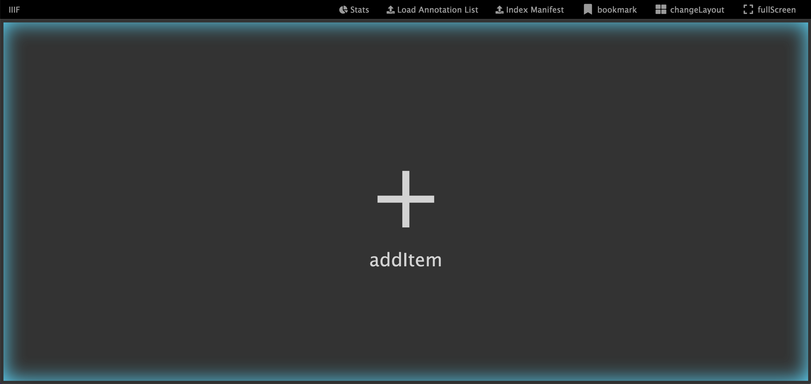
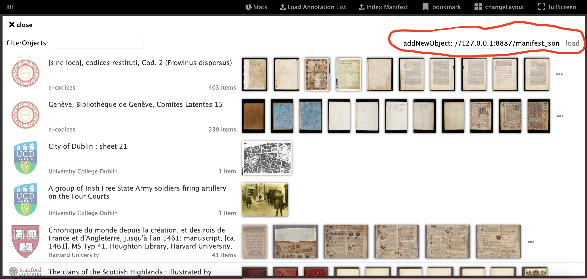
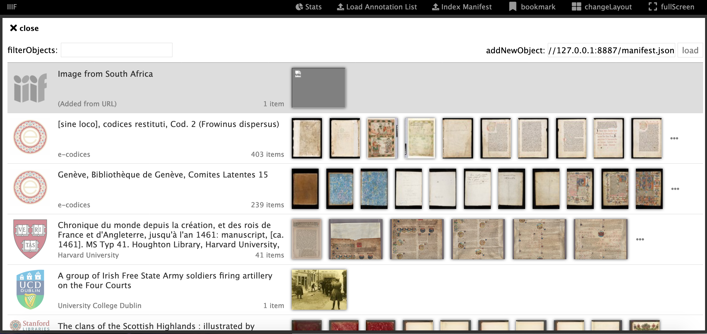
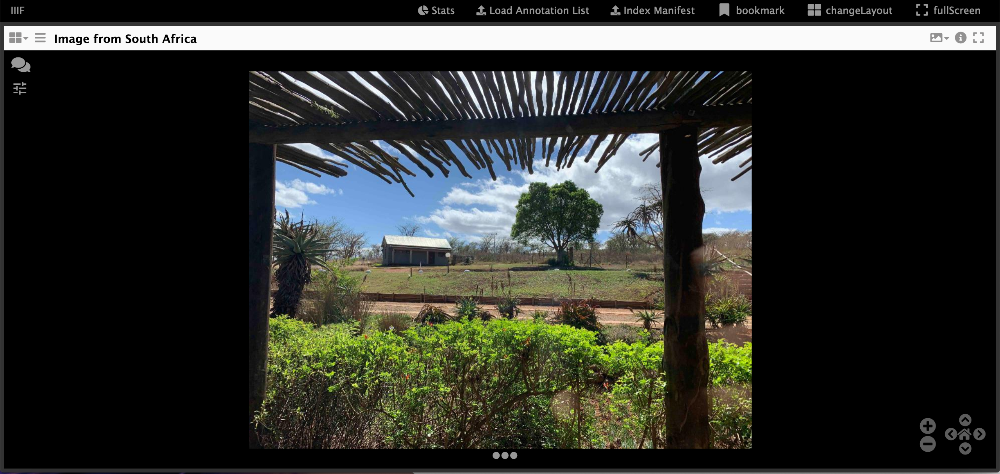
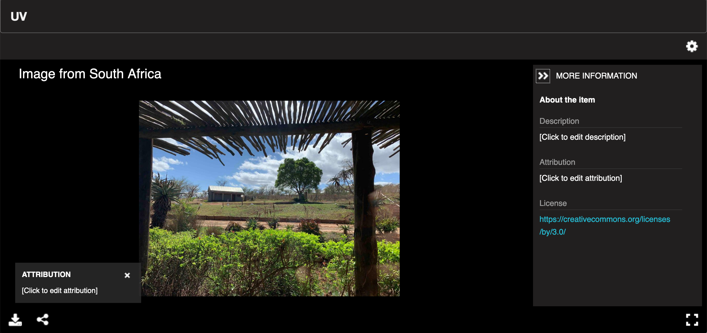
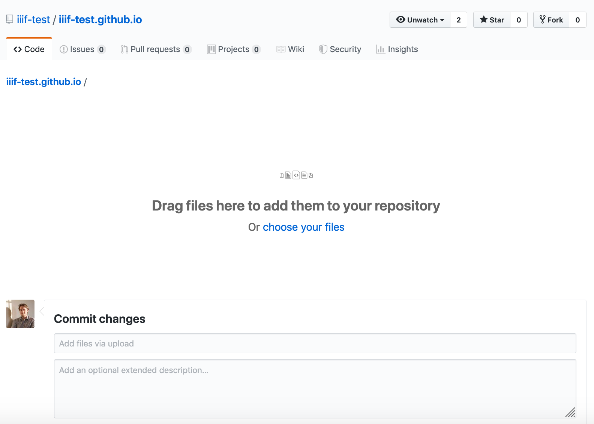
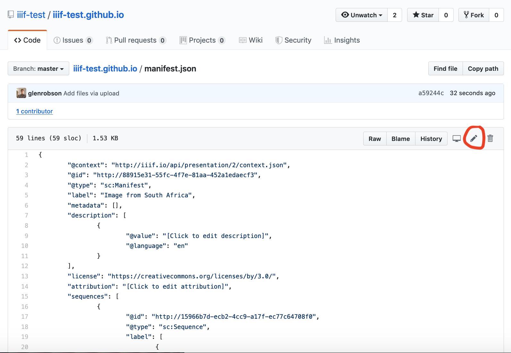

# Viewing your Manifest with a IIIF Compatible Viewer

Now you have created your manifest you want to view it using a IIIF Compatible Viewer. Each viewer have different functionality so when deploying your live IIIF site you should evaluate which meets your needs best. One of the benefits of IIIF is that a user can take the IIIF Manifest and load it into a different viewer if they disagree with your choice. In this example we will show you how to load your manifest in Mirador and the Universal Viewer.

## Using Mirador

To load your manifest into Mirador open up the following page into your browser:

http://iiif.gdmrdigital.com/mirador/

 * Click addItem

 

 * Enter your Manifest URL (e.g. http://127.0.0.1:8887/manifest.json) into the addNewObject box at the top right and click load.

 

 * You should see your manifest loaded as the first item. If you are using a level-0 IIIF image you may see a broken image as Mirador isn't correctly reading the `info.json`

 

 * Now click on your item and you should see the image you have added.

 

### Using the Universal Viewer

To load your manifest into the Universal Viewer (UV) you need to edit the following URL:

http://universalviewer.io/uv.html?manifest=

Copy the URL of your manifest and add it after the `=` so it looks like:

http://universalviewer.io/uv.html?manifest=http://127.0.0.1:8887/manifest.json

 


### A note about https

You will notice the links above to Mirador and the Universal Viewer both use `http` rather than `https`. This is because your manifest is being served locally using the Chrome Web Server that only supports unencrypted http. `https` websites require `https` manifests so if you want to show your manifest in a `https` site it must be served over `https`. To achieve this you can use GitHub pages in the example below but in production your http server should use `https`. 

### Publishing your manifest publicly 

Manifests can be hosted with any http server as long as it has been configured to use `CORS`. We enabled the `CORS` functionality in our Chrome Web Server. A free service that supports both CORS and https that we can use to host our manifest is [GitHub Pages](https://pages.github.com/). If you followed the instructions in [Hosting IIIF Images with GitHub pages](../image-api/level0-github-hosting.md) you can now also host your manifest using the following steps:

 * Step 1: Upload your manifest
 In the root directory of your github repository (e.g. https://github.com/iiif-test/iiif-test.github.io). Click `Upload Files`

 * Step 2: Drag or navigate to your manifest and click upload. 

 

 * Step 3: Click commit changes. You should now be back it your GitHub repository root. 
 * Step 4: Click on your Manifest

 

 * Step 5: Click to edit your manifest. This is the pen symbol on the right hand side, circled above. 
 * Step 6: Change the `@id` from something like:

```json
 "@id": "http://88915e31-55fc-4f7e-81aa-452a1edaecf3",
```

to:

```json
  "@id": "https://username.github.io/manifest.json",
```

Where username is your GitHub user. 

 * Step 7: View your manifest

You should now be able to view your manifest using the following URL:

https://username.github.io/manifest.json

(remember to change the username in the link above).

**Note:** When ever you move a manifest or host it in a different place, remember to update the `@id` to point to the web accessible version. You should always be able to copy the URL in `@id` into your browser and get to the manifest. 

For a completed example see the following GitHub repository: https://github.com/iiif-test/iiif-test.github.io

You should now be able to view your manifest in a public https site e.g.:

https://projectmirador.org/

If you've reached here, why not have a go at creating some annotations using the following guide:

https://iiif.github.io/training/iiif-5-day-workshop/day-three/annotations-exercises.html
