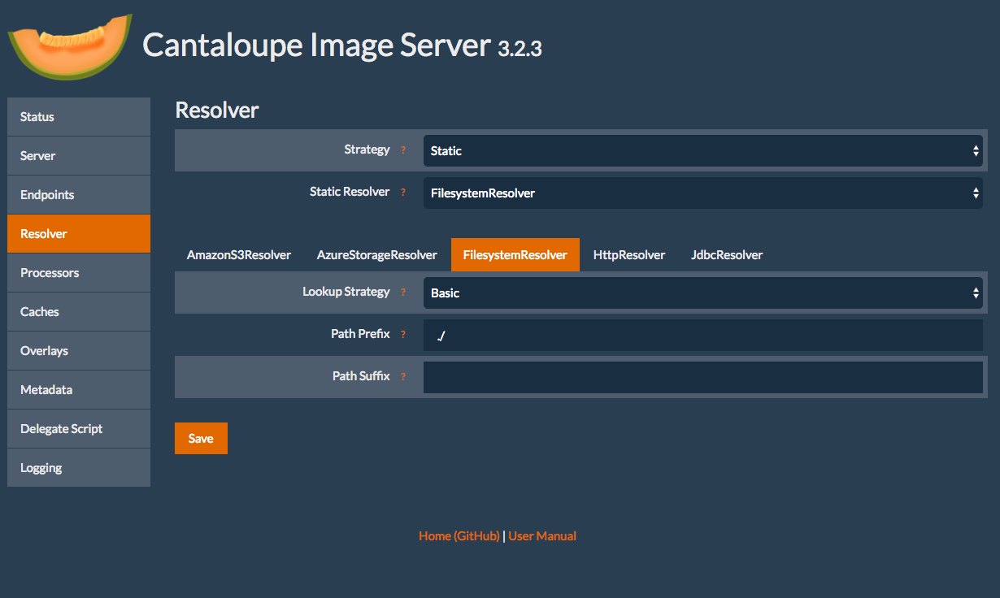
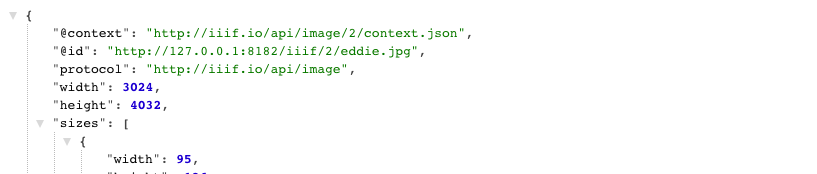
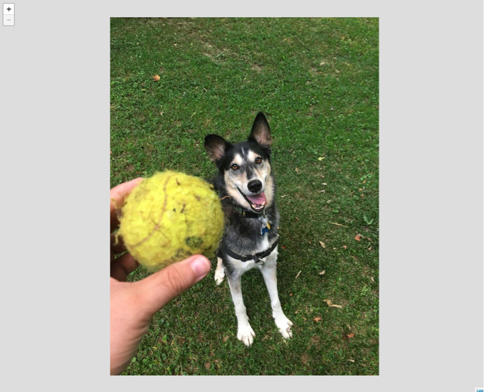

# Configuring Cantaloupe to use your images.

Congrats now you have your image server up and running! We need to feed it some images to keep it happy!

## Download some images

Go ahead and download a `*.jpg` image from the Internet into your Cantaloupe directory `Cantaloupe-3.4.2`. Here is one [eddie.jpg](https://github.com/sul-cidr/histonets/raw/master/spec/fixtures/images/eddie.jpg) that you can use.

## Configure Cantaloupe to use the correct path

Now we need to configure Cantaloupe to use that image directory.

Navigate to the admin page [http://127.0.0.1:8182/admin](http://127.0.0.1:8182/admin).

Click on "Resolver", then click "FilesystemResolver" tab.

Next fill in Path Prefix to be `./`

## Check it out in the browser

Now you should be able to navigate to an image's info.json response successfully.

Checkout [http://127.0.0.1:8182/iiif/2/eddie.jpg/info.json](http://127.0.0.1:8182/iiif/2/eddie.jpg/info.json)

And if everything goes right, you should see an `info.json` response.

Let's finally check it using the Leaflet-IIIF image api viewer.

Try this url: [http://mejackreed.github.io/Leaflet-IIIF/examples/?url=http://127.0.0.1:8182/iiif/2/eddie.jpg/info.json](http://mejackreed.github.io/Leaflet-IIIF/examples/?url=http://127.0.0.1:8182/iiif/2/eddie.jpg/info.json)

Notice how we added our local IIIF server's info.json response url as a parameter. This is used by IIIF Image API clients to understand how they can request images/tiles.

Cross our fingers, but you should see a picture of Eddie in a zoomable viewer.

Other ways to view this image include:
 * OpenSeaDragon: [http://iiif.gdmrdigital.com/openseadragon/index.html?image==http://127.0.0.1:8182/iiif/2/eddie.jpg/info.json](http://iiif.gdmrdigital.com/openseadragon/index.html?image==http://127.0.0.1:8182/iiif/2/eddie.jpg/info.json)
 * UCD Image Cropper: [https://jbhoward-dublin.github.io/IIIF-imageManipulation/index.html?imageID=http://127.0.0.1:8182/iiif/2/eddie.jpg](https://jbhoward-dublin.github.io/IIIF-imageManipulation/index.html?imageID=http://127.0.0.1:8182/iiif/2/eddie.jpg)
