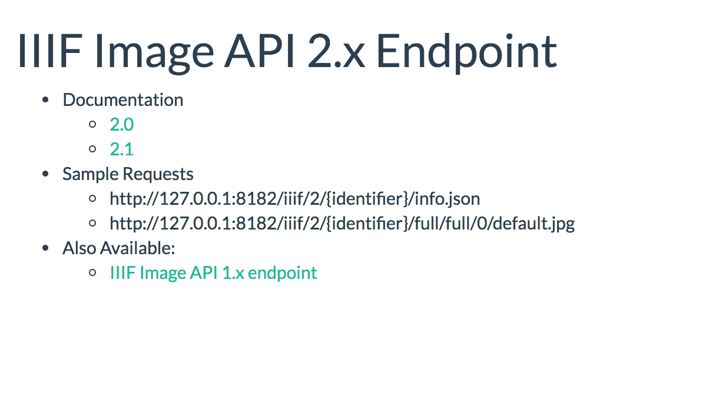
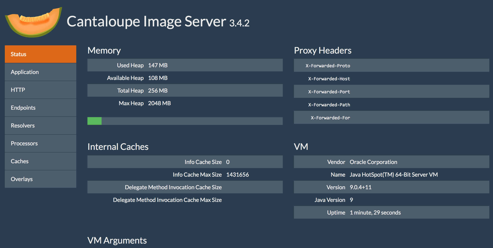

# Setting up Cantaloupe IIIF Image Server

Make sure you have [installed the prerequisites](https://gist.github.com/mejackreed/8ed979425ae702eaf1ebb2dbc1d7313b).

## Download Cantaloupe

For more information, checkout the [Cantaloupe getting started guide](https://medusa-project.github.io/cantaloupe/get-started.html).

Download [Cantaloupe v3.4.2](https://github.com/medusa-project/cantaloupe/releases/download/v3.4.2/Cantaloupe-3.4.2.zip)

Open and extract the zip file to your directory of choosing. We suggest `~/Desktop`.

Now change directory to that extracted directory

```sh
$ cd ~/Desktop/Cantaloupe-3.4.2
```

## Configure Cantaloupe

Now lets create a copy of the configuration file:

```sh
$ cp cantaloupe.properties.sample cantaloupe.properties
```

Now lets enable the admin panel where we will modify the rest of the settings.

Scroll to line 104, and change `false` to `true`. Also add a password.

```diff
# Enables the Control Panel, at /admin.
- admin.enabled = false
+ admin.enabled = true
- admin.secret =
+ admin.secret = yolo
```

Save the file.

Now lets try and start the server. Run this command from your Cantaloupe directory

```sh
$ java -Dcantaloupe.config=./cantaloupe.properties -Xmx2g -jar Cantaloupe-3.3.1.war
```

Now navigate to [http://127.0.0.1:8182/iiif/2](http://127.0.0.1:8182/iiif/2) in your browser.

You should see this:



Congrats you successfully installed Cantaloupe!

Also make sure you can get into the admin panel by navigating to [http://127.0.0.1:8182/admin](http://127.0.0.1:8182/admin).

Use the username `admin` and the password you set previously.


