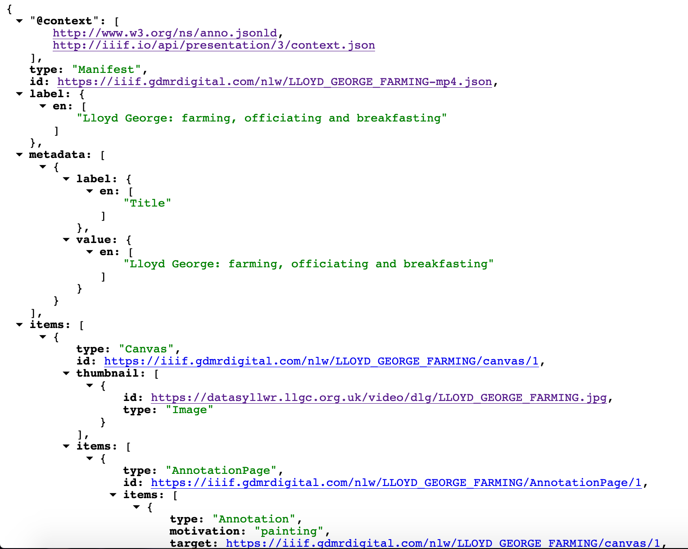
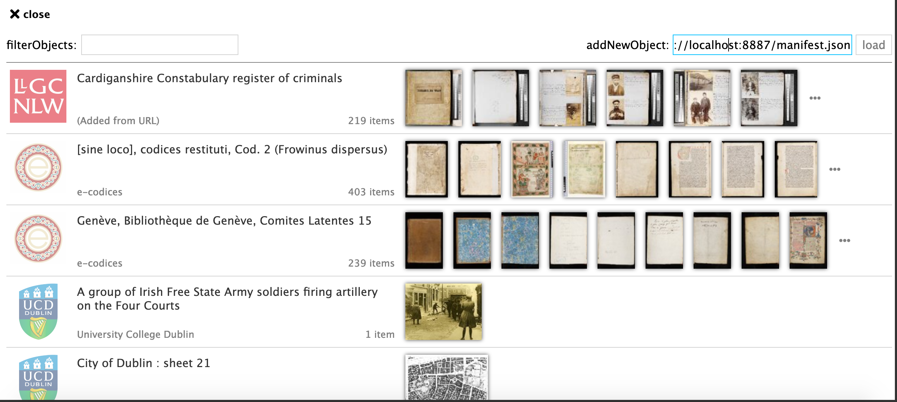
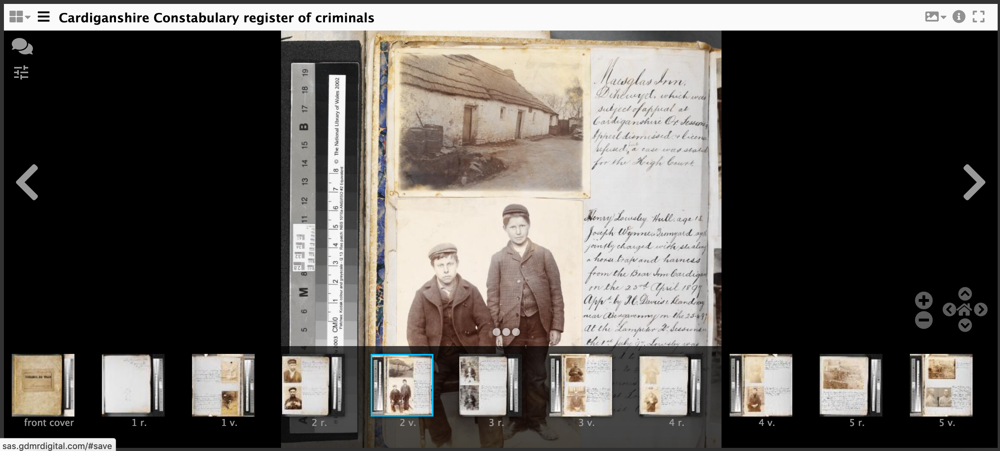

# Creating and downloading Annotations

In this tutorial we are going to annotate an image from your own manifest using the hosted SimpleAnnotationStore. Once we have finished annotating we are going to download the annotations created in an Annotation list and link them to the Manifest. This is a way of permanently attaching annotations to a manifest. 

## Step 1 Load your manifest into the hosted Mirador:
 * Go to http://sas.gdmrdigital.com
 * Add your manifest to the addNewObject field and click load:

  

## Step 2: annotate manifest

 * Start annotating your manifest

  

## Step 3: Download annotations

Now you have finished annotating you need to download the annotations and link them to canvases in your manifest. To do this you will download 1 annotation list per page/canvas. 

 * Navigate to http://sas.gdmrdigital.com/list.html
 * You will have to check the canvas ids linked on that page next to the canvas ids in your manifest.
 * Right click and do save as.
 * Save the annotations to your `dhsi2019` folder with the name `annotations1.json`, `annotations2.json` etc...

## Step 4: Link annotations to Manifest
To get the annotations to display you need to link them into the manifest. To do this find the canvas your annotations point to then add the following:

```json
"otherContent": [
    {
        "@id": "http://example.com/files/page1.json",
        "@type": "sc:AnnotationList",
        "label": "My fantastic annotations"
    }
]
```

after the images array. A full canvas example is below:

```json
{
    "@id": "http://dams.llgc.org.uk/iiif/2.0/4004562/canvas/4004563.json",
    "@type": "sc:Canvas",
    "label": "1r",
    "height": 5584,
    "width": 3744,
    "images": [
        {
            "@id": "http://dams.llgc.org.uk/iiif/2.0/4004562/annotation/4004563.json",
            "@type": "oa:Annotation",
            "motivation": "sc:painting",
            "resource": {
                "@id": "http://dams.llgc.org.uk/iiif/2.0/image/4004563/full/1024,/0/default.jpg",
                "@type": "dctypes:Image",
                "format": "image/jpeg",
                "service": {
                    "@context": "http://iiif.io/api/image/2/context.json",
                    "@id": "http://dams.llgc.org.uk/iiif/2.0/image/4004563",
                    "profile": "http://iiif.io/api/image/2/level1.json"
                },
                "height": 5584,
                "width": 3744
            },
            "on": "http://dams.llgc.org.uk/iiif/2.0/4004562/canvas/4004563.json"
        }
    ],
    "otherContent": [
        {
            "@id": "http://example.com/files/page1.json",
            "@type": "sc:AnnotationList",
            "label": "My fantastic annotations"
        }
    ]
},

```

Save the manifest.

## Step 5: check the annotations are showing

 * Go to https://projectmirador.org/demo/ or http://iiif.gdmrdigital.com/mirador/index.html if you want a version that doesn't require https.
 * Load the manifest using Add new object from URL
 * Click on one of the images to view the manifest
 * Click on the speech bubble to show the annotations.

  

 * and if it all worked OK you should see your annotation.

  


It is also possible to do the above with a locally running SimpleAnnotationServer just follow the [Annotating Stores - Do it yourself](day-three/annotations-stores-install.md) part of the course. When you get to downloading the annotations the file to get the list of annotated canvases is:

http://localhost:8080/list.html
