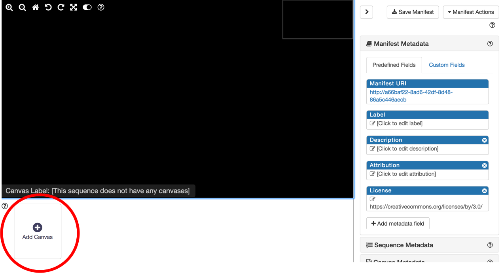
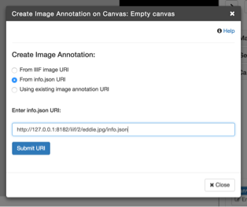

## Create your own manifest

### Manually build a manifest in a JSON Editor (Method 1)

Now that we have a template manifest and understand a bit better how it fits together, let's manually make our own manifest with images from the local image server we set up yesterday.
  * Hint: an important change will be modifying the "@id" of the service object associated with the image resource.
  The value of the "@id" should be the path of the image on your image service, without any specific IIIF URL parameters.
Use the manifest we just worked on together as a template.

### Building a manifest with a GUI (Method 2)

For this task, we'll use the very handy [Bodleian Manifest Editor](https://github.com/bodleian/iiif-manifest-editor), part of the [Digital Manuscripts Toolkit](http://dmt.bodleian.ox.ac.uk) developed by Text and Bytes for the Bodleian Library at the Unviersity of Oxford. It is a lightweight, web-based tool to manipulate existing IIIF manifests and create new ones without needing to edit the JSON-LD directly.

To begin, navigate to:

http://iiif.bodleian.ox.ac.uk/manifest-editor/

Alternative instances of the Bodleian Manifest Editor, in case the link above doesn't work for you:

- https://iiif-manifest-editor.textandbytes.com/
- http://bit.ly/dhsi-manifest-editor

After you've opened the editor interface,

1. Click "New Manifest."
1. Click "Add Canvas" and then click on the empty canvas that appears.

    

1. Now we need to add an image to this canvas. Click "Add Image to Canvas."
1. We want to use an image we are already hosting, so we select the "From info.json URI" option, and input our info.json URI from our local IIIF server. Then click "Submit URI."

    `http://127.0.0.1:8182/iiif/2/eddie.jpg/info.json`

    

1. We should now have an image in our view!
1. Finally, let's download the manifest, by clicking "Save Manifest" at the top of the page, and "Save."

  Great job! You now have created and downloaded a IIIF Presentation API manifest.
