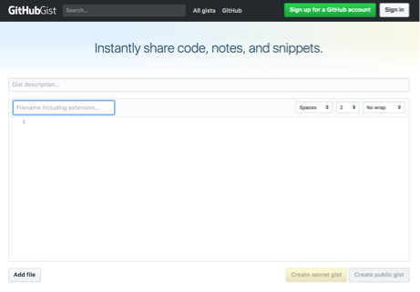

## Serve your manifest from a web service

### Method 1: Serve your manifest locally

* Use the HTTP server for node (this requires that npm is installed on your computer): 
  * Install http-server, `npm install -g http-server`
  * Then in the directory with the manifest, run `http-server --cors`
  * The manifest should be available at http://127.0.0.1:8080/manifest.json
* As a backup option, you also could install the [https://chrome.google.com/webstore/detail/web-server-for-chrome/ofhbbkphhbklhfoeikjpcbhemlocgigb?hl=en](Web Server for Chrome) and then simply drop the manifest into its root folder (this could be `dhsi2019/`). The manifest then should be accessible at http://127.0.0.1:8887/manifest.json

### Method 2: Serve your manifest via an online service

* Using myjson: copy and paste the contents of the manifest into http://myjson.com/, then click "Save"; the link will be listed under "URI to access this JSON directly."

* Using Github gist:
  1. Navigate to https://gist.github.com
  1. Drag and drop your `manifest.json` file into the window and click "Create Secret Gist" (or public if you like, it doesn't matter).

    

  1. After the gist is created, click the "Raw" button to get the raw file url.
