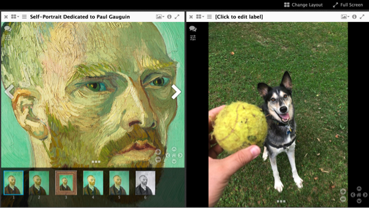

# Presentation API Deep Dive (Day II Afternoon Session)

## Introduction

Hopefully, through the process of slowly building your own image viewer, two things have become clear; Two things that help explain why something like the IIIF Presentation API exists.

1) Image viewers need more than just images.
They need specific kinds of metadata to orchestrates a user's complex interaction with a set of images. Data like the order of the images, the ways individual images should be used, metadata about the object represented by a set of images, metadata about individual images.

2) Image viewers are hard to build. They take time and they take money. If everyone had to build a new image viewer for their unique set of images, the world would be full of thousands of different mediocre viewers that are difficult and expensive to maintain.

The IIIF community recognized precisely this problem, and proposed standardizing the data that any image view would need. Because viewer applications and their data can b separated, image viewers can be re-used for a data set that is structured according to a standard (or set of rule) that the image viewer understands. The IIIF Presentation API is precisely this standard, and a IIIF compliant viewer is an image viewer that understands and knows how to display data that is structure according to these rules.

Today, we're going to look at the "guts" of this standard and learn how to structure our data according to the rules of the IIIF Presentation API.

First, let's look at the conceptual model of the IIIF Presentation API and then will begin building a manifest together.

## Looking Closer at a Manifest

### Basic Types
[http://iiif.io/api/presentation/2.1/#basic-types](http://iiif.io/api/presentation/2.1/#basic-types)

#### The manifest

The most fundamental resource type is the Manifest. In the IIIF world you will often here people talking about "manifests".

But there is nothing to magical about manifest.

A manifest is a resource that contains or wraps most of the resources and data and viewer will need.

The IIIF Spec Definition reads as follows:

> Manifest
The overall description of the structure and properties of the digital representation of an object. It carries information needed for the viewer to present the digitized content to the user, such as a title and other descriptive information about the object or the intellectual work that it conveys. Each manifest describes how to present a single object such as a book, a photograph, or a statue. [http://iiif.io/api/presentation/2.1/#overview-manifest](http://iiif.io/api/presentation/2.1/#overview-manifest)

A manifest is most typically encountered as a file that lives on the internet somewhere.
That file can be given to any IIIF Compliant Viewer. This viewer because it know what to do with data structure according to the IIIF rules can do stuff with that information, specifically it can provide a viewing experience.

So what kind of resources does a manifest contain? Well lots, but focus on the main one's we need to get started.

#### Sequences

A manifest contains a sequences property which contains an array of sequences that order individual image resources.

The Spec States:

>The order of the views of the object. Multiple sequences are allowed to cover situations when there are multiple equally valid orders through the content, such as when a manuscript’s pages are rebound or archival collections are reordered. [http://iiif.io/api/presentation/2.1/#overview-sequence](http://iiif.io/api/presentation/2.1/#overview-sequence)

In most manifests, you will find only one object within the sequences array.

NOTE: Sequences is removed in the 3.0 spec and is replaced by a property called "Items"

For the moment, what is important is that an individual sequence (or in 3.0 the items property) takes a list of "Canvases"

#### Canvas

The Spec defines a canvas as follows:

Canvas

>A virtual container that represents a page or view and has content resources associated with it or with parts of it. The canvas provides a frame of reference for the layout of the content. The concept of a canvas is borrowed from standards like PDF and HTML, or applications like Photoshop and Powerpoint, where the display starts from a blank canvas and images, text and other resources are “painted” on to it. [http://iiif.io/api/presentation/2.1/#overview-canvas](http://iiif.io/api/presentation/2.1/#overview-canvas)

Why not just call this the image?

The canvas is an important abstraction. In most advanced viewers, it is not enough just to see the image, we want do things with that image. We want make notes, translations, links, references that connect to various areas of an image.

But think for a minute. To what do these various kinds of annotations apply? When make a note about figure in an image, am I making a annotation about of set of bits unique to a jpeg image with a fixed some dimensions, or to black and white png image with a different set of dimensions. Generally no, I making an annotation about part of an "image idea" that can be digitally encoded and represented in a lots of different ways. If I want my annotation to show up when I'm viewing a .tiff, .jpg, .png, all with wildly different dimensions I need a higher level of abstraction. This abstraction is the Canvas.

Annotations can be associated with a canvas, and then different image resources can be interchangeably associated to that same canvas. In each case, the annotation coordinates and content remain applicable to each image.

#### The Content Resources

The last step requires is this association of an image resource with a canvas.

>Content resources such as images or texts that are associated with a canvas. [http://iiif.io/api/presentation/2.1/#overview-content](http://iiif.io/api/presentation/2.1/#overview-content)

This is done through privileged annotation.

## Activity: Building a Manifest

So usually all of this goes in one ear and out the other until we start building a manifest.

While in production, manifests can get very big and are usually machine generated there is not substitute for making one by hand.

First, we're going to do this together.

Then, we'll send you off to make your own

### Group Manifest

* Here [add link] I've created a bare minimum manifest for us all to share. But you'll notice, it is very sparse.

In this activity, we will pose a serious of questions and ask you to look at the IIIF documentation and hunt for an answer.

There really is no substitute for reading the documentations and learning to read them is empowering.

So in teams of 2, let's hunt for the following questions.

When you think you've found the answer, added it to your version of the manifest.
Then we're done will go through together the completed manifests and compare answers

1. Give the manifest resource the following title "A custom manifest for IIIF Practice"
1. Provide a short description of this manifest
1. Indicate that manifest resource has a creative commons 4.0 by-nc-sa license
1. Tell the image viewer that this resource should be explicitly viewed going from left to right
1. Create a second canvas, with appropriate ids
1. Indicate that the image for this second canvas has two facing pages and therefore when a viewer shows in book view, it should not combine this with an image before or after
1. Give canvas 1 a title "canvas number 1"
1. Give canvas 2 a title "canvas number 2"
1. Add a second image to canvas 1 with a different image format "image/png"
1. Given this second image a title called "alternative image for canvas 1"

### Manually Build a Personal Manifest (Method 1)

* Manually make a manifest with images from the local image server set up the night before.
  * Hint, a important change will be changing the "@id" of the service object associated with the image resource.
  The value of the "@id" should be the path of the image on your image service, without any specific IIIF URI parameters.
* Use the manifest we just worked on together as a template.

### Building a Manifest With a GUI (Method 2)

To start navigate to:

http://iiif.bodleian.ox.ac.uk/manifest-editor/

This is a demo/hosted version of the [iiif-manifest-editor](https://github.com/bodleian/iiif-manifest-editor).

1. Click "New Manifest"
1. Click "Add Canvas" and then click on the "Empty Canvas"

  

1. Now we need to add an image to this canvas. Click "Add Image to Canvas"
1. And we want to use an image we already hosting, so we select the "From info.json URI" option, and input our info.json URI from our local IIIF server. Then click "Submit URI"

  `http://127.0.0.1:8182/iiif/2/eddie.jpg/info.json`

  

1. We should now have an image in our view!
1. Finally, let's download the manifest, by clicking "Save Manifest" at the top of the page, and "Save"

  Great job! You now have created and downloaded a IIIF Presentation API manifest. But wait, theres more!

## Serve your manifest

### Method 1: Serve your Manifest Locally
* Serving manifest locally
  * Install http-server, `npm http-server`, or live-server, `npm live-server`
  * Then in the directory with the manifest, run `http-server --cors` or `live-server --cors`

### Method 2: Serve Your Manifest with github gist

1. Navigate to https://gist.github.com

1. Drag and drop your `manifest.json` file into the window and click "Create Secret Gist" (or public if you like, it doesn't matter).

  

1. After the gist is created, click the "Raw" button to get the raw file url.

## View your manifest

NOTE: If your viewing images from your local image server, you'll need be running a local instance of mirador or universal viewer

### Viewing in a local Mirador Instance

1. Download the most recent release from here: [https://github.com/ProjectMirador/mirador/releases](https://github.com/ProjectMirador/mirador/releases)
1. Unzip the package
1. In Chrome open the file in the downloaded package called example.html
  * File->Open File->example.html
1. Now drop in your custom manifest

### Viewing Online in UniversalViewer

1. Copy that URL, navigate to [http://universalviewer.io/uv.html?manifest=](http://universalviewer.io/uv.html?manifest=) and past the hosted manifest url after the `=` in the url.

  Hopefully you see your images in the [UniversalViewer](http://universalviewer.io/).

### Viewing Online in Mirador
Let's also view this in [Mirador](projectmirador.org)

1. Navigate to [http://projectmirador.org/demo/](http://projectmirador.org/demo/).
1. Click the `x` box in both windows to close the windows.
1. Hover over the icon to the right of the `x` and click "Replace Object"

  

1. Paste in your manifest url to the text box "Add new object from URL:"
1. Click "Load" - You should see your manifest loaded there. Click on one of your images.

You should see one of your images now in the view next to a van Gogh

