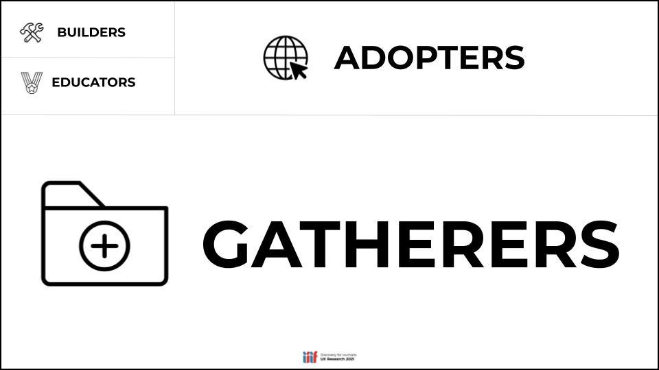

# Introductions

## British Library involvement with IIIF
IIIF is a set of standards that provide access to high quality images and audio-visual content in a method that allows users to choose different viewers and tools to interact with cultural heritage content. It has been widely adopted by world leading organisations including the British Library. It provides a basis for users to gather digital content and enables research by comparing and annotating content. The IIIF standards are developed by an international open community and are supported by a consortium of institutions including the BL. 

The British Library has been involved with the development of IIIF since the very beginning and was instrumental in seeking and managing the grant which added audio-visual support to IIIF. It was also one of the eleven [founding members](https://iiif.io/news/2015/06/17/iiif-consortium/) of the IIIF Consortium. Members of staff at the BL have been active participants in the community providing advice on implementation and also funding tools that benefit both the BL and the wider IIIF community. One example is with the development of the [Universal Viewer (UV)](http://universalviewer.io/) which started life as the [Wellcome Viewer](https://wellcome.org/press-release/wellcome-librarys-digital-player-made-freely-available) before the BL funded work for it to become one of the most widely used IIIF viewers. By supporting financially the work of the [UV Open Collective](https://opencollective.com/universalviewer) the BL has enabled the addition of the A/V support in the UV along with numerous usability fixes. Some of the BL priorities for using IIIF include enabling 3D content and content enrichment both through crowdsourcing and machine learning, digital engagement and storytelling and discovery of our open access digitised newspaper collections.

# How users make use of IIIF 

One of the IIIF Community groups has done some research on how people use IIIF items and created the following groups of users: 

From the [D4H Community Group Resarch Findings presentation](https://docs.google.com/presentation/d/1JhhjJdGIAZjYm0j9iNig7-YT2LJqFgVgThsoS59jAV0/edit#slide=id.gdbd80f572f_0_95)

The groups are defined as:

### Gatherers
 * **EXPERTISE IN IIIF:** Does not use IIIF. May be aware or unaware that it exists.
 * **MOTIVATION:** The materials relevant to their research; technology agnostic.
 * **TOOLBOX:** Use tools like Zotero, Google Drive, Dropbox and MS Office to manage digital items.
 * **PEERS:** Involved in their own research communities.

Use cases include:
 * Making use of your [catalogue](http://explore.bl.uk/primo_library/libweb/action/search.do?vid=BLVU1&_ga=2.265106831.1638856473.1637881558-35362652.1567638963) to find digital stuff
   * Searching for a specific item: 'William Caxton Chaucer's Canterbury Tales'
 * Browsing a project website like [Endangered Archives Programme](https://eap.bl.uk/search?_ga=2.193748269.1638856473.1637881558-35362652.1567638963)   
 * Storing references in Zotero or Spreadsheets
 * Downloading images
 
### Adopters
 * **EXPERTISE IN IIIF:** Utilize IIIF-compliant materials for research projects.
 * **MOTIVATION:** Available technology and materials relevant to their research.
 * **TOOLBOX:** Use tools like [FromThePage](https://fromthepage.com/), [Wordpress](https://www.vam.ac.uk/blog/digital/iiif-wordpress-and-shakespeare-too), [Omeka](https://omeka.org/s/), and other out-of-the-box solutions for research projects.
 * **PEERS:** Involved in their own research communities more than IIIF community.
 
Use cases include:
 * Looking for IIIF material. Will use your excellent [IIIF guide](https://www.bl.uk/collection-guides/iiif)
 * Using multiple collections with tools like [Mirador](https://projectmirador.org/)
    * [Canterbury Tales - BL](http://explore.bl.uk/BLVU1:LSCOP-ALL:BLL01018739574)
    * [The Ellesmere Chaucer - Huntington Digital Library](https://hdl.huntington.org/digital/collection/p15150coll7/id/2838)
    * [Hengwrt Chaucer - National Library of Wales](http://hdl.handle.net/10107/4628556)
 * Will use tools like [Exhibit](https://exhibit.so/) to put together exhibitions/presentations. See [Guest video](../GuestPresentations.md#exhibit)
 * Can create transcription projects using [FromThePage](https://fromthepage.com/). See [Guest video](../GuestPresentations.md#crowdsourced-transcription-using-fromthepage--iiif)

### Educators
 * **EXPERTISE IN IIIF:** Understand how to use IIIF tools for viewing, annotation, and transcription.
 * **MOTIVATION:** Teach people about the possibilities of IIIF.
 * **TOOLBOX:** Use tools like viewers in teaching.
 * **PEERS:** May be involved with IIIF community.

Use cases include:
 * Similar tools to above
 * Will use annotation tools we will cover on Thursday
 * Will use tools like [Recogito](https://recogito.pelagios.org/) which is a hosted annotation tool for teaching
 * Use AV tools like [Timeliner](https://cultural-heritage.digirati.com/our-work/timeliner/) or the [Europeana Media Player](https://video-editor.eu/).
 * Can setup crowdsourcing projects
 * We held a community call on Teaching and Learning with IIIF. Notes [here](https://docs.google.com/document/d/1viF1tgssZSTTiMTPy1sY3iTxgAKfByt1eM9MrCQEfF4/edit) and video [here](https://www.youtube.com/watch?v=ILrmRxPcK-o).

### Builders
 * **EXPERTISE IN IIIF:** Possess a deep, technical knowledge.
 * **MOTIVATION:** Make digital content from their institution available.
 * **TOOLBOX:** Use tools like Github, code editors, open source tools.
 * **PEERS:** Members of the IIIF community.

Use cases:
 * This will be you by the end of the course :-)
 * Create Manifests and IIIF Images either programmatically or through tools like Manifest Editors
 * They know about the IIIF tools available and where to look for them ([awesome-iiif](https://github.com/IIIF/awesome-iiif))

