# Advanced IMMARKUS features

IMMARKUS has a number of other features that make it suitable for a Digital Humanities project. The first is Visual Search which I've found is a bit hit and miss but the idea is once you've indexed your images you should be able to create an annotation and then find similar shapes in other canvases. 

Adding Entities and Classes allows you to add structured tags to your images to link annotations across multiple works. 

## Visual Search

Visual search allows you to find similar shapes in images. To work with the visual search you need to start by indexing the images. I'm going to be using the [Cardiganshire Criminals](https://www.library.wales/discover-learn/digital-exhibitions/manuscripts/modern-period/criminals) manifest but feel free to use your own. 

Navigate to the Settings part of IMMARKUS:

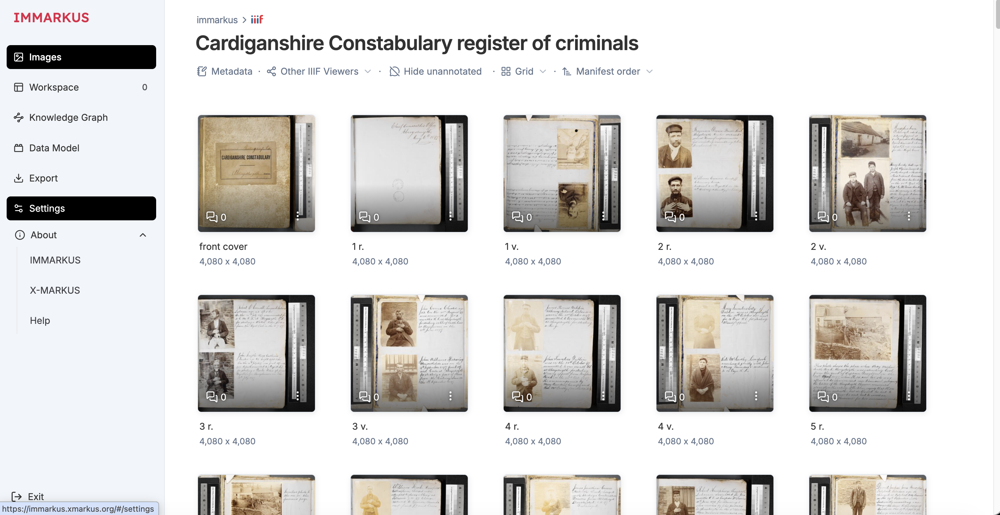

Then below General select Visual Search. It will show you how many images you have loaded and it will include any manifests that are in your project. Click the Index x new images. 

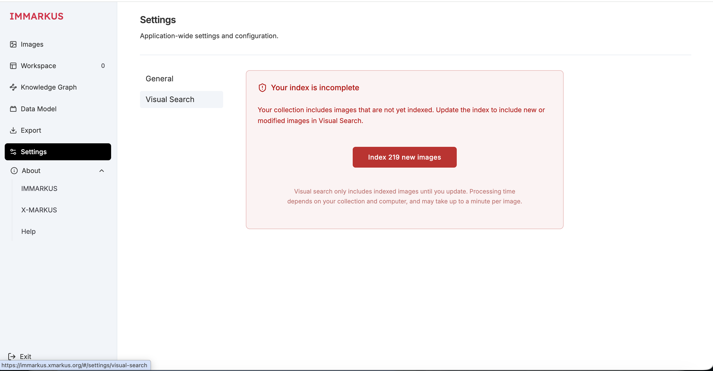

As it mentions it can take around a minute per page although I managed to index over 200 pages in around 15mins. 

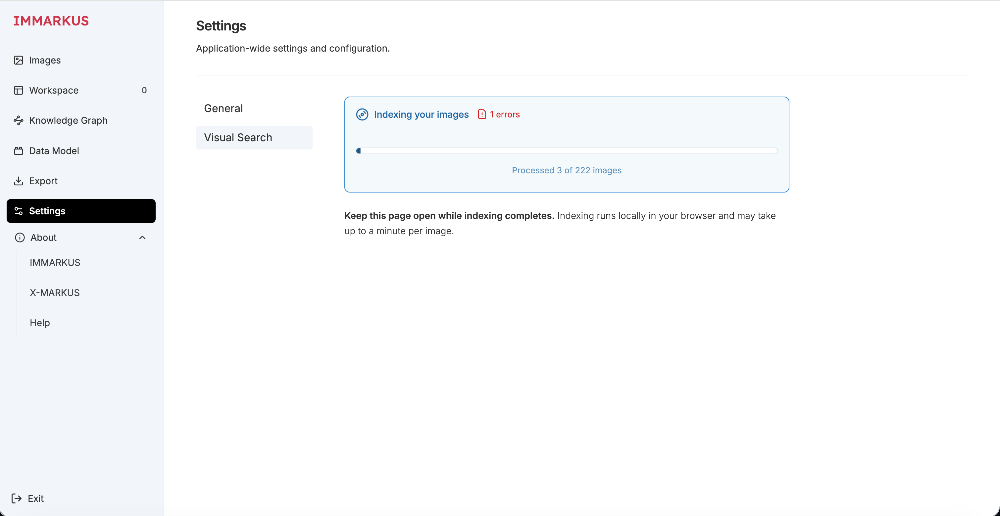

Once the indexing has finished you should see the following. If you need to re-index due to errors you can delete the index and go through the indexing process again. In my example one of the images didn't resolve. 

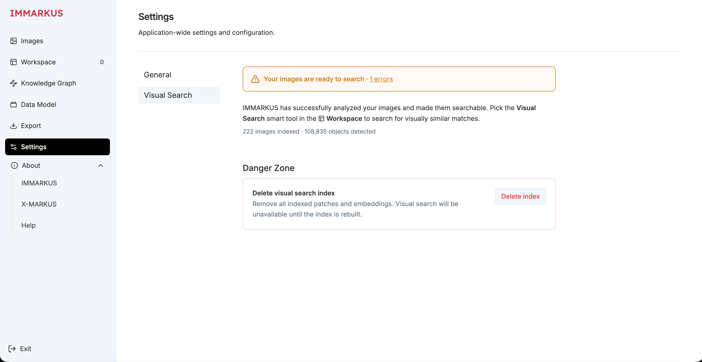

Now go back to your Manifest and create an annotation. For this example I am looking for photographs that are contained in the Manifest so I've annotated one image and I am hoping the visual search will find the rest. Once you have done your annotation select Visual Search from the Menu and re-select your annotation. 

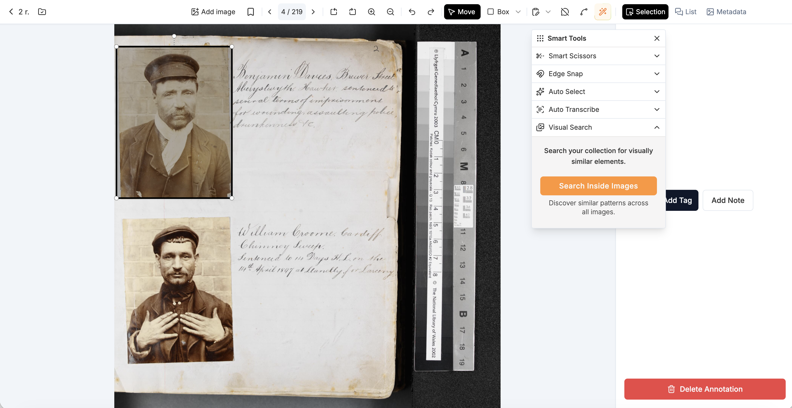

The visual search has found 4 annotations on the current page including the one I started with. Two of them aren't great boxes around the photograph but in two of them they have done quite a good job. I could select the second annotation and add it to the store but I'm going to click the All images to see how its done with the rest of the Manifest. 

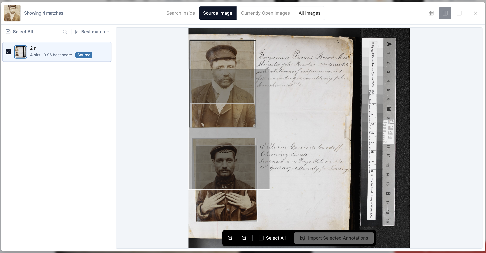

As you can see its done quite a good job of finding similar photographs. 

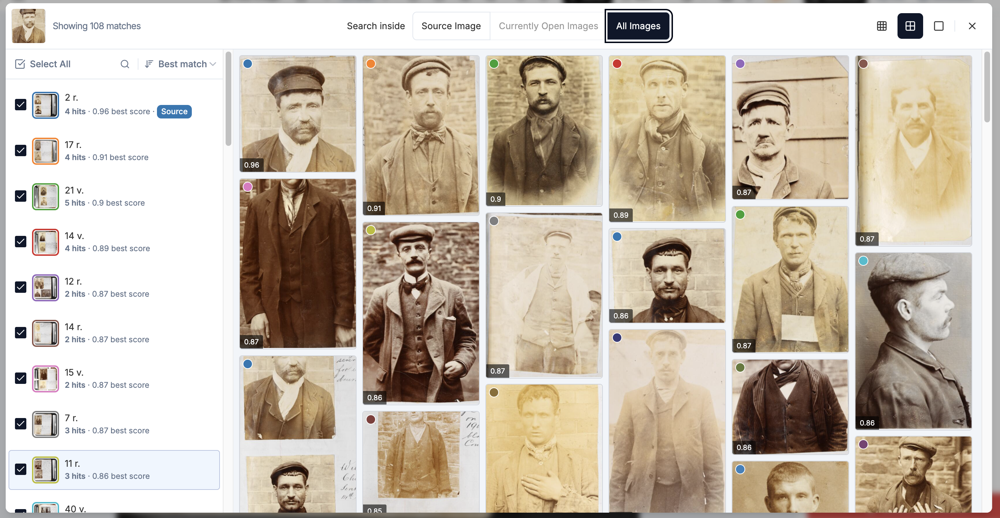

If I click on one of the results I can see all of the annotations that it has matched.

I can then select the ones I want to keep and click "Import Selected Annotations". Once I do this it takes me back to the Visual Search page where I can add other annotations. Once I've added all the ones I want to I can close the Visual Search page and go back to my Manifest and edit the boxes or add Class information which we will do in the next step.  

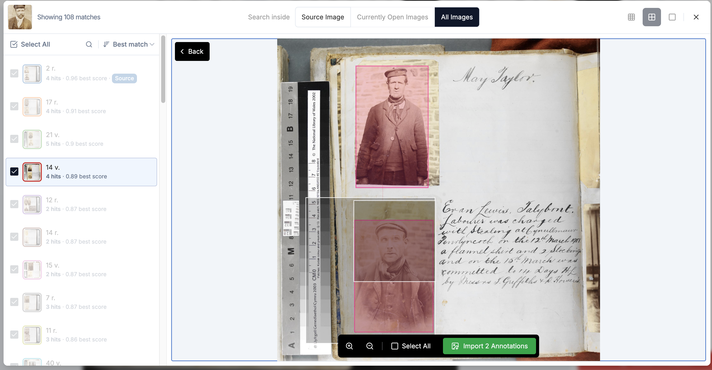

One useful feature is to click the hide unannotated so I can just focus on the ones that have annotations:

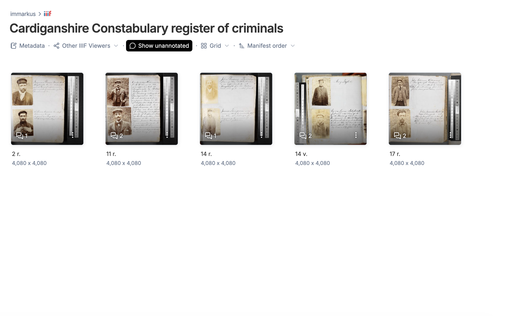

## Adding Entities and Classes

The Cardiganshire Constabulary register of criminals contains:

"Register of criminals apprehended by Cardiganshire Constabulary, 1897-1933 with physical descriptions of prisoners and details of previous convictions. Photographs are included of most of those sentenced between 1897 and 1909. "

It includes photos and descriptions of the criminal and also what crime they committed. I would like to create a database of the criminals and the crimes to see if there is any link between their location or the types of crimes they committed. 

To do this I can cremv ate tags for each annotation of a person and associate the following fields:

 * Name
 * Place
 * Job
 * Crimes (a controlled list of terms):
    Wounding
    Assaulting police
    Drunkenss
    Larceny

To do this in IMMARKUS I create a Class for the Criminal and for each field I create a property of that class. First navigate to the Data model tab:

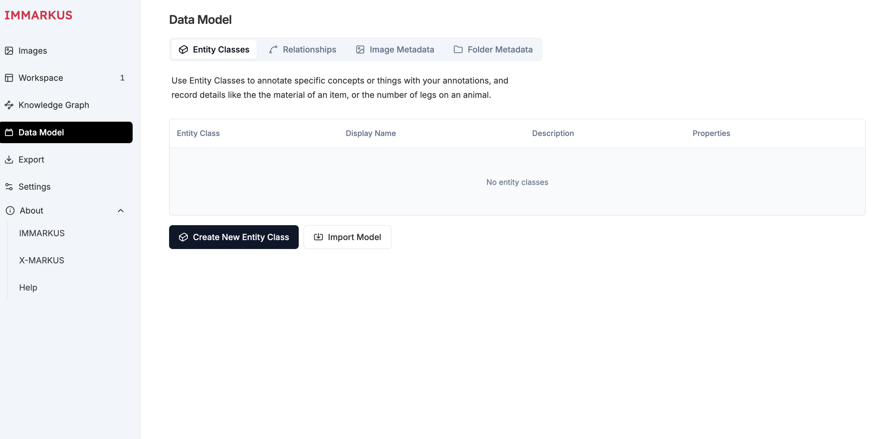

and then click Create New Entity Class.  There is a lot you can do with classes including make parent classes and subclasses. If I wanted to I could make Criminal a subclass of Person and store the Name and Job at the person level but for simplicity I am only going to have one class. Add a class name, display name and description.

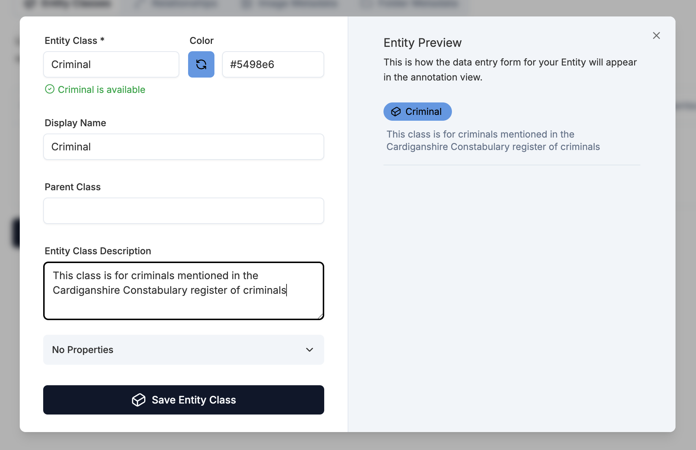

Now we need to add the properties. Click the no properties drop down at the bottom and then add property. Add a name for your property and a type. There are lots of different types and this can enforce consistency when populating the type. In this case we will use Text but you can see for Place we might try Geo coordinates and for crimes we might want a list of options. 

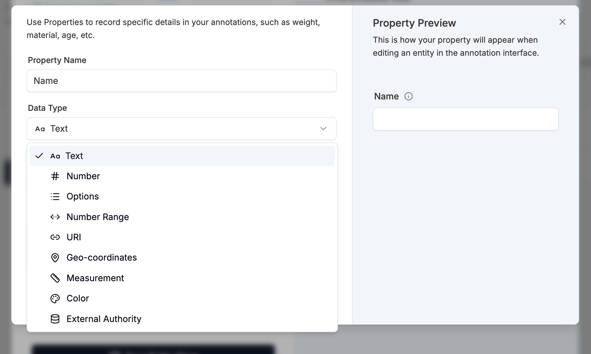

Once you have selected your type you can choose to have a multi line text box if the content was going to be long. We don't need a large text box for the name. We also don't want multi values but this will be useful for the Crime property. 

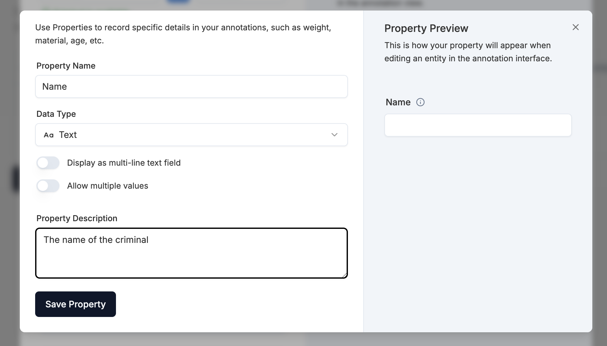

I am now going to add the other properties:

 * Place - text, single value
 * GeoPlace - geo coordinates for the place mentioned above
 * Job - text, single value
 * Crimes - options, multi value

This is what the Crime property looks like:

[Screenshot of crime property](images/immarkus/create_property_crime.png)

Once you've added your properties click Save Entity Class.  Now we have our data model we want to go back and edit our annotations to add these classes and properties. 

In the example below I've made the job a bit easier by using the auto transcribe feature to transcribe the text next to the image. I can then use that data to copy and paste into the class. I've selected the annotation over the photograph and I am going to click add Tag.

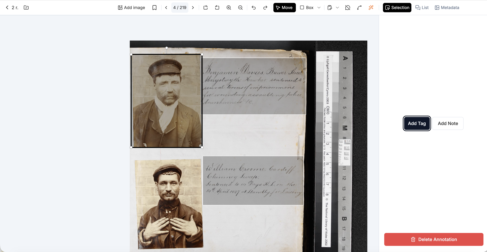

It asks me to select which class I want to add, as I only have one I am going to select Criminal:

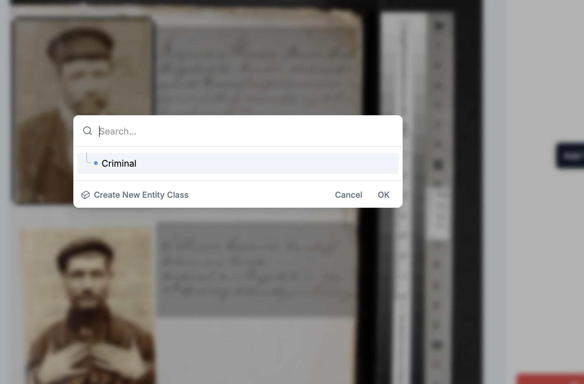

Now I am going to populate the data for this Criminal using the text alongside it. Note I am using [this geo coordinates tool](https://www.maps.ie/coordinates.html) to get a rough geo coordinates for the place. 

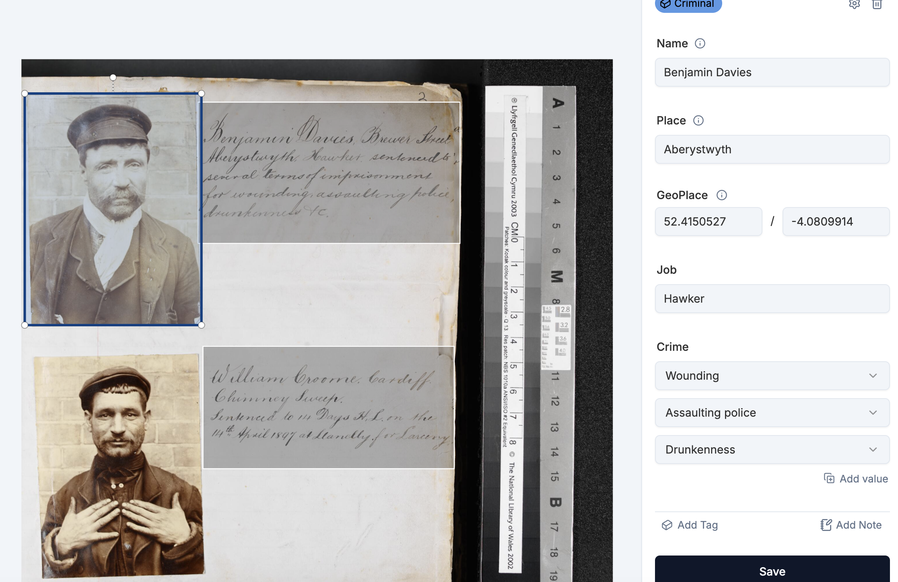

I can then go through the rest of the annotations adding class information for all of the criminals I have annotated. Once I've done that I can go to the Knowledge Graph to see the connections. In the example below I've annotated five criminals and gone to settings to hide unconnected nodes. I can click on the nodes to see the annotations. 

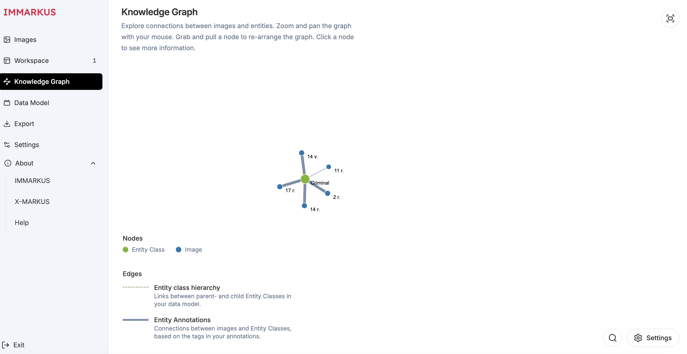

If I want to interrogate the data more I can do a graph search by clicking the magnifying glass. In this example I want to find images which have the criminal class and the property Crime with a value of Larceny or Theft. You can see there are 4 criminals with this conviction. 

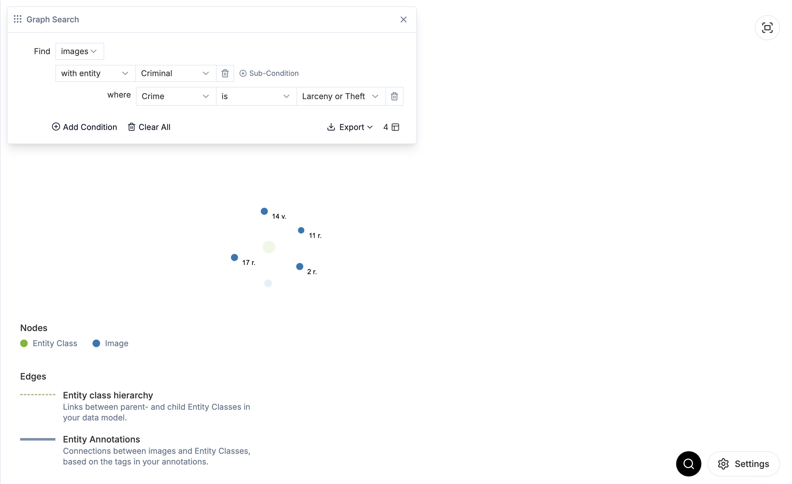

There is a lot more you can do here by linking properties together between different classes and looking more into the graph search. You can find more details on the [IMMARKUS wiki](https://github.com/rsimon/immarkus/wiki/04-Designing-a-Data-Model). 