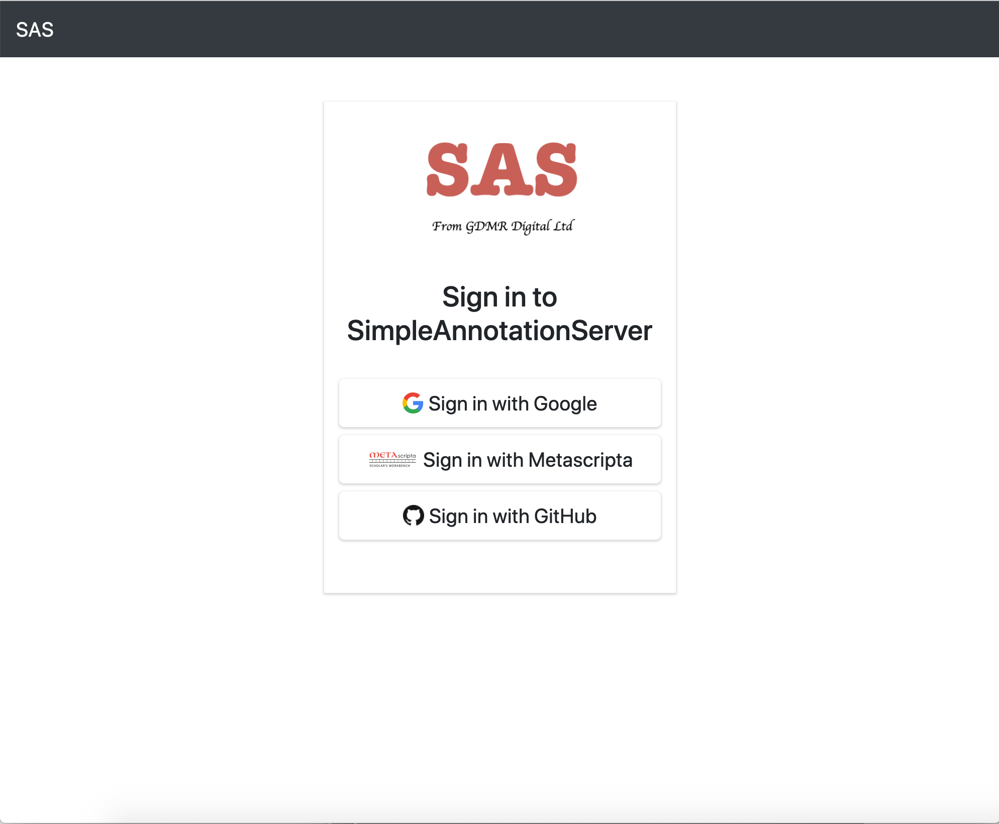
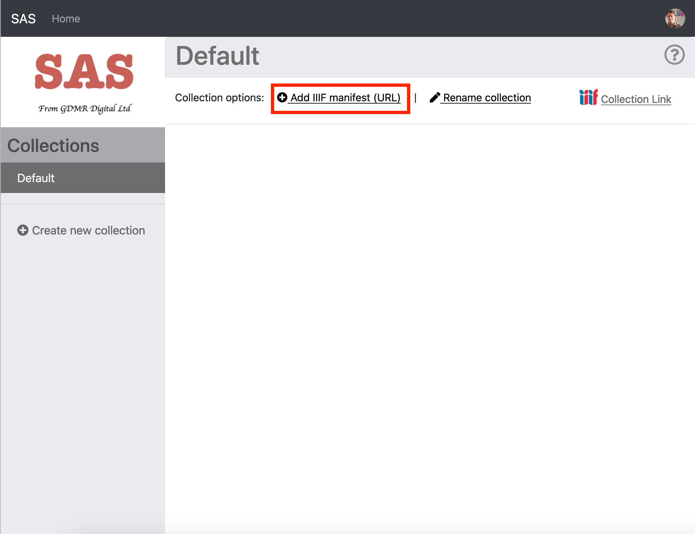

# Creating and downloading Annotations

In this tutorial we are going to annotate an image from your own manifest using a very recently released version of the SimpleAnnotationStore. Once we have finished annotating we are going to test viewing and searching your annotations with a public viewer. 

## Step 1 find a Manifest

If you haven't aleady go back to the [Finding Manifests](basics/guides.md) guide and find a Manifest from one of the public collections. My personal favourite is:

https://damsssl.llgc.org.uk/iiif/2.0/4389767/manifest.json

## Step 2 Login to SAS
 * Navigate to https://dev.gdmrdigital.com/ and click the Log in / Sign Up link. 
 * This will take you to the following screen where you can choose to either login using your Google or Github accounts

  

The GitHub/Google methods are purely used to provide authentication to SAS with all of the data being stored on the SAS server. 

## Step 3 Load your manifest into SAS:
Once you have logged in you will be presented with the following collection screen: 

  

 * Now click the Add IIIF manifest (URL) link and enter the URL to your manifest as below.

  

 * Then click Add. Depending on how many pages the Manifest has, this might take a minute or two to index.
 * Once your manifest is loaded you should see it appear in your default Collection:

  

Once you have finished annotating click the Home link at the top to get back to your collections. 

