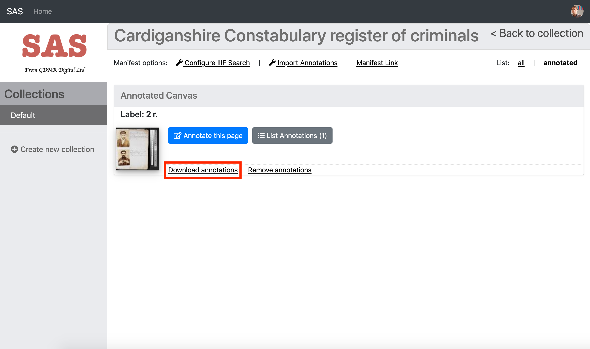
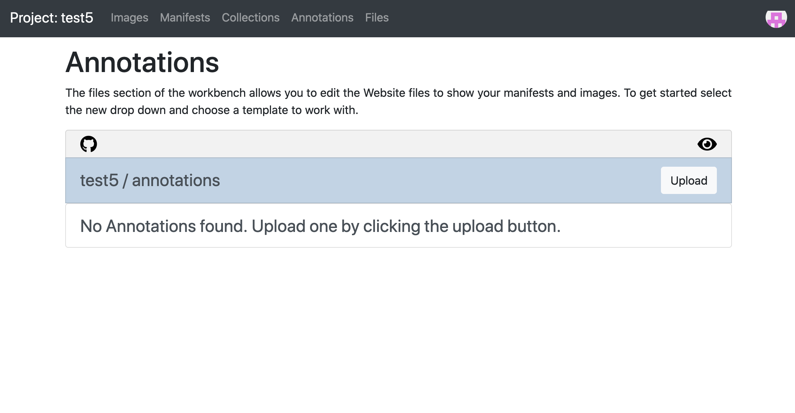
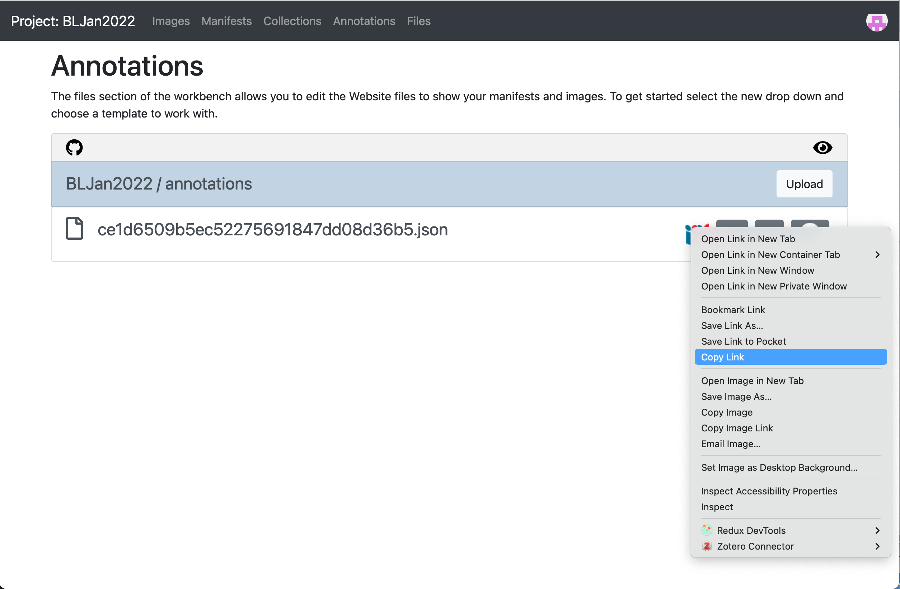

# Downloading and linking your annotations

In the last section we created a SimpleAnnotationServer (SAS) version of your manifest but now we are going to download the annotations from SAS and link them to your Workbench manifest. This is useful to create a read only copy of your annotations and you will also be able to view them using a feature of the Workbench and a tool called Annona. You will also see how annotations are connected to a manifest and how a viewer follows these links in your manifest to show annotations. 

Note from this step forward the activities get more difficult and will involve editing your Manifest. These stages are optional and will give you a complete workflow for annotating and publishing your annotations. The overall process is as follows:

 * Step 1: Setup your environment 
 * Step 2: Download your annotations from SAS
 * Step 3: Upload your annotations to Workbench
 * Step 4: Link your manifest to the annotations
 * Step 5: Exhibit your annotations with Annona


### Step 1: Setup your environment 

Through various iterations of this workshop we have found it easiest to save a copy of your manifest from Workbench to the directory that you are using for the Chrome Web Server. Make your edits on this file, test to make sure its working and then finally replace the Manifest on Workbench with your updated copy. To get a copy of your Workbench manifest ready for editing:

 * Navigate to your manifest in your workbench 
 * Right click on the IIIF logo and select `Save Link As`
 * Save it in the Chrome Web Server directory and call it `manifest2.json`
 * Ensure your Chrome Web server is running. This should be running on port `8887` and the manifest should be available at http://localhost:8887/manifest2.json
 * Open the downloaded manifest in [Atom](https://atom.io/) ready for editing.

## Step 2: Download your annotations from SAS

Now you have finished annotating you need to download the annotations before uploading it to the Workbench. To do this you will download 1 annotation list per page or canvas. 

 * Navigate back to the collections page by either clicking the Home menu item or following this link: https://dev.gdmrdigital.com/collections.xhtml
 * Now click the grey "Browse Annotations" button

  

 * You should now see the canvases which have annotations. 
 * Click the "Download Annotations" link.

  

If you download this annotation file to your workshop directory. The name of the file isn't important as long as it ends in .json.  

### Step 3: Upload your annotations to Workbench

In a new Browser tab navigate to your Workbench by going to https://workbench.gdmrdigital.com/login.xhtml and logging in. Select the project you are working on and click the Annotations section.



Now upload the annotations you downloaded from SAS:


Once you have uploaded your annotations you should see the screen below. 


It takes about 10mins for the Workbench to publish the annotation list to your Website but we can still copy the URL to the annotations list to move on to the next stage. To do this right click on the IIIF logo and select "Copy Link" to copy the URL of your annotations. This is what we will add to your manifest.



## Step 4: Link your manifest to the annotations

To get the annotations to display you need to link them into the manifest. Open up your manifest in your Chrome Web Server directory in [Atom](https://atom.io/). 

Then find the canvas your annotations point to then add the following:

```json
"otherContent": [
    {
        "@id": "https://iiif-test.github.io/BLJan2022/annotations/ce1d6509b5ec52275691847dd08d36b5.json",
        "@type": "sc:AnnotationList",
        "label": "My fantastic annotations"
    }
]
```

after the images array. Replace the URL after the `@id` with the URL you copied from Workbench. A full canvas example is below:

```json
{
    "@id": "http://dams.llgc.org.uk/iiif/2.0/4004562/canvas/4004563.json",
    "@type": "sc:Canvas",
    "label": "1r",
    "height": 5584,
    "width": 3744,
    "images": [
        {
            "@id": "http://dams.llgc.org.uk/iiif/2.0/4004562/annotation/4004563.json",
            "@type": "oa:Annotation",
            "motivation": "sc:painting",
            "resource": {
                "@id": "http://dams.llgc.org.uk/iiif/2.0/image/4004563/full/1024,/0/default.jpg",
                "@type": "dctypes:Image",
                "format": "image/jpeg",
                "service": {
                    "@context": "http://iiif.io/api/image/2/context.json",
                    "@id": "http://dams.llgc.org.uk/iiif/2.0/image/4004563",
                    "profile": "http://iiif.io/api/image/2/level1.json"
                },
                "height": 5584,
                "width": 3744
            },
            "on": "http://dams.llgc.org.uk/iiif/2.0/4004562/canvas/4004563.json"
        }
    ],
    "otherContent": [
        {
            "@id": "https://iiif-test.github.io/BLJan2022/annotations/ce1d6509b5ec52275691847dd08d36b5.json",
            "@type": "sc:AnnotationList",
            "label": "My fantastic annotations"
        }
    ]
},

```

Save the manifest. Watch out for JSON typing errors. Common JSON issues include:

 * Make sure that all the brackets match up
 * Lines that are not the last line in a list or array must have a `,` at the end of the line. 

To make this easier you may want to use a JSON aware editor like [ATOM](https://atom.io/) which will tell you if you are missing brackets or commas. You can also copy and paste your JSON to:

https://jsonlint.com/

which will tell you if the JSON is valid and if not where the error is. 

Now test your edited manifest in the browser to check it looks OK. If you are using `manifest2.json` then the link will be:

http://localhost:8887/manifest2.json

If you click on your manifest you should see the JSON. If you copy the URL in the browser address bar you will have the Manifest URL for your edited manifest. 

## Step 4: Test to see if your annotations are working

 * Go to http://iiif.gdmrdigital.com/mirador/index.html.
 * Load the manifest using Add new object from URL (using the manifest hosted in the Chrome Web Server)
 * Click on one of the images to view the manifest
 * Click on the speech bubble to show the annotations.

  

 * and if it all worked OK you should see your annotation.

  


Another method to see your annotations is with a tool using the [Annona Storyboard viewer](https://ncsu-libraries.github.io/annona/) by Niqui O'Neill from NC State University Libraries. This will demonstrate the interoperability of these annotations and also provide an option for the end of week projects. Annona is a powerful tool to create stories from annotations and supports a wide variety of use cases. The most important one for this lesson is to support annotations created by the SimpleAnnotationServer (SAS). 

If you navigate to your Workbench and click the Annotations tab you should see an `Annona` button next to your annotation list:


If you click this Annona will open in a new window. Use the arrow buttons to navigate through your annotations:


