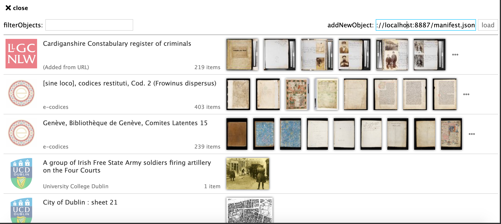
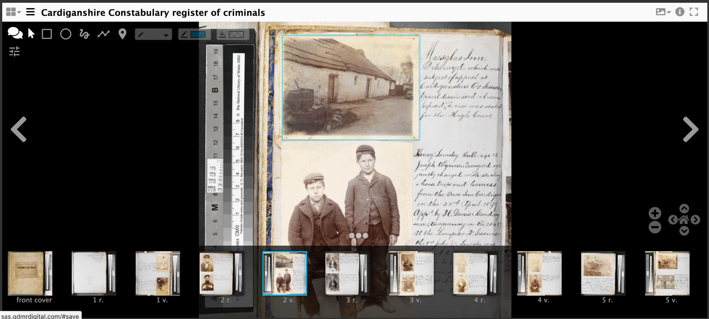
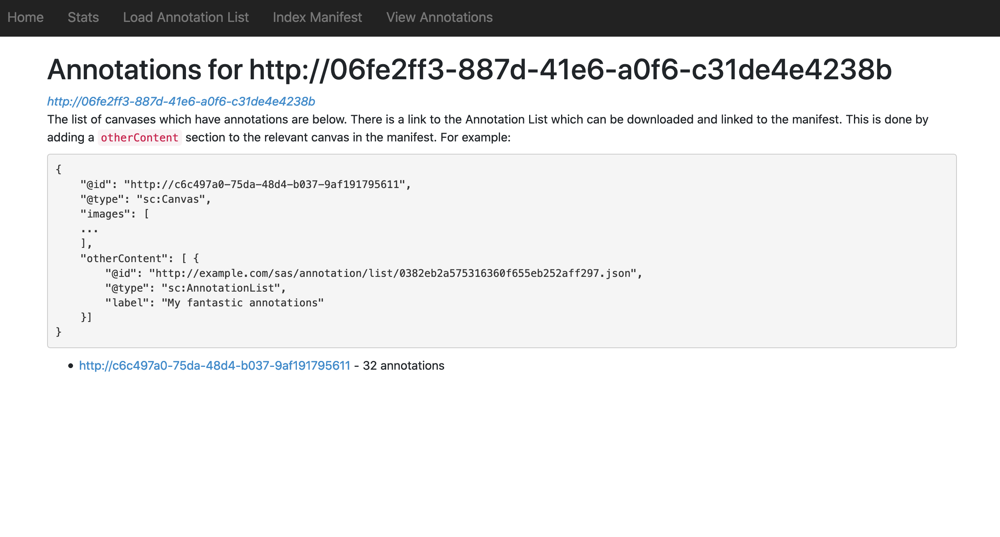
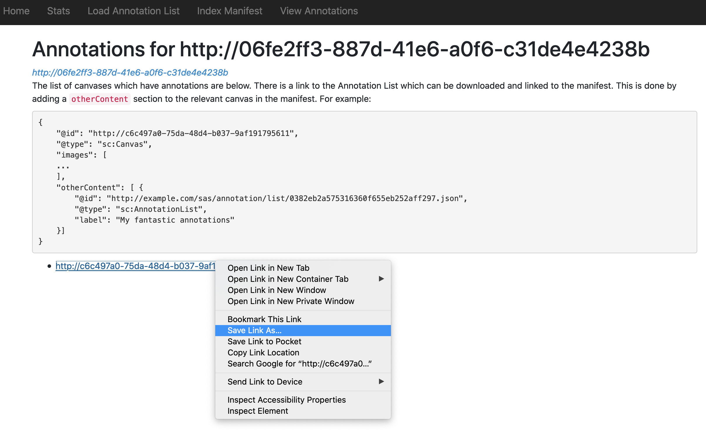
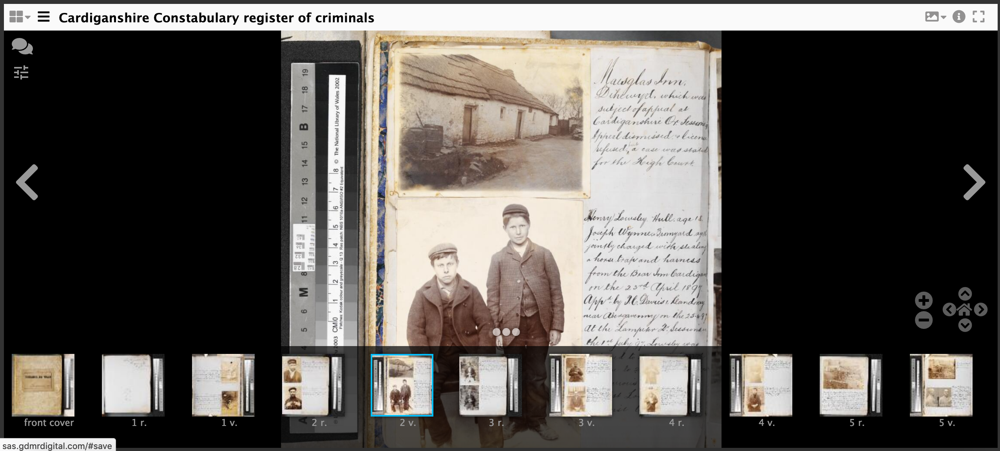

# Creating and downloading Annotations

In this tutorial we are going to annotate an image from your own manifest using the hosted SimpleAnnotationStore. Once we have finished annotating we are going to download the annotations created in an Annotation list and link them to the Manifest. This is a way of permanently attaching annotations to a manifest. 

Note from this step forward the activities get more difficult and will involve editing your Manifest. These stages are optional and will give you a complete workflow for annotating and publishing your annotations. There are three options for getting a Manifest to Annotate.

### Option 1 use the Workbench

This is the preferred option as it will save some steps later on. This option uses a combination of annotating the version of the manifest from your Workbench (see step [Publishing your Manifest](../day-three/workbench/)) and creating a copy that you can edit and test using the Chrome Web Server. For this option you need to do the following two things:

1. Download your manifest for editing

 * Navigate to the manifest in your workbench 
 * Right click on the IIIF logo and select `Save Link As`
 * Save it in the Chrome Web Server directory
 * Ensure your Chrome Web server is running. This should be running on port `8887` 
 * Open the downloaded manifest in [Atom](https://atom.io/) ready for editing. 
 
2. Copy the Manifest URL

Now go back to your manifest in the Workbench and right click on the IIIF logo again but this time select `copy link`. This will copy the Manifest URL to your clipboard. 

### Option 2 Use manifest2.json in your Chrome Web Server

As part of the Presentation API stage you created a file called `manifest2.json` in your Chrome Web Server directory. You can use this file and the URL: `http://localhost:8887/manifest2.json` for the annotations but note there are some extra steps you will need in the next section on presenting your annotations. 


### Option 3 Use any public IIIF manifest

If you didn't manage to get a manifest in the previous step you can use any IIIF Manifest. My personal favourite is:

https://damsssl.llgc.org.uk/iiif/2.0/4389767/manifest.json

## Step 1 Load your manifest into the hosted Mirador:
 * Go to http://sas.gdmrdigital.com
 * Add your manifest to the addNewObject field and click load:
   * If you are using the Workbench use the URL copied from the IIIF logo.
   * If you are using the Chrome web server the URL is: http://localhost:8887/manifest2.json

  

## Step 2: annotate manifest

 * Start annotating your manifest

  

## Step 3: Download annotations

Now you have finished annotating you need to download the annotations and link them to canvases in your manifest. To do this you will download 1 annotation list per page/canvas. 

 * Navigate to http://sas.gdmrdigital.com/manifests.xhtml

You will see a list of manifests that have been annotated by the class and previous classes. You will need to search for your manifest by getting the `@id` from your manifest. For example if my manifest started with:

```
{
	"@context": "http://iiif.io/api/presentation/2/context.json",
	"@id": "http://d937e822-64cd-4815-a6da-bc6a79f11619",
	"@type": "sc:Manifest",
	"label": "Test Manifest",
	"metadata": [],
```

I would look for `http://d937e822-64cd-4815-a6da-bc6a79f11619` in the list of Annotated Manifests. Once you have found your manifest click the link and you should see a page similar to the following:



The links at the bottom of the page are annotations for each canvas (page) you have annotated. For each canvas Right click and do save as. Save the annotations to your Google Chrome Web server folder with the name `annotations1.json`, `annotations2.json` etc... Do this step for both the Workbench and `manifest2.json` options. 



## Step 4: Link annotations to Manifest
To get the annotations to display you need to link them into the manifest. Open up your manifest in your Chrome Web Server directory in [Atom](https://atom.io/). 

Then find the canvas your annotations point to then add the following:

```json
"otherContent": [
    {
        "@id": "http://localhost:8887/annotations1.json",
        "@type": "sc:AnnotationList",
        "label": "My fantastic annotations"
    }
]
```

after the images array. A full canvas example is below:

```json
{
    "@id": "http://dams.llgc.org.uk/iiif/2.0/4004562/canvas/4004563.json",
    "@type": "sc:Canvas",
    "label": "1r",
    "height": 5584,
    "width": 3744,
    "images": [
        {
            "@id": "http://dams.llgc.org.uk/iiif/2.0/4004562/annotation/4004563.json",
            "@type": "oa:Annotation",
            "motivation": "sc:painting",
            "resource": {
                "@id": "http://dams.llgc.org.uk/iiif/2.0/image/4004563/full/1024,/0/default.jpg",
                "@type": "dctypes:Image",
                "format": "image/jpeg",
                "service": {
                    "@context": "http://iiif.io/api/image/2/context.json",
                    "@id": "http://dams.llgc.org.uk/iiif/2.0/image/4004563",
                    "profile": "http://iiif.io/api/image/2/level1.json"
                },
                "height": 5584,
                "width": 3744
            },
            "on": "http://dams.llgc.org.uk/iiif/2.0/4004562/canvas/4004563.json"
        }
    ],
    "otherContent": [
        {
            "@id": "http://localhost:8887/annotations1.json",
            "@type": "sc:AnnotationList",
            "label": "My fantastic annotations"
        }
    ]
},

```

Save the manifest. Watch out for JSON typing errors. Common JSON issues include:

 * Make sure that all the brackets match up
 * Lines that are not the last line in a list or array must have a `,` at the end of the line. 

To make this easier you may want to use a JSON aware editor like [ATOM](https://atom.io/) which will tell you if you are missing brackets or commas. You can also copy and paste your JSON to:

https://jsonlint.com/

which will tell you if the JSON is valid and if not where the error is. 

Now test your edited manifest in the browser to check it looks OK. If you are using `manifest2.json` then the link will be:

http://localhost:8887/manifest2.json

If you are using the workbench then the link will be similar but the name might be different to `mainfest2.json`. If you go to:

http://localhost:8887/

You should be able to see your manifest. If you click on your manifest you should see the JSON. If you copy the URL in the browser address bar you will have the Manifest URL for your edited manifest. 

## Step 5: check the annotations are showing

 * Go to http://iiif.gdmrdigital.com/mirador/index.html.
 * Load the manifest using Add new object from URL (using the manifest hosted in the Chrome Web Server)
 * Click on one of the images to view the manifest
 * Click on the speech bubble to show the annotations.

  

 * and if it all worked OK you should see your annotation.

  


It is also possible to do the above with a locally running SimpleAnnotationServer just follow the [Annotating Stores - Do it yourself](annotations-stores-install.md) part of the course. 
