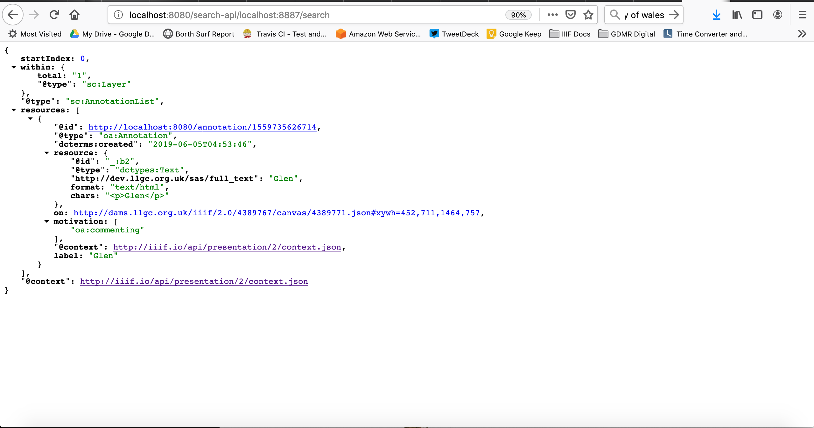
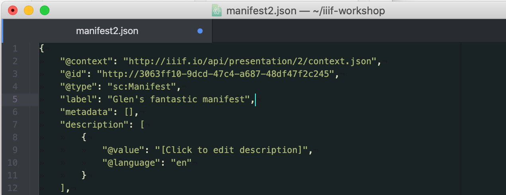
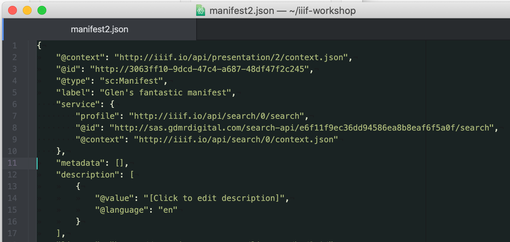

# Installing an Annotation Server (Advanced)

We are now going to attempt to install an Annotation Server locally. This is useful if you want to try out your own annotations and keep them private. It is also the only way currently to demonstrate the IIIF Search API working on your content. This exercise will need you to run some command line commands. 

A summary of the commands we will be using are:

| Command | Description |
| --- | --- |
| `cd` | Change directory |
| `ls` | list directory |
| `pwd` | to show you where you are (Print Working Directory) |

For this you will need:

## Prerequisites

### Java

If you followed the Cantaloupe or Static Images exercise as part of the Image API session you may already have this. If not you will need Java 11 installed.

 - [Downloading Java 11](https://www.oracle.com/technetwork/java/javase/downloads/jdk11-downloads-5066655.html)

To verify you have the correct package installed, you can run the following command from a terminal or command prompt:

```sh
$ java -version
# java version "1.11.0_102"
```

You should see version `1.11.x`. For more information on the install options see:

 - [Java install options](https://java.com/en/download/help/download_options.xml)

## Step 1:
  * Download the latest SimpleAnnotationServer release: [https://github.com/glenrobson/SimpleAnnotationServer/releases](https://github.com/glenrobson/SimpleAnnotationServer/releases/tag/1.0.1). Download sas.zip

  

## Step 2:
  * Extract the zip file into a `iiif-workshop` directory. 
  * __On windows__ make sure it is extracted by right click on the file and uncompressing. 
  * __Note__: this doesn't need to be in your Chrome Web server directory

## Step 3:
  * In your terminal window `cd` into the sas directory which should have been created in the last step.

```
Glens-MacBook-Pro:tmp gmr$ cd sas
Glens-MacBook-Pro:sas gmr$ ls
2019_06_05.request.log		generated-sources		maven-status			surefire-reports
classes				generated-test-sources		simpleAnnotationStore		test-classes
dependency			maven-archiver			simpleAnnotationStore.war	work
```

## Step 4:
  * Run the SimpleAnnotationStore:

```java -jar dependency/jetty-runner.jar simpleAnnotationStore.war```

## Step 5:
  * Navigate to http://localhost:8080/index.html
  * And you should see Mirador
  * Navigate to an item and make an annotation. Does it save? If not ask for help

## Step 6: 
  * Now add your manifest
    * Go to http://localhost:8080/index.html
    * Go to the list of manifests (click the big plus sign or if you are viewing a manifest click the four boxes at the top left and select 'newObject').
    * In the list of manifests paste the link to your manifest http://localhost:8887/manifest2.json into the addNewObject text field and click `load`.
 * You should now see:

  

## Step 7:
  * Add some annotations to this manifest.

## Step 8: 
  * We are now going to index the manifest and add a search API.
  * Navigate to: http://localhost:8080/uploadManifest.html
  * Upload your manifest (http://localhost:8887/manifest2.json)
  * If this was succesfull you should see the following page:

  
 
  * Copy the URL in the search bar so you can use it later. In my example above this would be `http://localhost:8080/search-api/localhost:8887/search`
  * Now open up the Manifest in Atom and it should look like this:

  

  * Now add the following JSON to the manifest after the `label`:

```
"service": {

    "profile": "http://iiif.io/api/search/0/search",
    "@id": "SEARCH_ID",
    "@context": "http://iiif.io/api/search/0/context.json"

},
```

  * Now replace the SEARCH_ID with the URL you copied earlier. In my example it would look like:

  

## Step 9:
  * Test your manifest with the Universal Viewer to see if has worked.
   * Open up http://universalviewer.io/
   * and paste your manifest http://localhost:8887/manifest2.json in the View a IIIF Manifest section
   * Does it show a search box?
   * Has it found an annotation? Note the search is case sensetive. 

Extras:

 * [Loading a Newspaper example with OCR](https://github.com/glenrobson/SimpleAnnotationServer/blob/master/doc/PopulatingAnnotations.md)
 * [Download annotations](https://github.com/glenrobson/SimpleAnnotationServer/blob/master/doc/DownloadAnnotations.md)
 * Note as well as storing Static Images you can also host manifests and annotation lists using GitHub pages. For details on loading content to Github see the [Static Images](day-two/image-servers/static-tiles.md) tutorial from Tuesday. 
