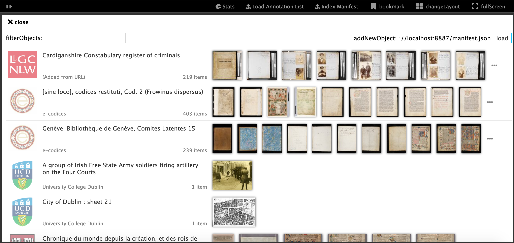

# Installing an Annotation Server (Advanced)

We are now going to attempt to install an Annotation Server locally. This is useful if you want to try out your own annotations and keep them private. This exercise will need you to run some command line commands. 

A summary of the commands we will be using are:

| Command | Description |
| --- | --- |
| `cd` | Change directory |
| `ls` | list directory |
| `pwd` | to show you where you are (Print Working Directory) |

For this you will need:

## Prerequisites

### Java

If you followed the Cantaloupe or Static Images exercise as part of the Image API session you may already have this. If not you will need Java 11 installed.

 - [Downloading Java 11](https://www.oracle.com/technetwork/java/javase/downloads/jdk11-downloads-5066655.html)

To verify you have the correct package installed, you can run the following command from a terminal or command prompt:

```sh
$ java -version
# java version "1.11.0_102"
```

You should see version `1.11.x`. 

## Step 1:
  * Download the `sas.zip` file from the latest SimpleAnnotationServer release: 

[https://github.com/glenrobson/SimpleAnnotationServer/releases](https://github.com/glenrobson/SimpleAnnotationServer/releases)

  

## Step 2:
  * Extract the zip file into a `iiif-workshop` directory. 
  * __On windows__ make sure it is extracted by right click on the file and uncompressing. 
  * __Note__: this doesn't need to be in your Chrome Web server directory

## Step 3:
  * In your terminal window `cd` into the sas directory which should have been created in the last step.

```
MacBook-Pro:tmp gmr$ cd sas
MacBook-Pro:sas gmr$ ls
dependency			simpleAnnotationStore.war
```

## Step 4:
  * Run the SimpleAnnotationStore:

```java -jar dependency/jetty-runner.jar --port 8888 simpleAnnotationStore.war```

## Step 5:
  * Navigate to http://localhost:8888/index.html
  * And you should see Mirador
  * Navigate to an item and make an annotation. Does it save? If not ask for help

## Step 6: 
  * Now add your manifest
    * Go to http://localhost:8888/index.html
    * Go to the list of manifests (click the big plus sign or if you are viewing a manifest click the four boxes at the top left and select 'newObject').
    * In the list of manifests paste the link to your manifest http://localhost:8887/manifest3.json into the addNewObject text field and click `load`.
 * You should now see:

  

## Step 7:
  * Click on your manifest in the list
  * Add some annotations to this manifest. Do they save?
  * You should now be able to use the SimpleAnnotationServer to save and search annotations. 

Extras:

 * [Loading a Newspaper example with OCR](https://github.com/glenrobson/SimpleAnnotationServer/blob/master/doc/PopulatingAnnotations.md)
 * [Download annotations](https://github.com/glenrobson/SimpleAnnotationServer/blob/master/doc/DownloadAnnotations.md)
 * Note as well as storing Static Images you can also host manifests and annotation lists using GitHub pages. For details on loading content to Github see the [Publishing your annotated Manifest](workbench.html). 
