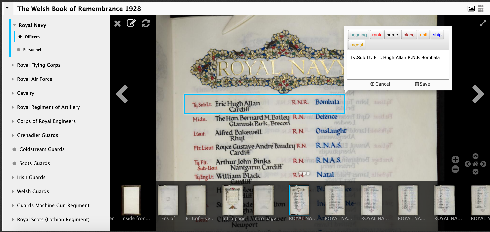
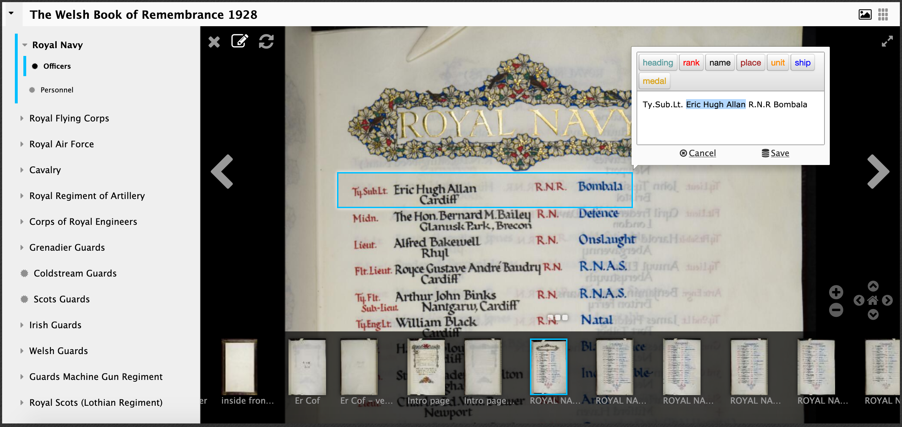
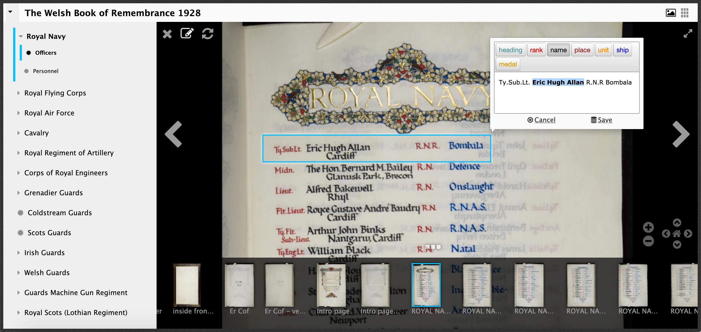
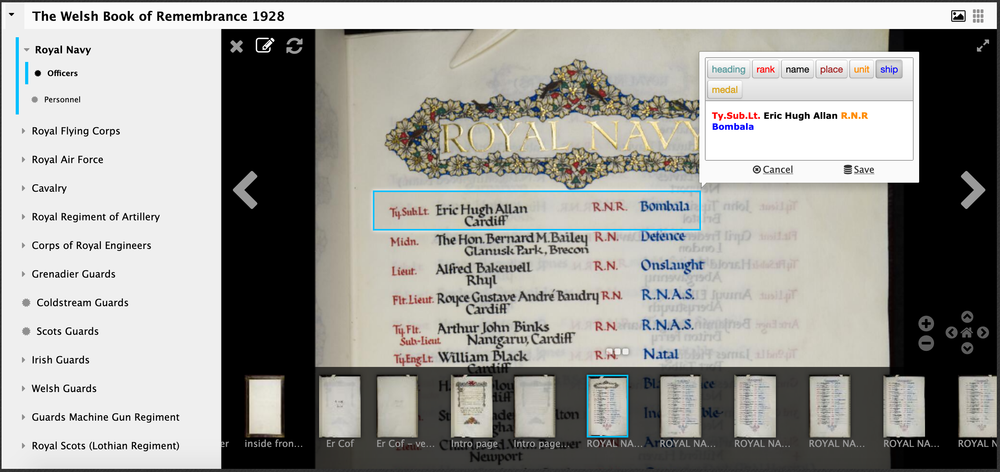
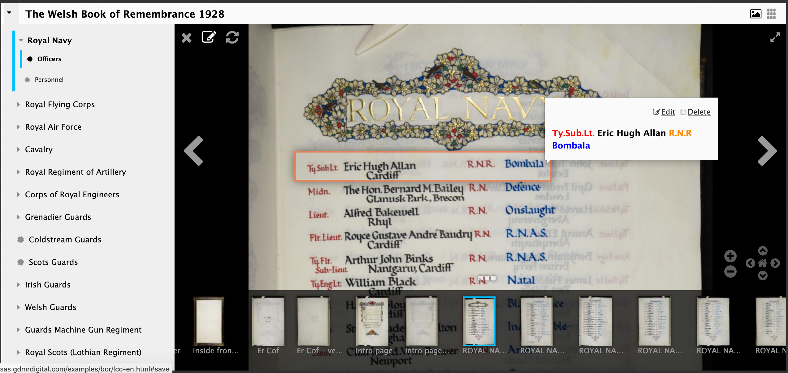

# Annotation Stores

Like image servers there are a number to choose from:

https://github.com/IIIF/awesome-iiif#annotations

Popular ones include:
 * annotot - Simple IIIF annotations mounted in a Ruby on Rails applications by Jack Reed
 * Elucidate - Java and Postgres annotation server by Digirati
 * SimpleAnnotationServer - Java annotation server backed by an Apache Jena triple store, Elastic Search, or Solr. - developed while working at the NLW

A really interesting recent development is Annonatate from [Niqui O'Neill](https://twitter.com/niqui_o) from NCSU Libraries. This is a hosted annotation store which connects to your GitHub account and allows you to store your annotations publicly using GitHub Pages website. You can see examples of the annotations it creates [here](https://github.com/iiif-test/annonatate). There is a demo video here:

<blockquote class="twitter-tweet">
This application is now live at <a href="https://t.co/fAq7CiiFdA">https://t.co/fAq7CiiFdA</a>. Please feel free to reach out to me with questions and any problems you see or open an issue on this repo: <a href="https://t.co/W4PbzHiTiA">https://t.co/W4PbzHiTiA</a> <a href="https://t.co/NRb9V24HAY">https://t.co/NRb9V24HAY</a>
&mdash; Niqui O&#39;Neill (@niqui_o) <a href="https://twitter.com/niqui_o/status/1361708671949041678?ref_src=twsrc%5Etfw">February 16, 2021</a></blockquote>  

and the application is available at [https://annonatate.herokuapp.com/]([https://annonatate.herokuapp.com/.

For this exercise we are going to be using the [SimpleAnnotationServer](https://github.com/glenrobson/SimpleAnnotationServer) and we are going to work on a copy of the Welsh Centre for International Affairs' Book of Remembrance hosted by the National Library of Wales. The live version of the books is available at:

https://viewer.library.wales/4642022 

### DOIs (Digital Object Identifiers)

As an aside a question came up about DOIs. When I worked at the National Library of Wales we created DOIs for our IIIF implementation:

http://hdl.handle.net/10107/4642022

This should resolve to the viewer link above. We didn't create a DOI for the Manifest because this was a 'presentation' of the resource rather than a constituent of the resource. IIIF aims to be good for presentation and doesn't serve the needs required for preservation. 

### Transcribing the Book of Remembrance

This example will demonstrate the following:

 * Share some experiences of using Mirador in a volunteer lead example
 * Use of Mirador with an annotation server
 * Show some of the customisation possibilities of Mirador 2

We are going to use the following version which has an annotation server connected to Mirador:

http://sas.gdmrdigital.com/examples/bor/lcc-en.html

Mirador doesn't cope well with multiple people annotating the same page at the same time so if you can randomly choose a section:

 * Cavalry
 * Corps of Lancers
 * Grenadier Guards
 * The Queen's (Royal West Surrey Regiment)
 * The King's Own (Royal Lancaster Regiment)
 * Northumberland Fusiliers
 * Norfolk Regiment
 * The Prince of Wales's Own (West Yorkshire Regiment)
 * Canadian Expeditionary Force Service in France (right at the bottom of the book)
 * New Zealand Expeditionary Force (also at the bottom)

For this exercise only transcribe a few lines to get the feel of how the annotation would work in a practical example. As part of this project we wanted to capture not just a transcription but also the fields to allow research so we customised Mirador to capture the different fields. 

To annotate a name:

## Step 1:
 * To navigate make sure the  pen and paper at the top left is disabled
 * Get the line in full view
 * Click the pen and paper to start annotating
 * Draw a box as well as you can around the name 

  

 * Now type what you see (don't worry about the buttons yet). So in this example I would type `Ty.Sub.Lt. Eric Hugh Allan R.N.R Bombala`

 * Once you've typed everything double click on a word or highlight two words if required. 

 * Now click the button that matches the type of the text. In this example I would click name and see the text go black:

 * Now do the rest:

 * Then click save:

