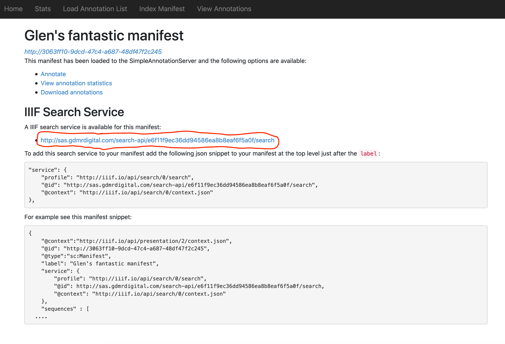

# Searching Annotations

In the last session we looked at downloading annotations so they could be linked to a manifest. In this session we are going to look at adding a Search service to the manifest so that the annotations you created can be searched using a IIIF Viewer. The procedure to achieve this is:

 * Index your manifest with the SimpleAnnotationServer
 * Add a link to the Search service in your manifest
 * Test with a IIIF Viewer


## Step 1: Index your manifest
The SimpleAnnotationServer supports the IIIF Search API but for it to be able to provide this service it needs to index the manifest so it as a list of Canvas Ids to search. To do this navigate to:

http://sas.gdmrdigital.com/uploadManifest.xhtml

and upload your Manifest. We have used http://localhost:8887/manifest2.json in previous examples.

If this is successful then you will see a page similar to the following:

  

This page gives details on how to add a link to the search service. Copy the URL circled in Red in the image above.
 
## Step 2: Link Manifest to Search Service

Now open up your Manifest in Atom and it should look like this:

  

Now add the following JSON to the manifest after the `label`:

```
"service": {
    "profile": "http://iiif.io/api/search/0/search",
    "@id": "SEARCH_ID",
    "@context": "http://iiif.io/api/search/0/context.json"
},
```

Now replace the SEARCH_ID with the URL you copied earlier. In my example it would look like:

  

## Step 3: Test with a IIIF Viewer
Test your manifest with the Universal Viewer to see if has worked.

 * Open up http://universalviewer.io/
 * and paste your manifest http://localhost:8887/manifest2.json in the View a IIIF Manifest section
 * Does it show a search box?
 * Has it found an annotation? Note the search is case sensitive. 
 * If you add an annotation in Mirador does it show up in the search results in the UV?

