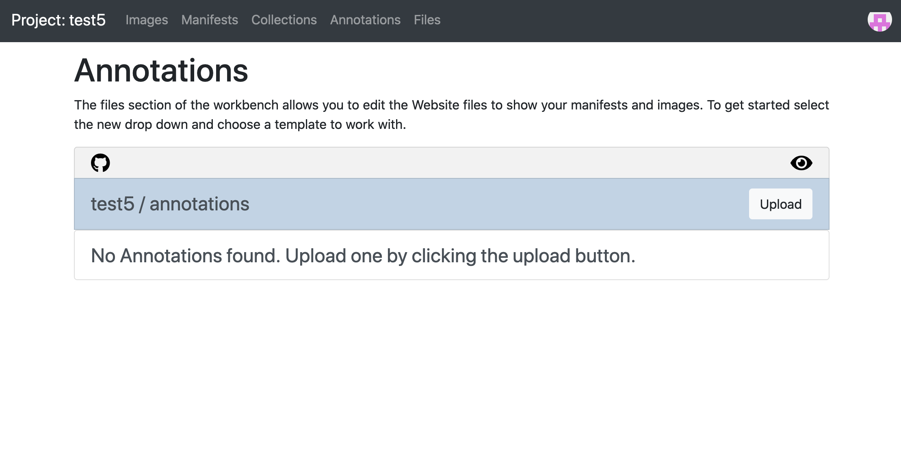
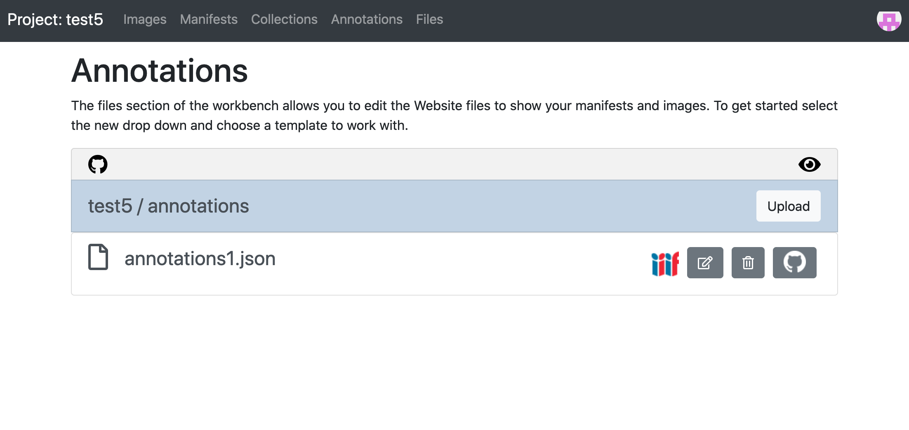

# Publishing your annotated Manifest

Now you have finished editing your manifest you can upload it to your Workbench so you can share it with others. The reason we have been developing with the Chrome Web Server version is that GitHub caches all of the Website files and so it takes a while for the changes you make to appear on the Website. 

There are three stages to this process:

 * Stage 1: Upload your annotations
 * Stage 2: Edit your manifest to point to the Annotations in Workbench
 * Stage 3: Replace your manifest on Workbench 

## Stage 1: Upload your annotations

If you go to the training workbench:

[https://workbench.gdmrdigital.com/](https://workbench.gdmrdigital.com/index.xhtml)

and navigate to the Annotations section. 

Now click upload to upload your annotation list. Once you have uploaded your annotation list you should see the following page:

The Annotations screen has similar buttons to the manifest area and from left to right these buttons do:

 * IIIF logo - right click and copy link to get the URL for your annotation list.
 * Edit - this will take you to GitHub so you can edit your annotation list.
 * Remove - this will delete the annotation list from your project.
 * GitHub - this links you to the annotation list in Github.

## Stage 2: Edit your manifest to point to the Annotations in Workbench

During the development of your manifest we asked you to link the annotations using the URL `http://localhost:8887/annotations1.json`. Now we have moved the annotations we need to update the Manifest to point to the new location. The easiest way to do this is to do a search and replace to find all instances of `http://localhost:8887/annotations1.json` and replace it with the URL you copied in the previous step. 

## Stage 3: Replace your manifest on Workbench 

Once you have edited your manifest you can navigate to the Manifests part of the Workbench and delete the old version and then Upload your edited copy. GitHub will be updated quite quickly but the public Web version can take a couple of minutes to update. If you click on the IIIF icon it will open your manifest in a new window. If you do Shift Refresh until your changes appear. 

You should now be able to see your annotations in the following places:

 * Mirador 3: https://projectmirador.org/
 * Universal Viewer: http://universalviewer.io/
 * Annona: http://iiif.gdmrdigital.com/annona/index.html?iiif-content=[annotations_url]

