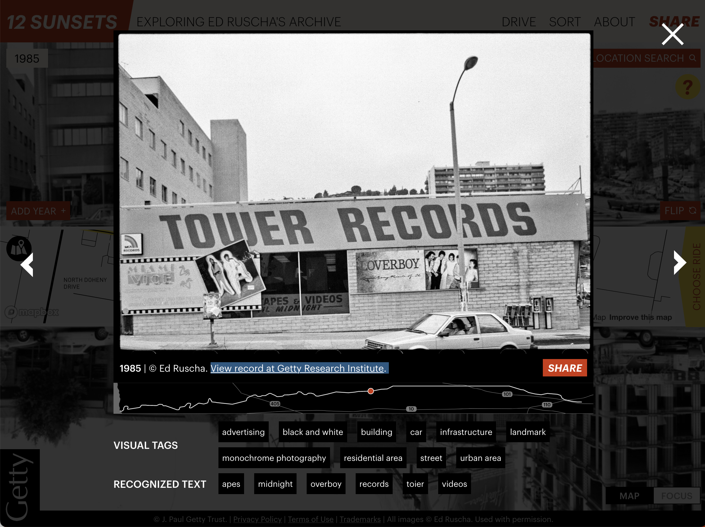
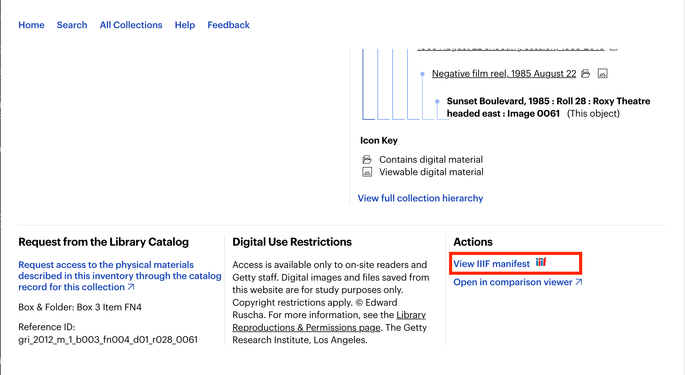
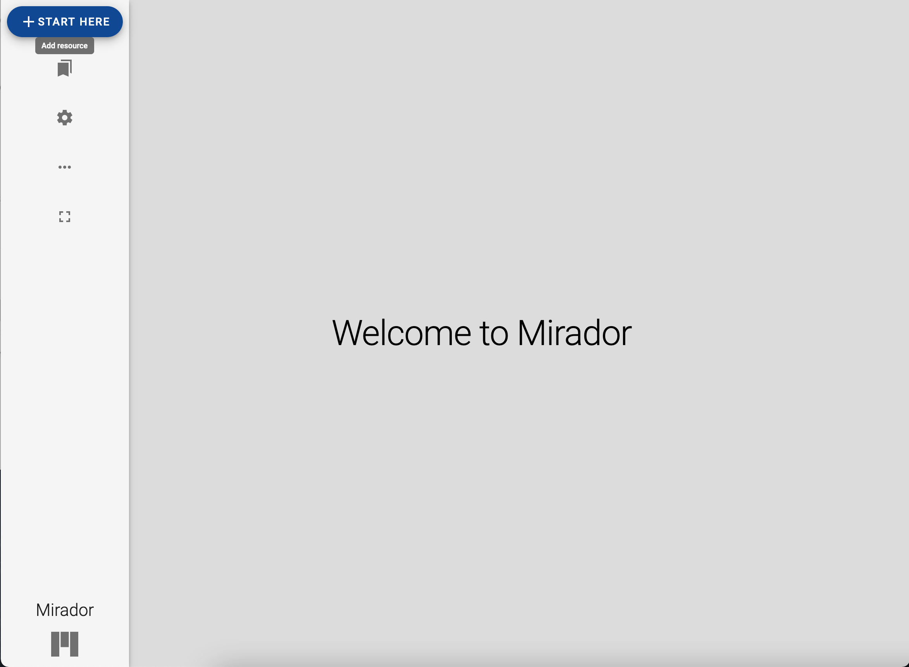
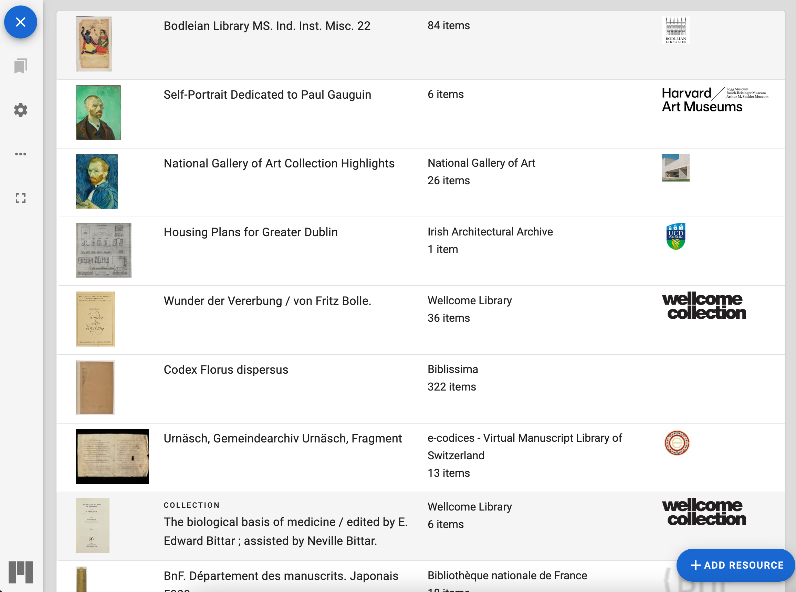
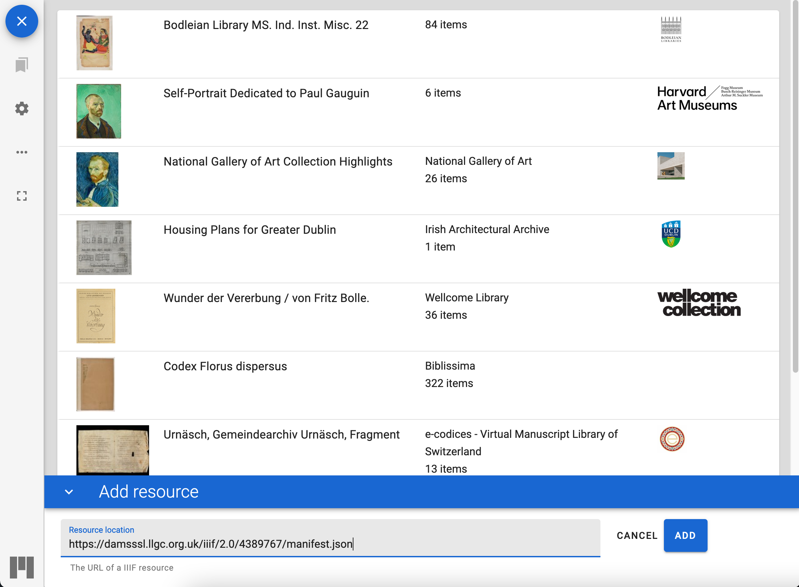
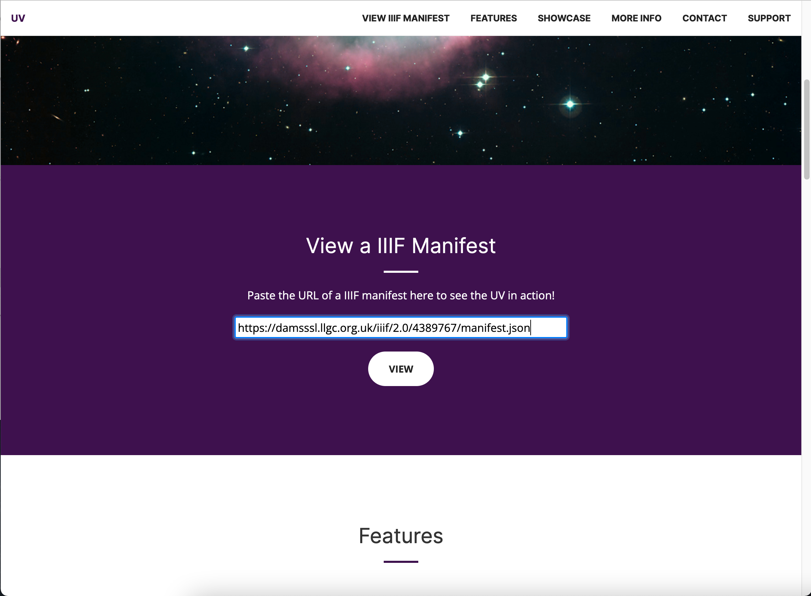

# Finding IIIF manifests in the GRI collection

For the purposes of this workshop we are going to look at a GRI item in a number of different viewers to show one of the popular use cases. This can be either from the view point of a researcher choosing a particular viewer with the tools they need to do their research or from an institution creating a custom view on their collection. 

We are going to start with the Edward Ruscha photographs of Los Angeles streets which can be found on the website below and we are going to try and find something called a IIIF Manifest. A Manifest is something defined by the IIIF standards and is a document which points to all of the images and metadata about an object. We are going to copy a link to this manifest and open it in a number of different IIIF viewers.

 * [https://12sunsets.getty.edu](https://12sunsets.getty.edu)

Once you have selected an image you will need to navigate to the record at Getty Research Institute:  

Once you have clicked on the GRI link you can scroll to the bottom of the page and look for the View IIIF manifest link. If you right click and either Copy link (Firefox) or Copy Link Address (Chrome). You now have a link to the manifest you can use in the viewers mentioned below.

You could also use the [Digital Florentine Codex](https://florentinecodex.getty.edu/). Unfortunately it isn't possible to access the Manifests through the site as the site does not have a IIIF button. So the manifest for the site is shown below:

 * [The Florentine Codex](https://dfc-django-backend.getty.digirati.io/iiif/iiif/manifest/f75b53f9-7295-41f3-9299-6bbe04685c8b/) 

# Finding IIIF manifests from other institutions  

This is also an issues for the IIIF Community is how to find IIIF resources. One method that the community is using to solve this problem is to create a list of guides showing how to access IIIF manifest for various institutions. 

This is available on the IIIF website at the following location:

[https://iiif.io/guides/finding_resources/](https://iiif.io/guides/finding_resources/)

This is a community effort and if your institution isn't listed then please feel free to add it to the [Github Repository](https://github.com/IIIF/guides) or fill in the following [Google form](https://forms.gle/S6LLjBy2o4iEBR8C9).

If you look through the different collections listed you will notice there are many ways to get the link to a Manifest and this is also something the community is looking to standardise. 

# Task: Find a Manifest

Using the guides site above find a Manifest you would like to view in one of the major IIIF viewers, either Mirador or the Universal Viewer (UV). Opening Manifests in the UV and Mirador is something that we will do a lot of during the course. 

## Opening up a Manifest in Mirador 3

Navigate to [https://projectmirador.org/](https://projectmirador.org/) and click the __Try a Live Demo__ button. Once Mirador opens close the two demo objects by clicking the two crosses highlighted in the screen shot below:

Then click the Start here button on the top left.

Then click the add resource button at the bottom right:

Finally you can paste your URL to your manifest and click Add and Mirador should open your Manifest.

## Opening up a Manifest in the Universal Viewer

Navigate to [http://universalviewer.io/](http://universalviewer.io/). Scroll down to where you see the __View a IIIF Manifest__ heading and enter in your Manifest URL and click View.

If you need to switch to a new manifest then scroll to the bottom of the UV page and enter it in the __Set IIIF Manifest Id__ box and click the button next to it. 

## Other viewers

Clover:
 * [https://samvera-labs.github.io/clover-iiif/docs/viewer/demo](https://samvera-labs.github.io/clover-iiif/docs/viewer/demo)
 * Paste the Manifest URL just below the docs button. 

IIIF Curation Viewer
 * [http://codh.rois.ac.jp/software/iiif-curation-viewer/demo/](http://codh.rois.ac.jp/software/iiif-curation-viewer/demo/) 
 * Right click in the middle and click paste

Tify
 * [https://tify.rocks/](https://tify.rocks/)
 * Scroll to the bottom and enter the manifest URL into the box and hit return. 

Annona
 * [https://ncsu-libraries.github.io/annona/tools/#/display?url=https://media.getty.edu/iiif/manifest/4fc71f54-cd9e-4d68-bb33-3866e5deb530&viewtype=iiif-storyboard&manifesturl=&settings={"fullpage"%3Atrue}](https://ncsu-libraries.github.io/annona/tools/#/display?url=https://media.getty.edu/iiif/manifest/4fc71f54-cd9e-4d68-bb33-3866e5deb530&viewtype=iiif-storyboard&manifesturl=&settings={"fullpage"%3Atrue})
 * You will have to edit the URL to get your own Manifest in here.    