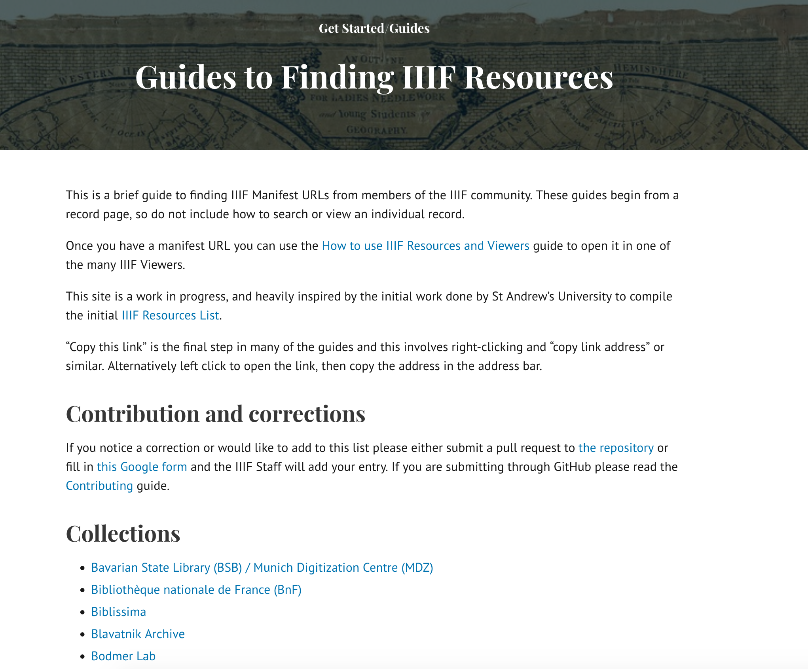
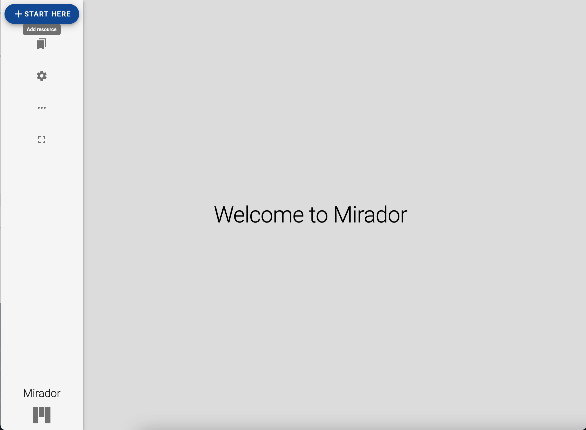
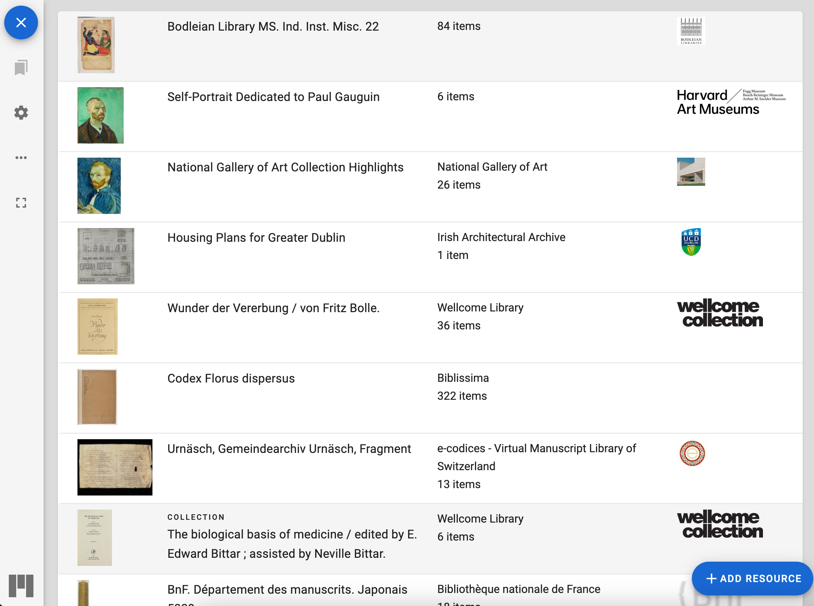
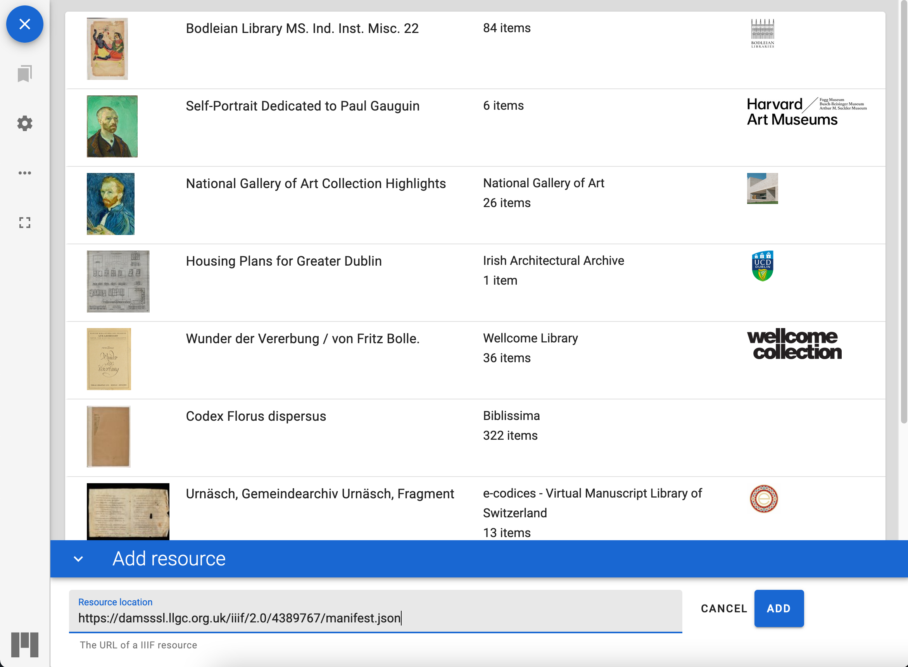
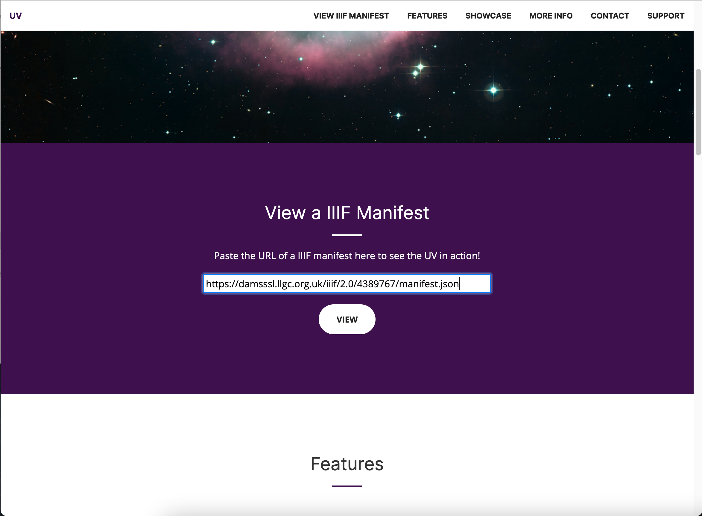

# Finding IIIF Manifests

One of the problems that the IIIF Community is struggling with is how to find IIIF resources. One method that the community is using to solve this problem is to create a list of guides showing how to access IIIF manifest for various institutions. 

This is available on the IIIF website at the following location:

[https://iiif.io/guides/finding_resources/](https://iiif.io/guides/finding_resources/)

This is a community effort and if your institution isn't listed then please feel free to add it to the [Github Repository](https://github.com/IIIF/guides) or fill in the following [Google form](https://forms.gle/S6LLjBy2o4iEBR8C9).

If you look through the different collections listed you will notice there are many ways to get the link to a Manifest and this is also something the community is looking to standardise. 

# Task: Find a Manifest

Using the guides site above find a Manifest you would like to view in Mirador or the Universal Viewer. Opening Manifests in the UV and Mirador is something that we will do a lot of during the course. 

## Opening up a Manifest in Mirador 3

Navigate to [https://projectmirador.org/](https://projectmirador.org/) and click the __Try a Live Demo__ button. Once Mirador opens close the two demo objects by clicking the two crosses highlighted in the screen shot below:

Then click the Start here button on the top left.

Then click the add resource button at the bottom right:

Finally you can paste your URL to your manifest and click Add and Mirador should open your Manifest.

## Opening up a Manifest in the Universal Viewer

Navigate to [http://universalviewer.io/](http://universalviewer.io/). Scroll down to where you see the __View a IIIF Manifest__ heading and enter in your Manifest URL and click View.

If you need to switch to a new manifest then scroll to the bottom of the UV page and enter it in the __Set IIIF Manifest Id__ box and click the button next to it. 
