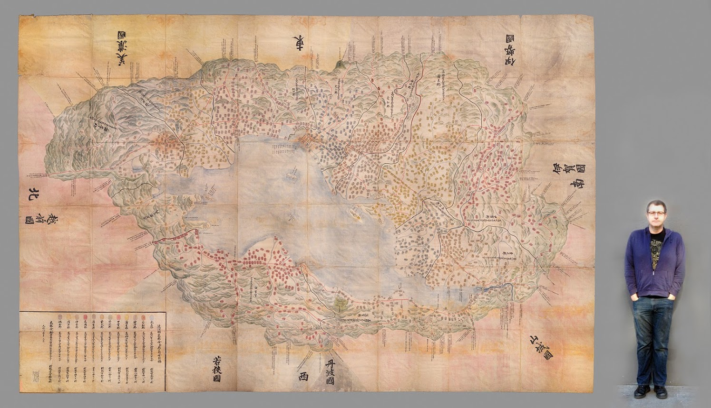
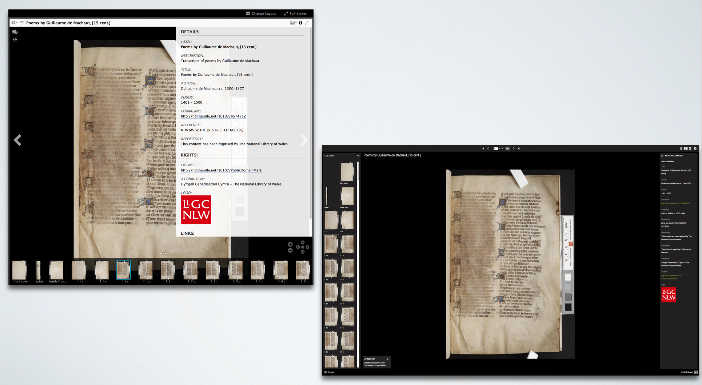
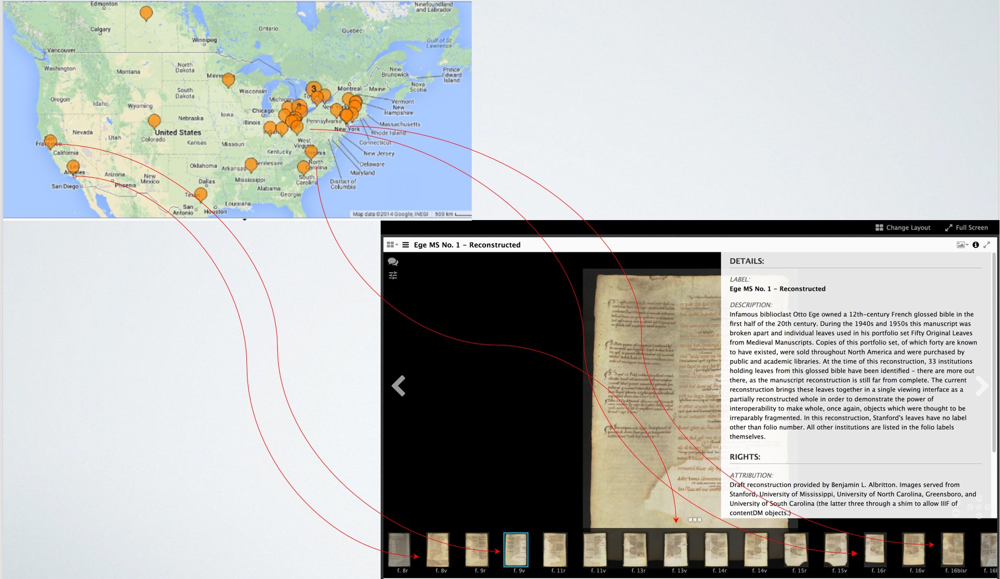
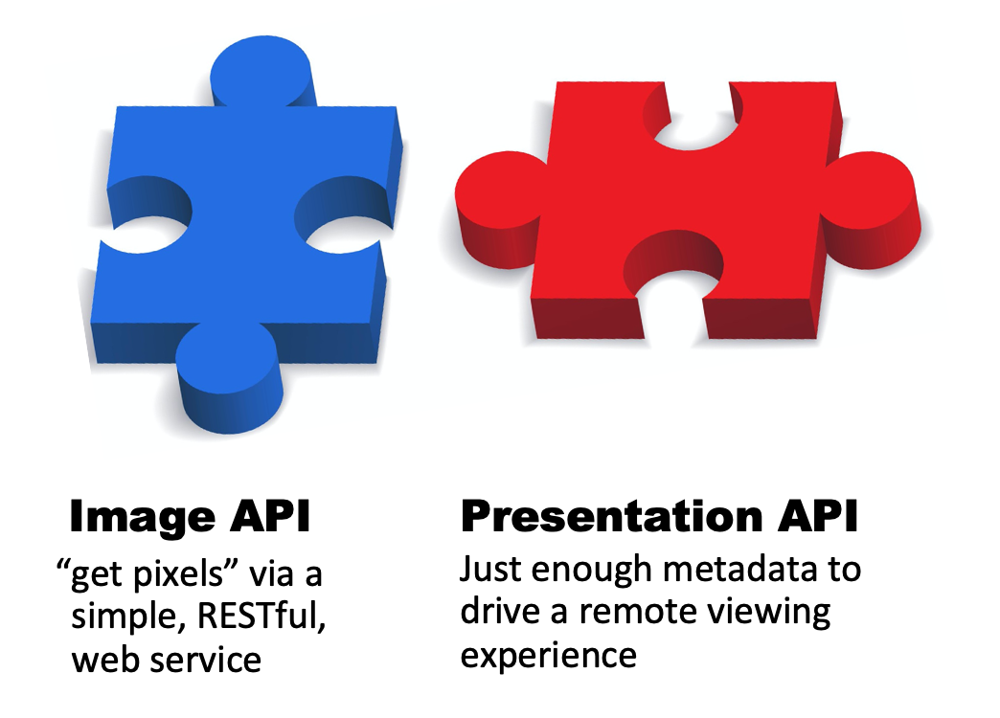

# What is IIIF?

IIIF stands for the International Image Interoperability Framework and is best described by looking at the acronym. Broadly it is two things:

<i>IIIF is a globally-adopted <b>open source</b> standardized model for delivering many types of image-based resources on the web in many different formats so that audiences can interact with them. It provides a lot of <b>benefits</b> to the institutions that use it, and when implemented across many institutions provides additional benefits <b>across institutional boundaries</b>.</i>

 

<i>But, IIIF is more than a standard: it is also an <b>open</b>, <b>global community</b> of software developers, librarians, researchers, educators, museums, universities, creative agencies, and more that work together to <b>develop open APIs, implement them in software, and expose images and A/V files</b>. It’s a grassroots effort between many different institutions to solve their shared problems with delivering, managing, sharing, and working with their resources."</i>

## International

IIIF has been implemented internationally and is not based in one country. It has been implemented by places like:

 * National Institutions:
    * Österreichische Nationalbibliothek (Austrian National Library), 
    * [BnF](https://guides.iiif.io/guides/gallica.bnf.fr/), 
    * [Library of Congress](https://guides.iiif.io/guides/loc.gov/) and 
    * the British library.  
 * Aggregators:
    * Artstore, 
    * ContentDM, 
    * Internet Archive and
    * Europeana
 * Universities & Research Institutions:
    * [Göttingen University Collections](https://guides.iiif.io/guides/gdz.sub.uni-goettingen.de/),
    * [Leiden University](https://guides.iiif.io/guides/universiteitleiden.nl/) and 
    * [Stanford University](https://guides.iiif.io/guides/searchworks.stanford.edu/)
 * Museums & Galleries:
    * British Museum, 
    * [National Gallery of Art (US)](https://guides.iiif.io/guides/nga.gov/) and 
    * [J. Paul Getty Trust](https://guides.iiif.io/guides/search.getty.edu/), 

For a fuller list of institutions who advertise their IIIF resources please see the [IIIF guides](https://guides.iiif.io/) site.

<iframe src="https://www.google.com/maps/d/embed?mid=1faJRKJpj2Vau__RDwt8af040x0GTVozp" width="640" height="480"></iframe>

## Image*

First and foremost IIIF started with the problem of making large images available on the Web. This means allowing users to zoom into large images in way that is scaleable and allows quick zooming on large images.

One of the examples of this is with the Japanese Tax Map below. In the image Wayne Vanderkuil, the Stanford lead photographer is shown next to the map for a sense of scale. Wayne is 6' 4" (1.93m) tall. The map is so big that it had to be photographed in separate sections and stitched together using Photoshop. If you click on the image below you will be taken to the IIIF image which allows you to zoom around this massive map.

For details on how this map was scanned, there is a blog post [here](https://web.archive.org/web/20230527005027/https://library.stanford.edu/blogs/digital-library-blog/2015/11/adventures-oversized-imaging-digitizing-omi-kuni-ezu-jin-jiang).

* the star next to the image is because IIIF now also supports Audio Visual resources but it was too late to change the name...

Here is an example of a video with table of contents shown in the [Universal Viewer](https://uv-v3.netlify.app/#?c=&m=&s=&cv=&manifest=https%3A%2F%2Fiiif.io%2Fapi%2Fcookbook%2Frecipe%2F0003-mvm-video%2Fmanifest.json)

## Interoperability

Interoperability can be though of in different ways and there are a few examples below on how IIIF achieves this interoperability. 

### Interoperable Viewers

First because IIIF provides a standard way of exposing images and metadata it is possible to switch viewers to view the same content. Users might want to do this for a number of reasons:

 * A Library provides content in a general purpose Viewer like the UniversalViewer
 * A user might want to take that manuscript and annotate it Mirador
 * A user might want to run some AI tools using the Curation IIIF image viewer

 * [Manuscript in NLW using the UniversalViewer](http://hdl.handle.net/10107/4574752)
 * [Same Manuscript in Mirador 3](https://projectmirador.org/embed/?iiif-content=https://damsssl.llgc.org.uk/iiif/2.0/4574752/manifest.json)
 * [IIIF Curation Viewer](http://codh.rois.ac.jp/software/iiif-curation-viewer/demo/?manifest=https://damsssl.llgc.org.uk/iiif/2.0/4574752/manifest.json)
 * [Annona](https://ncsu-libraries.github.io/annona/tools/#/display?url=https://damsssl.llgc.org.uk/iiif/2.0/4574752/manifest.json&viewtype=iiif-storyboard&settings=%7B%22fullpage%22%3Atrue%7D)
 * [Clover](https://samvera-labs.github.io/clover-iiif/docs/viewer/demo?iiif-content=https://damsssl.llgc.org.uk/iiif/2.0/4574752/manifest.json)

For instructions on how to take content from one viewer to another there is this [medium post](https://iiif-io.medium.com/how-to-use-iiif-resources-and-image-viewers-bd378a68b013). 

### Interoperable Images

The second way IIIF does interoperability is by allowing remote distributed images to be reunited in new digital editions. The manuscript below is one that was owned by the infamous biblioclast Otto Ege. In the early 20th century he split the manuscript and sold individual pages to institutions across the US. Using IIIF these images have been reconstructed in the following way:

The full manuscript can be viewer [here](https://projectmirador.org/embed/?iiif-content=https://dms-data.stanford.edu/data/manifests/Stanford/ege1/manifest.json).

Another example of a reconstructed manuscript is the one below from the BnF. Instead of brining together full images only the illustrations have been cut out and these are overlaid onto the original manuscript. In this example the illustrations are held by on institution and the manuscript by another. 

<iframe  id="mirador" title="BnF missing illustrations" width="100%" height="700" src="https://demos.biblissima.fr/chateauroux/demo/"> </iframe>

The full demo of this manuscript can be found on the [Biblissima website](https://demos.biblissima.fr/chateauroux/demo/).

There is also a IIIF Cookbook [recipe](https://iiif.io/api/cookbook/recipe/0036-composition-from-multiple-images/) for this example which supports version 3. 

### Interoperable Collections

As well as brining distributed images together it is also possible to compare different collections in a single viewer. The Mirador viewer allows side by side comparison and using the techniques discussed earlier its possible for users to collect manifests from different locations and then compare them side by side. The example we are going to use here is from a [blog by Ben Albritton of Stanford University](https://blalbrit.github.io/2015/07/14/fellow-travelers-the-canterbury-tales-and-iiif). It shows two copies of Chaucer's Canterbury Tales one from the National Library of Wales based in the UK and one from the Huntington Library in Los Angeles.

<!-- By default uses Roboto font. Be sure to load this or change the font -->
<link rel="stylesheet" href="https://fonts.googleapis.com/css?family=Roboto:300,400,500">
<!-- Container element of Mirador whose id should be passed to the instantiating call as "id" -->
 

## Framework

The last part of the acronym is Framework and this is for the different standards that IIIF provides to ensure viewers and publishers all agree on sharing compatible data. These standards are known as [APIs](https://en.wikipedia.org/wiki/API) and the two main APIs are:

These two APIs will be covered in detail in the rest of the workshop. As well as these APIs there are a number of other APIs defined by IIIF including:

 * [Content Search API](https://iiif.io/api/search/1.0) - to search annotations, a bit like a searching within a PDF file
 * [Authentication API](https://iiif.io/api/auth/1.0) - for protecting resources by username or giving lower quality images to unauthenticated users
 * [Change Discovery API](https://iiif.io/api/discovery/) - for Aggregators like Europeana to harvest IIIF data
 * [Content State API](https://iiif.io/api/content-state/) - to improve the method of taking content from one viewer to another
 * [Maps Extension](https://iiif.io/api/extension/navplace/) - to link a Geographical place to a IIIF object. Could be used to Georeference a map or photograph. 

