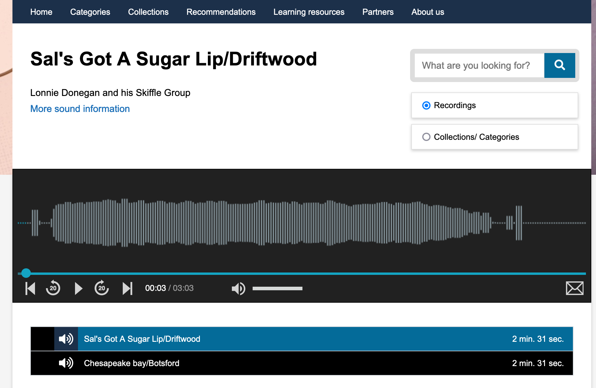
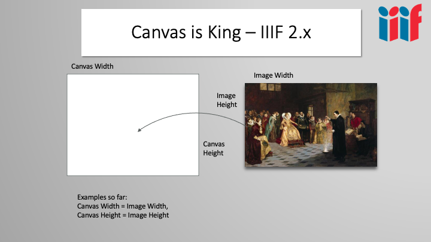
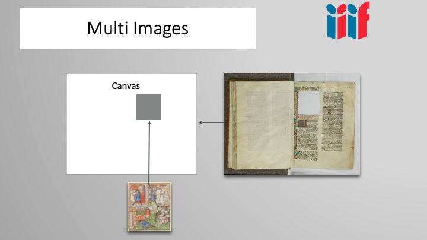
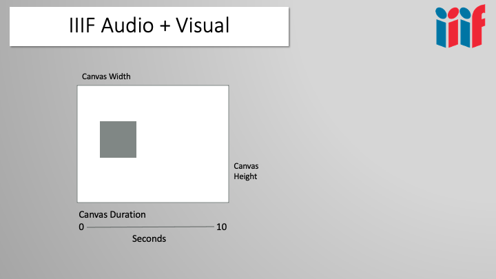
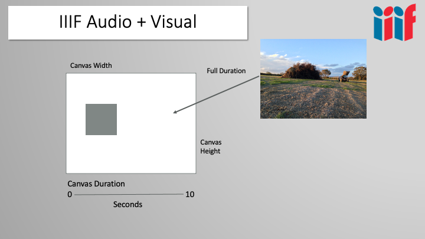
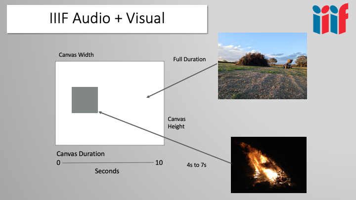

# Deep dive into the BL sound collection

The British Library has kindly provided a number of [examples](examples.md) of audio content to look at. We are going to analyse one of these Manifests and then look at creating our own Manifest by re-using the recordings from other manifests. 

The example we are going to use is the "Sal's Got A Sugar Lip/Driftwood" recording which can be viewed here:

https://sounds.bl.uk/sounds/sals-got-a-sugar-lipdriftwood-1001406563200x000006

The viewer which is used to play this recording is known as the Universal Viewer mini player. It shares a lot of code with the Universal Viewer that we've seen for images but is customised to hide things like the metadata and the canvas list. This mini player looks like this:



Unforunately there isn't a link to the IIIF Manifest on this page but this is included in the [examples](examples.md) page and is available below:

https://api-beta.bl.uk/metadata/iiif/ark:/81055/vdc_100140656320.0x000002/manifest.json

you can also discover the Manifest by opening up the Network developer tab in your browser and searching for `manifest.json`.  

There are a number of interesting features of this Manifests and before we start customising it we are going to take a look at the Manifest in detail.  

### 2 Canvases

This particular example contains two canvases and according to the Metadata this particular item is a [7" vinyl record](https://www.vectis.co.uk/vinyl/a-guide-to-record-sizes-and-speeds). There is one canvas for one side of the disk and another for the reverse. 

***Note:*** the JSON in the examples below has been collapsed to focus on the main items. Collapsed items are contained in the `[...]` and can be seen expanded in the full [manifest.json](https://api-beta.bl.uk/metadata/iiif/ark:/81055/vdc_100140656320.0x000002/manifest.json).

```
items": [

    {
        "id": "https://api-beta.bl.uk/metadata/iiif/ark:/81055/vdc_100140656320.0x000004",
        "type": "Canvas",
        "label": {
            "en": [
                "Disc 1 Side 1"
            ]
        },
        "duration": 182.88,
        "items": [ ... ],
        "thumbnail": [ ... ]
    },
    {
        "id": "https://api-beta.bl.uk/metadata/iiif/ark:/81055/vdc_100140656320.0x000005",
        "type": "Canvas",
        "label": {
            "en": [
                "Disc 1 Side 2"
            ]
        },
        "duration": 168.80000000000001,
        "items": [...],
        "thumbnail": [...]
    }
],
```

The duration is measured in seconds and is approximately `182 seconds` for the first canvas and `168 seconds` for the second canvas. Interestingly you will note in the [website](https://sounds.bl.uk/sounds/sals-got-a-sugar-lipdriftwood-1001406563200x000006) that the two recordings linked below the mini player are "Sal's Got A Sugar Lip/Driftwood" and "Chesapeake bay/Botsford". You might expect the names of these recordings would come from the canvas label so be "Disc 1 Side 1" and "Disc 1 Side 2". The labels are actually coming from the structure or table of contents explained below.

### Structure

You can see in the example below that the label for the files in the [website](https://sounds.bl.uk/sounds/sals-got-a-sugar-lipdriftwood-1001406563200x000006) is coming from the range. I believe this is done so that the Manifest can show two different orderings of the content. The first in the sequence that matches the physical layout on disk. The second order is provided in the structures element and is a logical ordering of the recording. In this example the physical layout exactly matches the logical layout so the range targets the full canvas duration.   

You can imagine other scenarios particularly with tapes where the sequence would contain two canvases, one for each side of the tape. The structures element would split the recording into logical units like individual interviews and these could cross between canvases or tape sides so would need to be combined in a range. 

```
structures": [
    "items": [
        {
            "id": "https://api-beta.bl.uk/metadata/iiif/ark:/81055/vdc_100140656320.0x000006",
            "type": "Range",
            "label": {
                "en": [
                    "Sal's Got A Sugar Lip/Driftwood"
                ]
            },
            "metadata": [...],
            "requiredStatement": {...},
            "rendering": [...],
            "items": [
                {
                    "id": "https://api-beta.bl.uk/metadata/iiif/ark:/81055/vdc_100140656320.0x000004#t=00.00,182.88",
                    "type": "Canvas"
                }
            ]
        },
        {
            "id": "https://api-beta.bl.uk/metadata/iiif/ark:/81055/vdc_100140656320.0x000008",
            "type": "Range",
            "label": {
                "en": [
                    "Chesapeake bay/Botsford"
                ]
            },
            "metadata": [...],
            "requiredStatement": {...},
            "rendering": [ ... ],
            "items": [
                {
                    "id": "https://api-beta.bl.uk/metadata/iiif/ark:/81055/vdc_100140656320.0x000005#t=00.00,168.80",
                    "type": "Canvas"
                }
            ]
        }
    ]
]
```

## Canvas deep dive

The canvas is a core feature of IIIF. For images the canvas is usually equivalent to a page in a book. For AV material the distinction can be more complicated. It is sometimes thought of as a empty powerpoint slide where images or audio are `painted` on to the slide at particular positions. 

In the slide below you can see the canvas has a height and a width. The example image is `painted` on to the full canvas so that the canvas width and height match the image width and height. This is the most common use case for IIIF images.



In the following example you can see two images are painted onto one canvas. One image is the background manuscript and the second image is the illustration. The background manuscript image is `painted` on to the canvas and matches the canvas height and width. The Illustration is `painted` on to a particular region of the canvas so that it appear in the correct place. 



The support for AV in IIIF entailed the addition of duration to the canvas. Now a canvas can have a height, width and duration. Different dimensions are needed for different content types i.e:

 * Images required width and height
 * Audio only files require duration
 * Video files required width, height and duration



With the canvas example below we have an imagined duration of 10 seconds. We can now `paint` an image on to the canvas and set it for a duration of 10 seconds so it will show for the full duration of the canvas. 



We can also `paint` a video on to the canvas and in the example below it is painted on a particular region of the canvas and set to play starting at second 4 and finishing at second 7. 



You can keep on adding images, videos and text to create a complicated canvas. The examples above where developed during the discussions on adding AV and a prototype presentation of this canvas can be seen at the following URL:

https://tomcrane.github.io/fire/

The method for `painting` an image, audio or video resource on to a IIIF canvas is done through an annotation. If we look at the following example where we can assume the body of the annotation is an audio recording. We can see the `target` points to the canvas ID and adds `#t=00.00,182.88` to the end of the canvas id. This means the body (audio resource) is painted on to the canvas from the start (second 00.00) to the end (second 182.88). In this case the `target` points to the full duration of the canvas so the addition of the `#t=00.00,182.88` isn't necessary as if the target points to the canvas id then it is assumed to cover the full duration of the canvas. 

```
{
    "id": "https://api-beta.bl.uk/metadata/iiif/ark:/81055/vdc_100140656320.0x000004/anno1/1",
    "type": "Annotation",
    "motivation": "painting",
    "target": "https://api-beta.bl.uk/metadata/iiif/ark:/81055/vdc_100140656320.0x000004#t=00.00,182.88",
    "body": [ ... ]
}
```

Note if the audio resource in the body is longer than the time specified in the canvas it should be played faster and if the audio resource is shorter than the target region then it should be played slower to fit the desired duration. 

The full first canvas for the example is shown below.  

```
{

    "id": "https://api-beta.bl.uk/metadata/iiif/ark:/81055/vdc_100140656320.0x000004",
    "type": "Canvas",
    "label": {
        "en": [
            "Disc 1 Side 1"
        ]
    },
    "duration": 182.88,
    "items": [
        {
            "id": "https://api-beta.bl.uk/metadata/iiif/ark:/81055/vdc_100140656320.0x000004/anno1",
            "type": "AnnotationPage",
            "items": [
                {
                    "id": "https://api-beta.bl.uk/metadata/iiif/ark:/81055/vdc_100140656320.0x000004/anno1/1",
                    "type": "Annotation",
                    "motivation": "painting",
                    "target": "https://api-beta.bl.uk/metadata/iiif/ark:/81055/vdc_100140656320.0x000004#t=00.00,182.88",
                    "body": [
                        {
                            "type": "Choice",
                            "items": [
                                {
                                    "id": "https://api-beta.bl.uk/media/iiif/ark:/81055/vdc_100140656320.0x00000e/manifest.mpd",
                                    "format": "application/dash+xml",
                                    "type": "Sound",
                                    "service": [ ... ]
                                },
                                {
                                    "id": "https://api-beta.bl.uk/media/iiif/ark:/81055/vdc_100140656320.0x00000e/index.m3u8",
                                    "format": "application/vnd.apple.mpegURL",
                                    "type": "Sound",
                                    "service": [...]
                                }
                            ]
                        }
                    ],
                    "seeAlso": [...]
                }
            ]
        }
    ],
    "thumbnail": [ ... ]
},
```

### Providing access to different audio formats

Another interesting aspect of this Manifest is the `choice` that is present in the annotation body. Usually you would just see a link to the audio resource as in this [IIIF Cookbook recipe](https://iiif.io/api/cookbook/recipe/0002-mvm-audio/).  With the choice in the body you are providing the IIIF Viewer with the option to choose one of the formats. It maybe that the viewer only support one type and so would select that one. The two formats available are [MPEG-Dash](https://en.wikipedia.org/wiki/Dynamic_Adaptive_Streaming_over_HTTP) and [HTTP live Streaming](https://en.wikipedia.org/wiki/HTTP_Live_Streaming). It appears both formats are similar streaming formats but are supported by different devices:

___"Both HLS and MPEG-DASH offer adaptive streaming and similar levels of quality and latency. But HLS is best for live streaming, while MPEG-DASH is best for on-demand streaming. HLS is more compatible with Apple devices, while MPEG-DASH is more compatible with other devices."___

From: https://www.gumlet.com/learn/hls-vs-dash/

```
"body": [
    {
        "type": "Choice",
        "items": [
            {
                "id": "https://api-beta.bl.uk/media/iiif/ark:/81055/vdc_100140656320.0x00000e/manifest.mpd",
                "format": "application/dash+xml",
                "type": "Sound",
                "service": [ ... ]
            },
            {
                "id": "https://api-beta.bl.uk/media/iiif/ark:/81055/vdc_100140656320.0x00000e/index.m3u8",
                "format": "application/vnd.apple.mpegURL",
                "type": "Sound",
                "service": [...]
            }
        ]
    }
],
```

### Waveform image

When you view the example audio file on the [website](https://sounds.bl.uk/sounds/sals-got-a-sugar-lipdriftwood-1001406563200x000006) you will see a Waveform which can be used to visualize the audio recording. This is achieved by adding a `seeAlso` to the canvas pointing to the Waveform. The `seeAlso` property is used to point to machine readable metadata and in this case points to a generated Waveform presumably using the [BBC tools](https://waveform.prototyping.bbc.co.uk/). Viewers won't necessarily support the Waveform profile but in this case the UV will show an image of the Waveform to enable easier browsing through a recording. 

```
seeAlso": [{
        "id": "https://api-beta.bl.uk/waveform/vdc_100140656320.0x000010",
        "type": "Dataset",
        "format": "application/octet-stream",
        "profile": "http://waveform.prototyping.bbc.co.uk"
}]
```

### Accompanying canvas

This can't be seen in the BL sound website but there is an image associated with the Manifest which should be shown to the user while the audio is playing. Presumably this is to allow the viewer to show something if it can't understand the Waveform profile. The supplied image is of the original vinyl:


An Accompanying Canvas is a special type of Canvas which is played while the main content is also playing. There is a [Cookbook recipe](https://iiif.io/api/cookbook/recipe/0014-accompanyingcanvas/) on accompanying canvas with further details on it's use. 

```
accompanyingCanvas": {

    "id": "https://api-beta.bl.uk/metadata/iiif/ark:/81055/vdc_100140656320.0x000002/c/poster",
    "type": "Canvas",
    "label": {
        "en": [
            "Illustration"
        ]
    },
    "width": 1440,
    "height": 1434,
    "items": [
        {
            "id": "https://api-beta.bl.uk/metadata/iiif/ark:/81055/vdc_100140656320.0x000002/c/a1",
            "type": "AnnotationPage",
            "items": [
                {
                    "id": "https://api-beta.bl.uk/metadata/iiif/ark:/81055/vdc_100140656320.0x000002/c/a1/a1",
                    "type": "Annotation",
                    "motivation": "painting",
                    "target": "https://api-beta.bl.uk/metadata/iiif/ark:/81055/vdc_100140656320.0x000002/c/poster",
                    "body": [
                        {
                            "id": "https://api-beta.bl.uk/image/static/ark:/81055/vdc_100140656320.0x000011?vdc_100140656320.0x000002",
                            "type": "Image",
                            "width": 1440,
                            "height": 1434,
                            "format": "image/jp2"
                        }
                    ]
                }
            ]
        }
    ]

},
```

### View Manifest in full UV

To see some of the hidden functionality we can have a look at the Manifest in the regular Universal Viewer:

https://uv-v4.netlify.app/#?manifest=https://api-beta.bl.uk/metadata/iiif/ark:/81055/vdc_100140656320.0x000002/manifest.json

You will notice a number of differences with the mini player. For example:

* The accompanying canvas image is showing. 
* The canvas labels for each side of the disk can be seen in the Thumbnails tab on the left hand side. 
* The Range is shown by switching the Thumbnails tab to Index.
