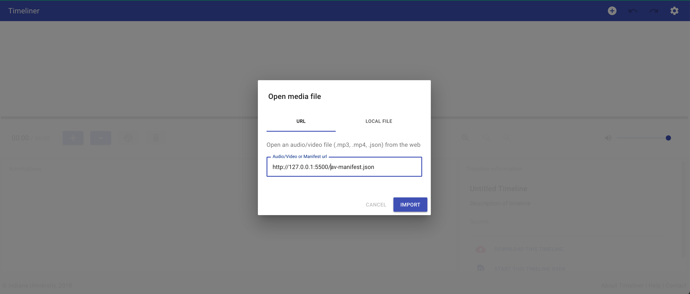
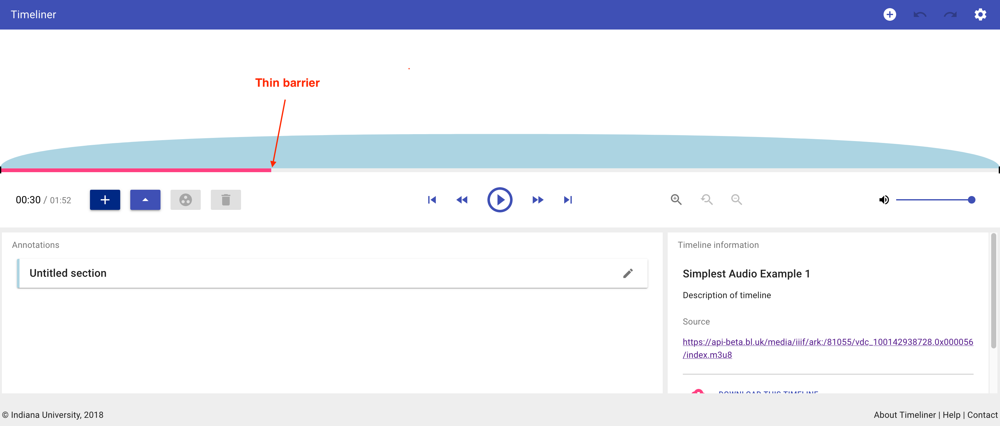

# Remix an audio file

For this exercise we are going to take the "Rough sea with heavy surf, England, 1996" recording from the following item:

https://sounds.bl.uk/sounds/rough-sea-with-heavy-surf-england-1996-1001429387280x000028

We are then going to create a new Manifest and add a table of contents using the Indiana University Timeliner tool. 

## Step 1: Find the information about the recording

The manifest for the above recording is available at:

https://api-beta.bl.uk/metadata/iiif/ark:/81055/vdc_100142938728.0x000001/manifest.json

and searching for the label "Rough sea with heavy surf, England, 1996" we find the following range:

```
{

    "id": "https://api-beta.bl.uk/metadata/iiif/ark:/81055/vdc_100142938728.0x000028",
    "type": "Range",
    "label": {
        "en": [
            "Rough sea with heavy surf, England, 1996"
        ]
    },
    "metadata": [...],
    "rights": "https://creativecommons.org/licenses/by/4.0",
    "requiredStatement": {...},
    "rendering": [...],
    items": [{
        "id": "https://api-beta.bl.uk/metadata/iiif/ark:/81055/vdc_100142938728.0x000001/canvas/node-id-000040#t=00.00,112.00",
        "type": "Canvas"
    }]
}
```

Using the canvas id in the `items` part of the range we can find the canvas that we want. 

```
{

    "id": "https://api-beta.bl.uk/metadata/iiif/ark:/81055/vdc_100142938728.0x000001/canvas/node-id-000040",
    "type": "Canvas",
    "label": {
        "en": [
            "[No Title]"
        ]
    },
    "duration": 112.0,
    "items": [
        {
            "id": "https://api-beta.bl.uk/metadata/iiif/ark:/81055/vdc_100142938728.0x000001/canvas/node-id-000040/anno20",
            "type": "AnnotationPage",
            "items": [
                {
                    "id": "https://api-beta.bl.uk/metadata/iiif/ark:/81055/vdc_100142938728.0x000001/canvas/node-id-000040/anno20/1",
                    "type": "Annotation",
                    "motivation": "painting",
                    "target": "https://api-beta.bl.uk/metadata/iiif/ark:/81055/vdc_100142938728.0x000001/canvas/node-id-000040#t=00.00,112.00",
                    "body": [
                        {
                            "type": "Choice",
                            "items": [
                                {
                                    "id": "https://api-beta.bl.uk/media/iiif/ark:/81055/vdc_100142938728.0x000056/manifest.mpd",
                                    "format": "application/dash+xml",
                                    "type": "Sound",
                                    "service": [
                                        {
                                            "id": "https://api-beta.bl.uk/auth/iiif/login",
                                            "type": "AuthCookieService1"
                                        },
                                        {
                                            "id": "https://api-beta.bl.uk/media/dash/ark:/81055/vdc_100142938728.0x000056/probe.json",
                                            "type": "AuthProbeService1",
                                            "profile": "http://iiif.io/api/auth/1/probe"
                                        }
                                    ]
                                },
                                {
                                    "id": "https://api-beta.bl.uk/media/iiif/ark:/81055/vdc_100142938728.0x000056/index.m3u8",
                                    "format": "application/vnd.apple.mpegURL",
                                    "type": "Sound",
                                    "service": [
                                        {
                                            "id": "https://api-beta.bl.uk/auth/iiif/login",
                                            "type": "AuthCookieService1"
                                        },
                                        {
                                            "id": "https://api-beta.bl.uk/media/hls/ark:/81055/vdc_100142938728.0x000056/probe.json",
                                            "type": "AuthProbeService1",
                                            "profile": "http://iiif.io/api/auth/1/probe"
                                        }
                                    ]
                                }
                            ]
                        }
                    ],
                    "seeAlso": [
                        {
                            "id": "https://api-beta.bl.uk/waveform/vdc_100142938728.0x000056",
                            "type": "Dataset",
                            "format": "application/octet-stream",
                            "profile": "http://waveform.prototyping.bbc.co.uk"
                        }
                    ]
                }
            ]
        }
    ],
    "thumbnail": [
        {
            "id": "https://api-beta.bl.uk/hub-logo/audio-tape.png",
            "Type": "Image"
        }
    ]

},
```

The bits we are interested in are the duration and the links to the files:

```
    "duration": 112.0,
```

```
    "body": [
        {
            "type": "Choice",
            "items": [
                {
                    "id": "https://api-beta.bl.uk/media/iiif/ark:/81055/vdc_100142938728.0x000056/manifest.mpd",
                    "format": "application/dash+xml",
                    "type": "Sound"
                },
                {
                    "id": "https://api-beta.bl.uk/media/iiif/ark:/81055/vdc_100142938728.0x000056/index.m3u8",
                    "format": "application/vnd.apple.mpegURL",
                    "type": "Sound"
                }
            ]
        }
    ],
```

Note the authorization service has been removed. As this content is open access the authentication service doesn't function for this resource so to simplifying things it can be removed. 

## Step 2: Use cookbook and insert new recording

Download the JSON-LD from the Audio cookbook by right clicking on the JSON-LD link and clicking "Save Link As":

https://iiif.io/api/cookbook/recipe/0002-mvm-audio/

Save the manifest.json to your `iiif-workshop` directory and called it `av-manifest.json`. 

Edit the duration field to `112.00` and copy in the body from the code sample above. You should have a manifest that looks like [manifest-single-recording.json](manifest-single-recording.json).

Now test that this manifest works before we go any further. Ensure you have the VS Code Live Server running then you should be able to click on the following link to view your Manifest:

https://uv-v4.netlify.app/#?manifest=http://127.0.0.1:5500/av-manifest.json&c=&m=&s=&cv=&xywh=

## Step 3: Load Manifest to Timeliner

Now you have the manifest working you need to make a slight change to the manifest so that it will open in the Timeliner. This is to do with the order of the different audio files as Timeliner currently has a problem with MPEG-Dash files. In the av-manifest.json file swap the different files so the index.m3u8 one is first:

```
    "type": "Choice",
    "items": [
        {
            "id": "https://api-beta.bl.uk/media/iiif/ark:/81055/vdc_100142938728.0x000056/index.m3u8",
            "format": "application/vnd.apple.mpegURL",
            "type": "Sound"
        },
        {
            "id": "https://api-beta.bl.uk/media/iiif/ark:/81055/vdc_100142938728.0x000056/manifest.mpd",
            "format": "application/dash+xml",
            "type": "Sound"
            }
        ]
    ]
```

Now navigate to the Timeliner and add the link to your manifest.



To break the recording up into chapters click on the thin barrier highlighted in the image below. Then click the + button to create a new section. You can edit the name of your section by clicking the pencil next to the section name. 



Create three or four chapters by repeating the steps above.

## Step 4: Test table of contents

You can export from Timeliner and it will create a manifest with the new structure included. 

Now we can test to see if the changes you made work in the Universal Viewer. Unfortunately the UV doesn't support HLS and the Timeliner doesn't support  MPEG dash so in step three we had to re-organise the order of derivatives and now we have to do the reverse so that MPEG dash is first.

Once you have done this change you should be able to open your manifest in the UV and see the table of contents included. 

https://uv-v4.netlify.app/#?manifest=http://127.0.0.1:5500/av-manifest.json&c=&m=&s=&cv=&xywh=