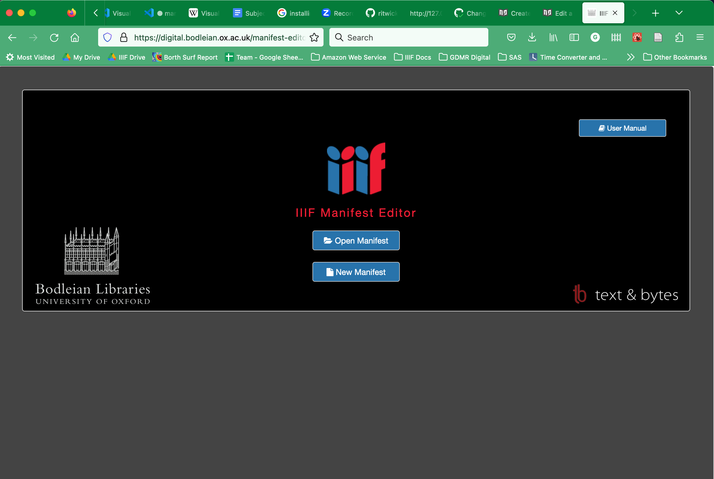
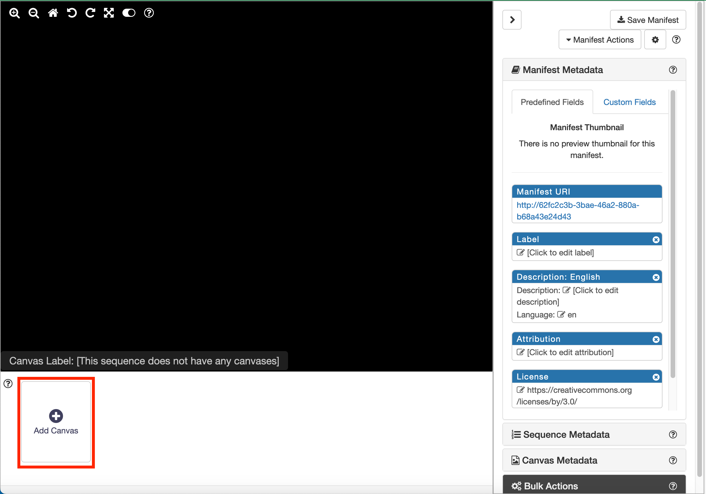
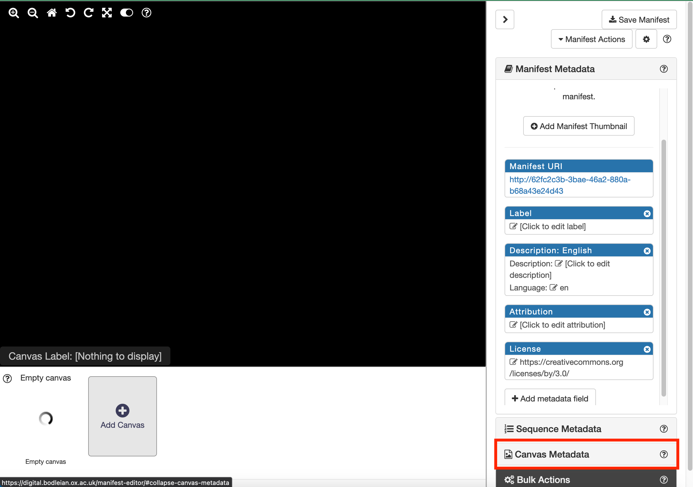
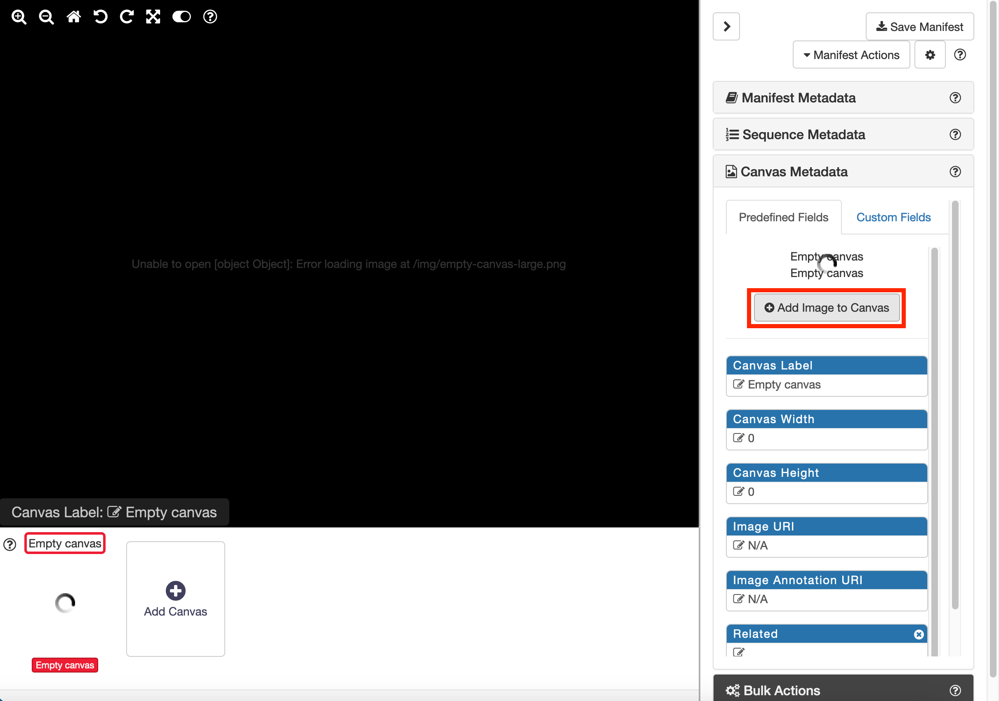
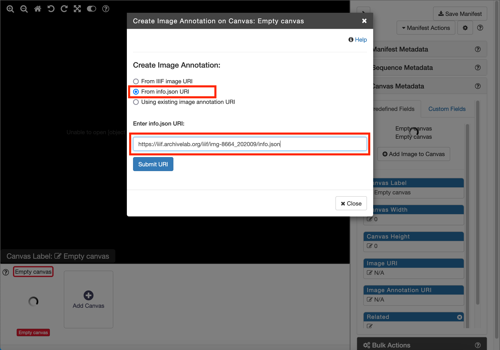
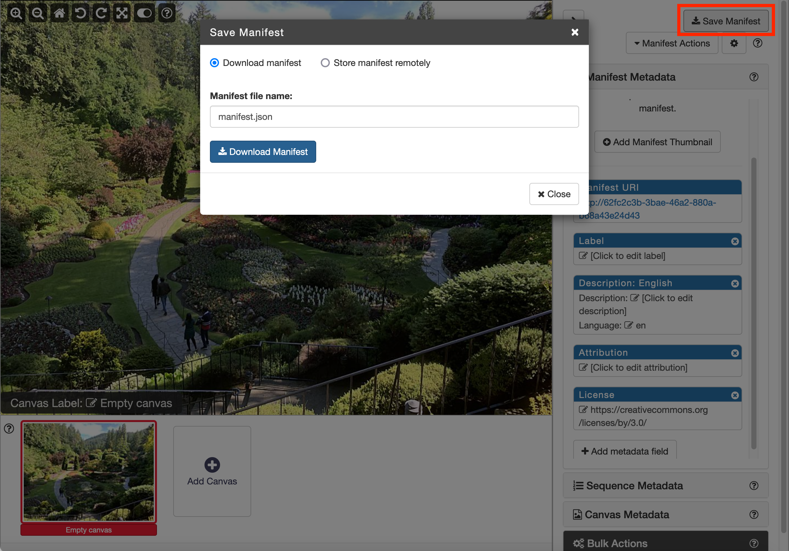

# Create a IIIF Manifest using the Bodleian Manifest Editor

## Gather images
First, assemble a list of IIIF `info.json` URLs for your content.  
 * Here is a sample image at [Klokan](http://free.iiifhosting.com/iiif/f9a02a80bf76333f50ffcf0f0c17aa58f9ebf6a1510c9801bde50f565ac0a936/info.json)
 * Here is a sample image at the [Yale Center for British Art](https://images.collections.yale.edu/iiif/2/ycba:9e08d901-a26b-4acb-a768-28f90a062adf/info.json)
   
## Use the Bodleian Manifest Editor to create a manifest

Navigate to the editor.  If *any* of your `info.json` URLs begin with HTTP, use the HTTP version.  See the [Note on Mixed Content](#note-on-mixed-content) section below for more information.  

- HTTP version at [text and bytes](http://iiif-manifest-editor.textandbytes.com/)
- HTTPS version at [the Bodleian](https://digital.bodleian.ox.ac.uk/manifest-editor/)

### Note on Mixed Content
The links above to Universal Viewer use the HTTP version of the site to avoid Mixed Content errors.  Likewise, you will need to use version of the Bodleian Manifest Editor served over HTTP if any of your IIIF images are served via HTTP. See this article on [Mixed Content](https://developers.google.com/web/fundamentals/security/prevent-mixed-content/what-is-mixed-content) for an explanation of the issue.

## Steps to create your Manifest

### Step 1
Click on the create New Manifest button.

### Step 2

Click the Add Canvas button

Select the Canvas Metadata on the right hand side of the screen. 

***Note***: the Empty canvas thumbnail on the left will keep on spinning until you add an image. If you use a level 0 image this thumbnail will keep on spinning as Manifest editors does not support level 0 images as thumbnails. The main image should work OK for a level 0 image. 

Now click the Add Image to Canvas button. 

***Note:*** again the thumbnail will still be spinning and there is also another spinning circle above the button which will disappear when an image is selected. The main image also says it can't load `/img/empty-canvas-large.png` but ignore this too as it will disappear when an image has been loaded. 

In the following dialog select the 'From info.json URI' option and enter your info.json into the text box. Then click Submit URI.

Once the image is loaded you should see something similar to the screenshot below. Note it may take a few minutes for the image to load if you are using the Internet Archive.  You should see the thumbnail at the bottom and above the Add Image to canvas button. 

Now edit the Canvas label by clicking into the highlighted box. 

Now repeat these steps to add a second canvas to your manifest. 

### Step 3

We are now going to edit the Manifest metadata to change the label. First click the Manifest Metadata panel to reveal the fields you can edit in the Manifest and then click the highlighted Label box to add a label. 

### Step 4

Now we are going to save and download the Manifest for the next stage. Click the Save Manifest button at the top right of the screen and then click the download button.

***Note:*** it is best to keep the Manifest Editor open as although the Manifest Editor allows you to import a Manifest for editing it is not very successful at doing this and often it will refuse to load a manifest so it is safer to keep the tab open until you are sure that you have finished with it. 

### Step 5

You should now create a directory to store all of the manifests and other things we create during the course. We suggest you call it `iiif-workshop` and you move the downloaded Manifest to this directory and call it `manifest.json`. 