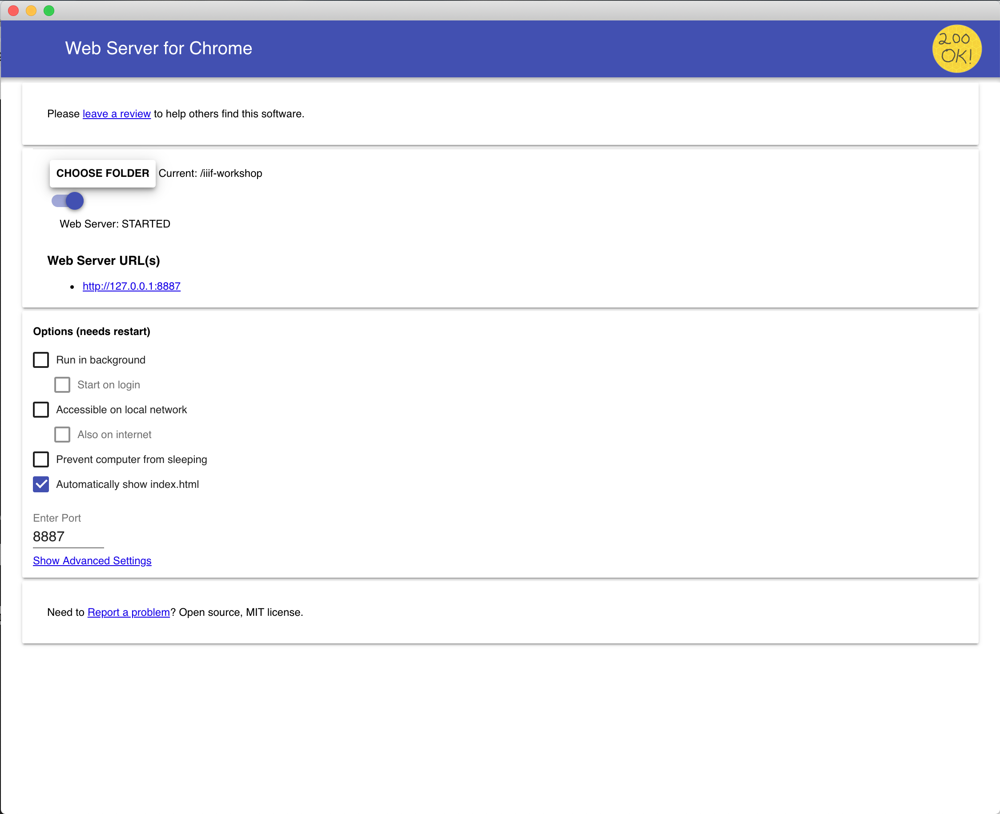

# Install the Web Server for Chrome plugin

1. Install the Chrome browser if you don't already have it: https://www.google.com/chrome/
1. Download and install the [Web Server for Chrome Plugin](https://chrome.google.com/webstore/detail/web-server-for-chrome/ofhbbkphhbklhfoeikjpcbhemlocgigb?hl=en)   
2. Create a directory somewhere convenient (e.g., on your desktop) to store your manifests in
3. Turn the server on using the slider control.
4. In the server's control panel, click "CHOOSE FOLDER" and select the directory you just created
5. Click "Show Advanced Options" and check "Set CORS headers"

Here is the plugin's interface:

