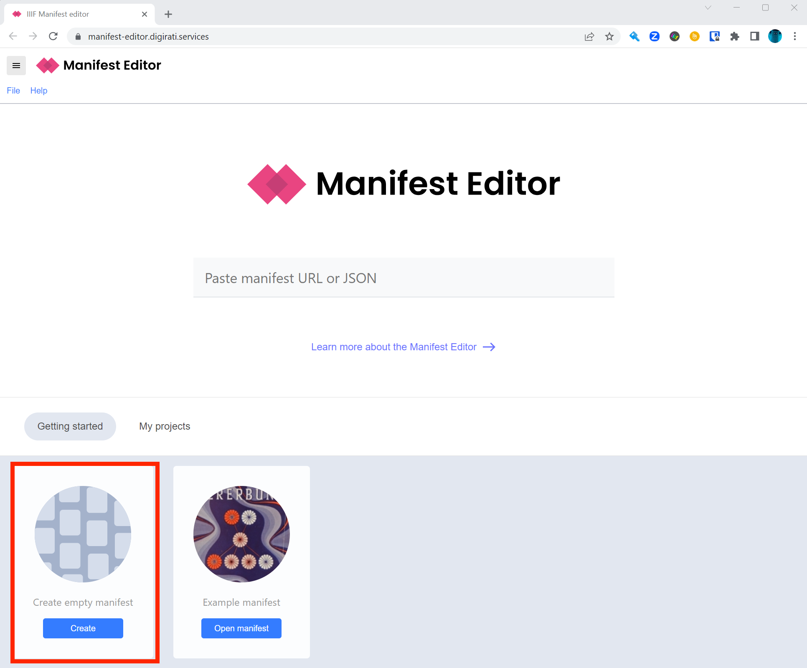
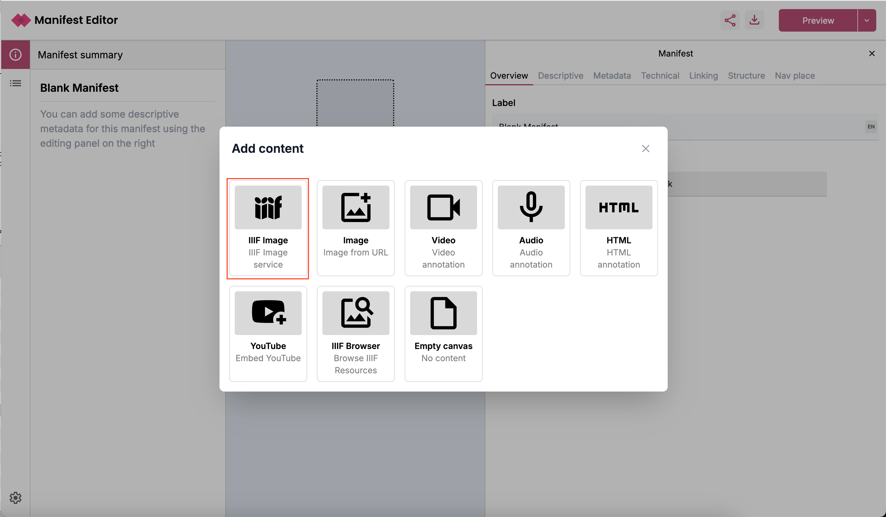
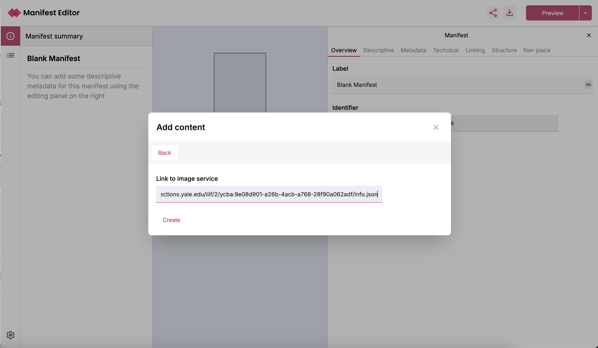
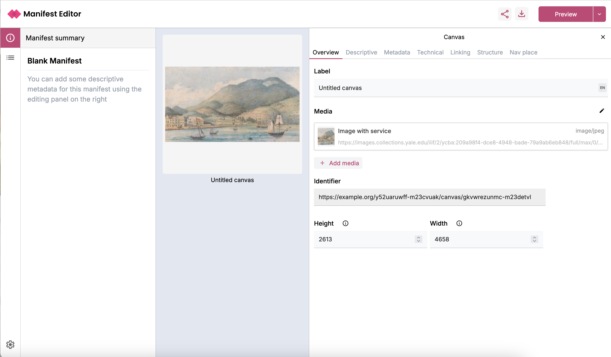
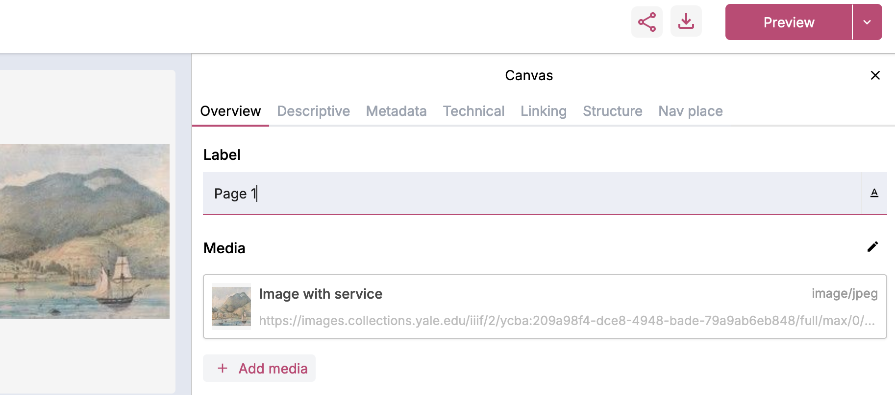
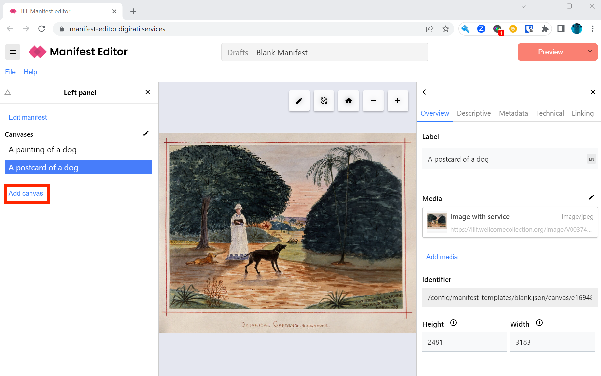
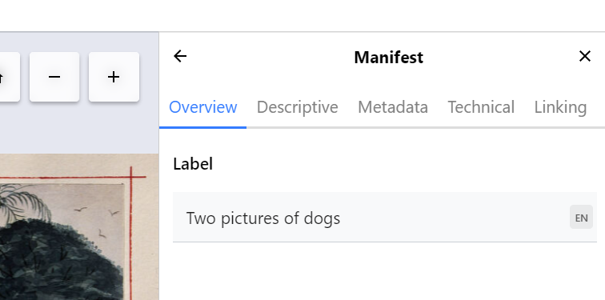
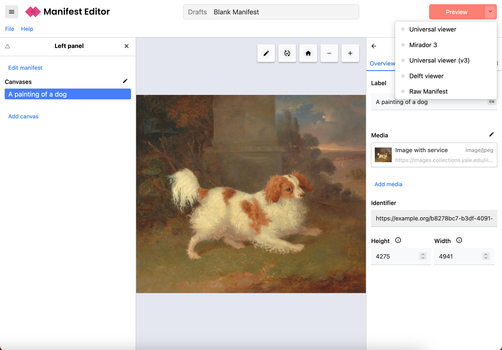

# Create a IIIF Manifest using the Digirati Manifest Editor

The Digirati Manifest editor provides more functionality than the Bodleian Manifest Editor that we used in the previous versions of the training. Specifically it supports version 3 of the IIIF specifications which allows you to add Video or Audio items to a canvas. 

## Gather images

First, assemble a list of IIIF `info.json` URLs for your content. They should all be on HTTPS URLs (not unsecure HTTP).

 * Here is a sample image at the [Yale Center for British Art](https://images.collections.yale.edu/iiif/2/ycba:9e08d901-a26b-4acb-a768-28f90a062adf/info.json)
 * Here's another sample image at [Wellcome](https://iiif.wellcomecollection.org/image/V0037482/info.json)
 * Here are some [book pages from Wellcome](https://digirati-co-uk.github.io/me-testing/03-image-services.html)

You can also use the following canvas finder which will take a Manifest and show you the IIIF Image Ids you need for the manifest editor:

[https://glenrobson.github.io/CanvasFinder/](https://glenrobson.github.io/CanvasFinder/)

## Steps to create your Manifest

### Step 1

Navigate to the editor at https://manifest-editor.digirati.services/ and click on the Create Empty Manifest option at the bottom of the page:

If you have previously been editing a Manifest in the editor, it will resume from where you left off. You can start a fresh Manifest from the File menu: **File** -> **New** -> **Blank Manifest**

### Step 2

Click the Add canvas link in the left hand menu

The Manifest Editor has a number of helpers for quickly creating Canvases from different sources. In this case, we're using IIIF Image Services. Select the **Image Service** option from the panel on the right.

Paste the URL of the info.json into the text box and click **Create**.

Once the image is loaded you should see something similar to the screenshot below. Note it may take a few minutes for the image to load if you are using the Internet Archive.  

Now edit the Canvas label, replacing the words "Untitled canvas" in the Label field in the right-hand panel:

Now repeat these steps to add a second canvas to your manifest by clicking the higlighted Add Canvas link on the left hand side. Once you've added a second canvas this will be listed on the left hand side:

### Step 3

We are now going to edit the Manifest metadata to change the label. First click the **Edit manifest** link at the top of the left panel. This changes the subject of the right panel.  The right panel always edits whatever is selected in the left hand or center panels.

Now edit the Manifest label:

### Step 4

Now we are going to view the manifest and try it out in some viewers. If you click the down arrow beside the red Preview button at the top right. You should see a list of options including Mirador and the Universal Viewer. There is also the option to view the Raw Manifest which you can copy and paste and use in other tools.  

