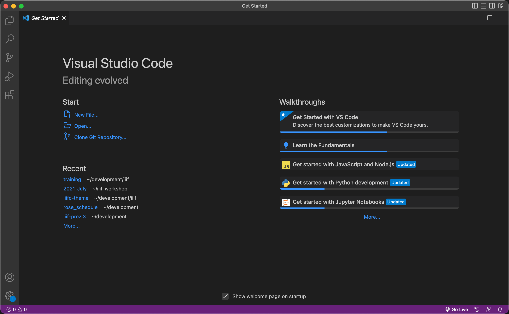
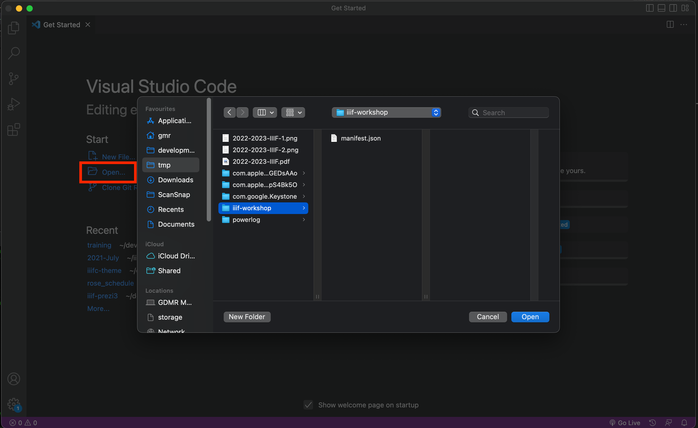
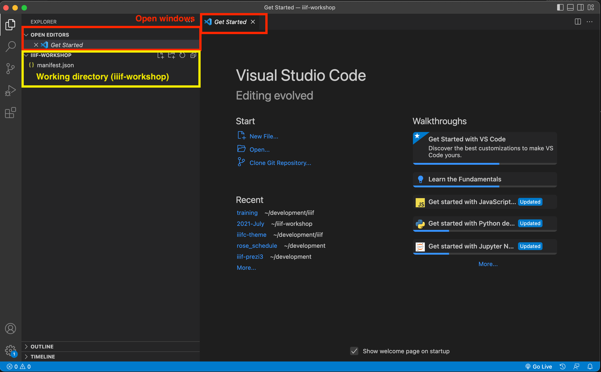
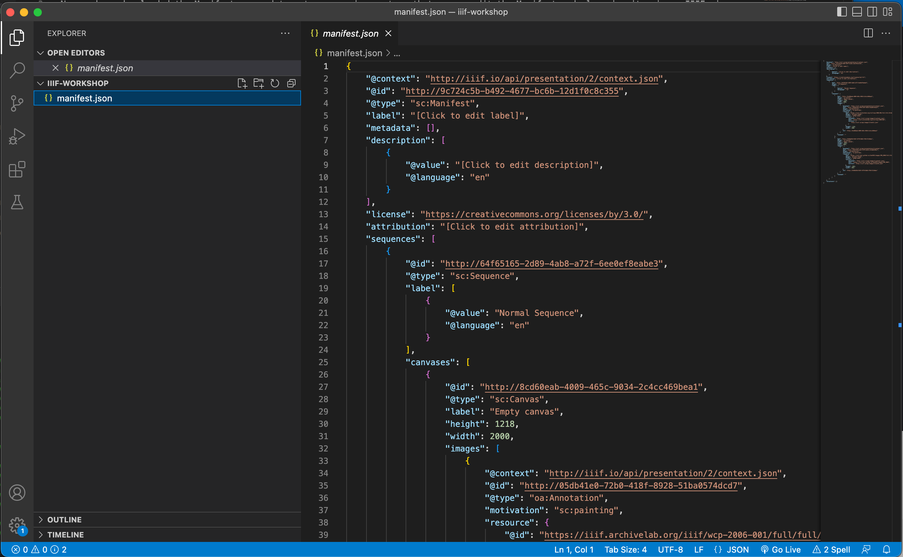
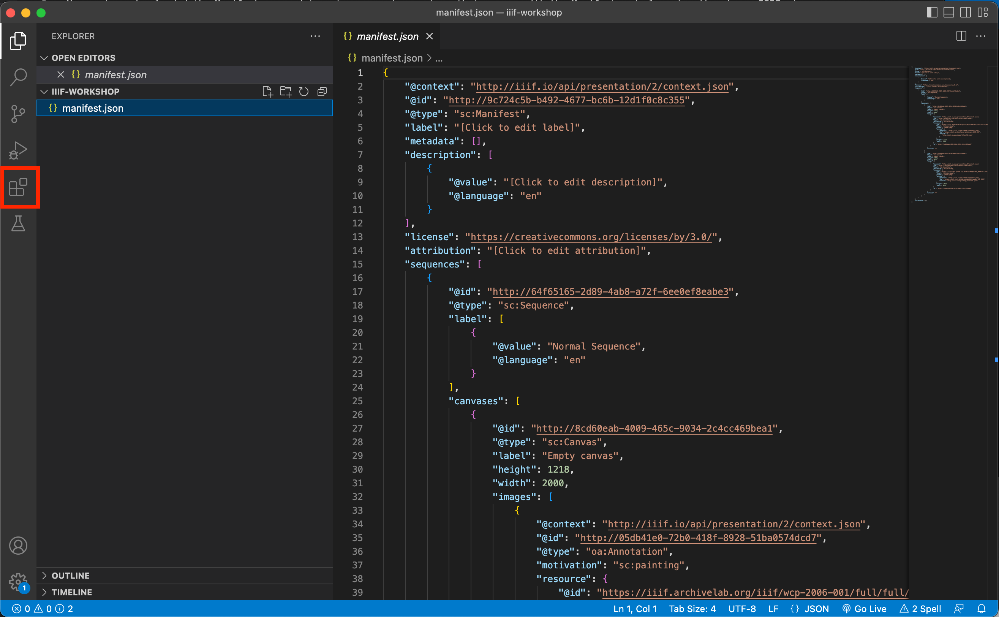
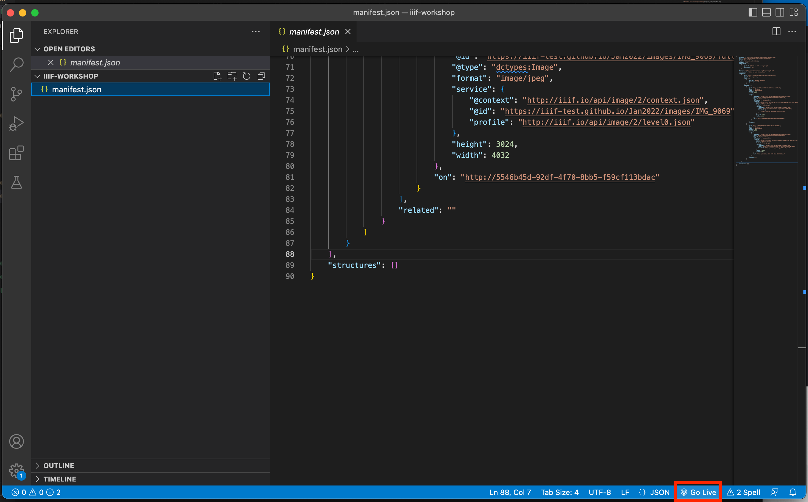
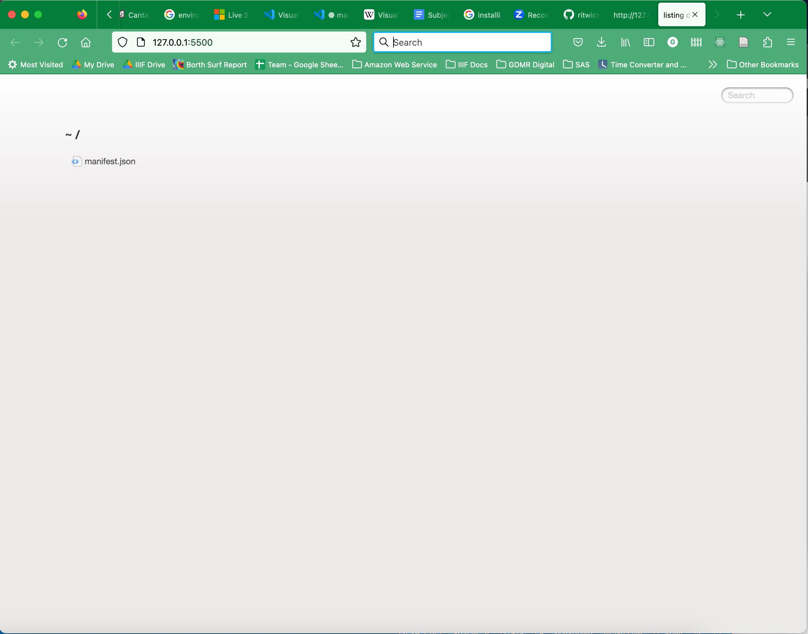
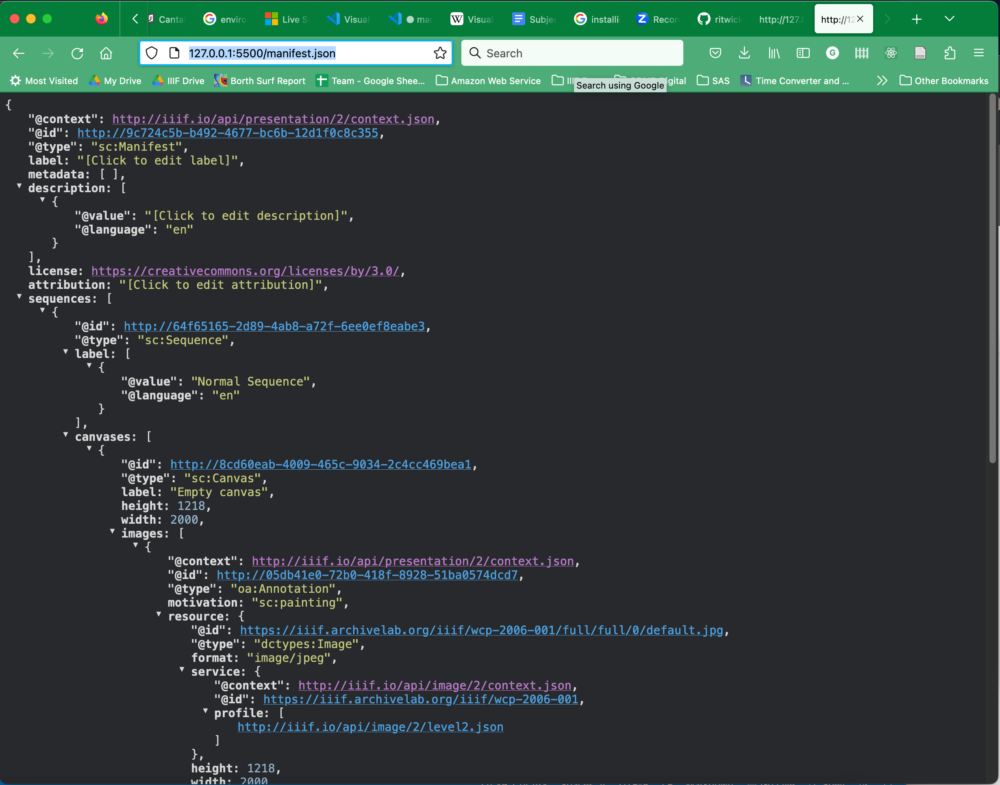

# Setup your environment

Now we have downloaded the Manifest we need to setup an environment so that we can edit the Manifest and also view it using a IIIF viewer. This requires two bits of software the first to allow editing is a JSON aware editor and to allow the viewing of the IIIF manifest in a viewer we need a web server.

## Installing Visual Studio Code

There are a number of JSON editors available but Visual Studio Code or VS Code makes it a lot easier by having robust error checking. It is free, Open Source and is currently the most popular editor. There are versions available for MacOS X, Windows and linux. To install this program navigate to the [VS Code](https://code.visualstudio.com/) website and click the download button. 

Once you have downloaded and installed the editor it should look similar to the following:

Once VS Code is open we want to open the `iiif-workshop` folder so that we can view the Manifest we have created. To do this select the `Open` option highlighted below and navigate to the iiif-workshop directory. 

Once you have selected the iiif-workshop directory you will be confronted with the following screen. This is called the Explorer view and allows you to navigate between the files in your directory. The items highlighted in read are the current open tabs similar to a list of browser tabs. The items highlighted in yellow are the files in the directory you are working with. Currently there is only a Manifest.json file but as you create more files these will appear in this list. Once you have to to this screen you can click on the Manifest.json link and this will open the JSON file in the editor. You can also close the getting started tab. 

You should now see your Manifest in the open tab of VS Code. You can already see some of the advantages of using VS code for editing JSON. Particularly the thumbnail image of the JSON on the right helps with navigating where you are in the JSON. You can also see how the different elements of the JSON line up as VS Code will connect a horizontal line to show you where a block starts and ends. We will go through the JSON in more detail later but for now you can have a look through your Manifest to see where the labels you entered are located in the JSON.  

## Setting up a Web Server

The next stage is to setup a Web Server so we can share our Manifest and open it in a IIIF Viewer. Luckily VS Code has an extension that provides a Web Server we can use. To install it first click the extensions link highlighted below:

This will load up a screen to search and install extensions. In the Search box enter `live server` and then click the small install button next to the top result. This will download and install the Live Server plugin. 

The Live Server adds  a Go Live button at the bottom of the editor highlighted in the screen shot below. If you click this it should open a link in your browser which allows you to navigate to your Manifest.json. 

Once you've clicked the Go live button you should see the following page in your browser. Now click the `manifest.json` link and it should open up the Manifest. 

Once opened the Manifest should like like the following. Now you will need to copy the link to the Manifest so you can open it in a IIIF Viewer. You can copy the URL in the address bar and if you have called your Manifest `manifest.json` the link will probably be:

[http://127.0.0.1:5500/manifest.json](http://127.0.0.1:5500/manifest.json)

## View the Manifest in Universal Viewer
1. Navigate to the [Universal Viewer](http://universalviewer.io) web page.  
1. Scroll down to "View a IIIF Manifest". 
1. Paste the URL http://127.0.0.1:5500/manifest.json into the text box and click "View".   
1. You should see your manifest in the Universal Viewer.

## Review the Manifest

Finally it is useful to view the Manifest to see if you can spot where things are appearing in the Viewer and where the data is in the JSON.  If you open the JSON at http://127.0.0.1:5500/manifest.json in your browser:

- Find Manifest `label`
- Explore the Manifest structure:
    - Sequence
        - Canvas
            - `@id`
            - `label`
            - Annotation
                - IIIF Image API service