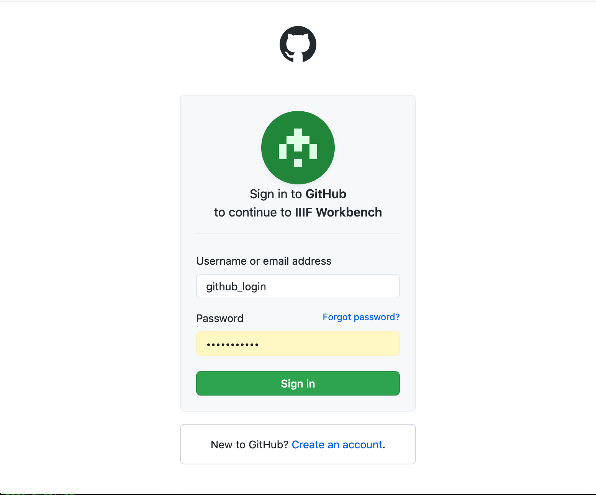

# Publishing your Manifest

<iframe src="https://player.vimeo.com/video/716825056?h=8353dfb649" width="640" height="360" frameborder="0" allow="autoplay; fullscreen; picture-in-picture" allowfullscreen></iframe>

Now we have downloaded the Manifest we can use a tool developed for the training called the Workbench. This will publish your manifest using GitHub and make it available on the Web. This encompasses the following stages:

1. Logon to Workbench and navigate to the Manifests section
2. Upload your Manifest
3. View your Manifest in compatible IIIF tools. 
4. Making changes to your manifest

Further details on these stages are below with screen shots:

# Stage 0. Register for a GitHub account if you don't have one. 

If you don't have a GitHub account register for one on the [Github](https://github.com/) webpage.

# Stage 1. Logon to Workbench

Then Navigate to the training workbench:

[https://workbench.gdmrdigital.com/](https://workbench.gdmrdigital.com/index.xhtml)

You should see the following screen:

Click the Login with GitHub button.

This will either ask you to login as shown in the following screen shot or if you are already logged in take you straight to the permissions page.

Next you will see the following permissions page. This is asking you if you are happy for the Workbench to write to your GitHub account. Click Authorize. 

You should now be taken to the projects page:

You have now successfully logged into the Workbench using your GitHub username and password. Once you have been through the Authorisation step once your browser and GitHub will remember that you have given permission and it should log you straight in.  The next stage is to create your project.

## Stage 2. Create your project

A project is a place to store the images and manifests you are working on. You can have multiple projects for every GitHub account but note each project is limited to 1GB in size. In the GitHub terminology a project in this case is equivalent to a GitHub Repository. 

To start click the Create Project button:

and enter a name for your project. Note the name can only contain letters, numbers or the following symbols `-` and `_` so don't add any spaces. 

Click create. This will take a few seconds but will setup an empty project on GitHub and then forward you onto the images part of the Workbench. 

You are now ready to upload your Manifest.

# Stage 3. Upload your Manifest

Now you can upload your manifest. Click the upload button and choose the manifest you want to upload. 

You can change the name of the manifest before uploading. You may want to do this if you already have a manifest with the same name that you've uploaded previously. Ensure that the filename doesn't have any spaces or characters that aren't `.`,`-` or `_`.

Then click upload. The upload happens in two stages. The first is uploading the manifest to GitHub which happens quite quickly. The second stage is GitHub updating the website which can take a couple of minutes. While the website is updating you may see the following which will wait to show the Mirador and UV links until the Manifest is available on the website. 

Once you see the IIIF image and other logos it is safe to start using your manifest in other tools.

# Stage 4. View your Manifest in compatible IIIF tools. 

Now you have a public https manifest you can start using it! There are a number of buttons underneath your manifest which is a good place to get started. 

The buttons from left to right are as follows:

 * IIIF Logo - if you click this, it will open your manifest in a new window and show you the JSON. If you right click on the image and select `Copy link`, this is the link to your manifest which you can use in other tools.
 * Edit icon - click this if you want to make small edits to your manifest. This feature is discussed further in stage 4.
 * Delete icon - This will delete the manifest from your project.
 * Github icon - This will take you to the GitHub location of your manifest. 
 * Mirador icon - click this to see your manifest in the latest version of Mirador. 
 * UV icon - click this to see your manifest in the public UV version. 

As well as the tools above there are also a number of other tools that work with IIIF manifests. For these you will need to copy the Manifest URL in the IIIF logo. Some other tools to try are:

 * [A guide to IIIF viewers](https://iiif-io.medium.com/how-to-use-iiif-resources-and-image-viewers-bd378a68b013) - try your manifest in Mirador 2, Tify, IIIF Curation Viewer and Diva.js
 * [exhibit.so](https://exhibit.so/) a tool for creating Exhibits or presentations of your manifests. See the [Guest Videos](https://training.iiif.io/iiif-online-workshop/GuestPresentations.html#exhibit) for more details.
 * [FromThePage](https://www.fromthepage.com/) a transcription tool. Also see the video in the [Guest Videos](https://training.iiif.io/iiif-online-workshop/GuestPresentations.html#crowdsourced-transcription-using-fromthepage--iiif). 
 * [Recogito](https://recogito.pelagios.org/) a hosted free transcription and teaching tool.

