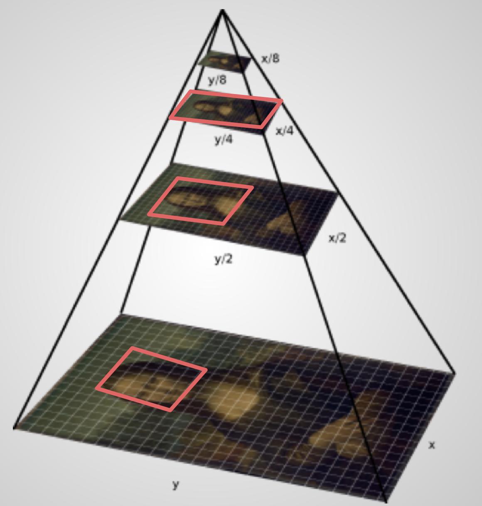

# File formats

The IIIF specification makes no mention of the source format of an image and the type of image you can use is driven by the IIIF Image Server you choose. Most support the common file formats like jpeg, png, tiff or gif. To get the fastest experience it is advised to use a special kind of image format that supports tilling. Examples of these include JPEG2000 and special types of Tiff files called Pyramid Tiffs. 

The reason for this can be demonstrated in the following diagram:

When you zoom into a image the viewer only shows you the tiles that are in your view. The view is shown in the red box. This means a very large image can be viewed but the viewer never downloads all of the images. Only the ones that are required. The JPEG2000 and Pryamid Tiff format have these tiles and levels pre-generated into the file format. A Image server just needs to read and extract the correct tiles. This makes them much faster particularly for larger images. Of course if a custom region is requested then the Image server would need to stitch the images together. 

