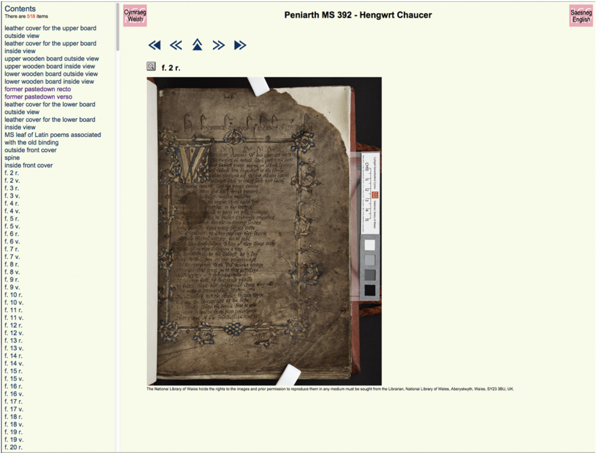

# Image API

## Learning objectives
 * Understand what the Image API provides
 * Be able to change a Image API URL to get access to different parts of an image
 * Understand the different types of Image API implementations (level0, level1 etc)
 * Know the tools that work with the Image API so you can test your Image API server

## Introduction

 * What is it? A contract between the server and a viewing client
 * Its the foundation of all of the IIIF APIs. They all build on top of the Image API.
 * Luckily its one of the easiest to implement 
 * because others have written servers you can install which provide the service

## Terminology
 * __API__ - Application Programming Interface. In this case an agreed standard between the Image API Server and the Image API Client. 
 * __Client__- The software which allows you to view a IIIF Image. As Web Browsers don't support the Image API Natively there are many Javascript viewers that live on webpages that can allow you to view IIIF Images. Examples include OpenSeaDragon, Mirador and Universal Viewer. 
 * __Viewer__ - also known as a IIIF Viewer. This is the same as a Client and lets you view IIIF Images. Examples include OpenSeaDragon, Mirador and Universal Viewer. 
 * __Server__ - Software that runs on a machine at all times and is assessable over the Web. For this workshop I will mostly be referring to Image API Servers but there are other types of servers including Web servers or Email servers. Sometimes they are also know as Services e.g. Image API service, Web Service or Mail Service.  
 * __Image API__ - the agreed standard and specification which forms the contract between Client and Server
 * __Image API Server__ - the running software that provides access to images using the Image API. Sometimes shortened in this context to Image Servers. 
 * __IIIF Image__ - an Image that is made available through a IIIF Image API Server. 

## History

IIIF really started out of the study of Medieval Manuscripts and the difficulty in using Digitised versions. Ben Albritton has written a great blog on the difficulties of working with images at that time and the promise IIIF gives in [Fellow Travelers: The Canterbury Tales and IIIF](https://blalbrit.github.io/2015/07/14/fellow-travelers-the-canterbury-tales-and-iiif). From a more personal perspective and also from a perspective of an institution providing these digital images. When I started work at the National Library of Wales, Manuscripts were digitised and three images were created per page. 

1. A thumbnail:

    

2. A Web or reference sized image:

    

3. and a high quality archival Tiff that was only available on request. 

These were made available through a viewer allowing you to browse around the Manuscript and switch between Thumbnail and Web view: 

As screens got bigger and the internet got faster the limited size of the Web images became a real barrier to use. Although the Archival Tiff was too big to put on the web, we needed some way to allow access to large images and support new methods of access like mobile browsers and the new uses scholars were making of the collection. The solution many institutions moved to, was to create Zooming viewers like [Zoomify](http://www.zoomify.com/) and [Microsoft's DZI](https://en.wikipedia.org/wiki/Deep_Zoom). These viewers tended to use Flash which was unsupported on Mobile and required proprietary file formats to support. Around this time the JPEG2000 file format started to gain traction as an open file format that could support Zoomable viewers. 

Enter:

Provides:
 * A standard URL structure for accessing images (easy to support)
 * Enough information to drive a zoom viewer
 * Human hackable URLs
 * Cacheable and Scalable URLs

## Example:
 

    

