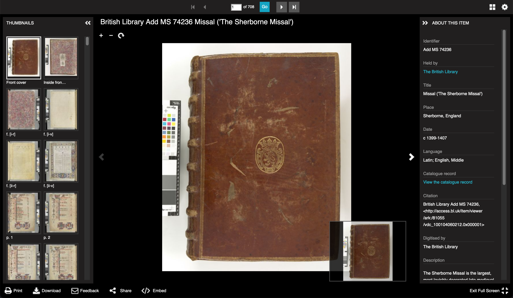
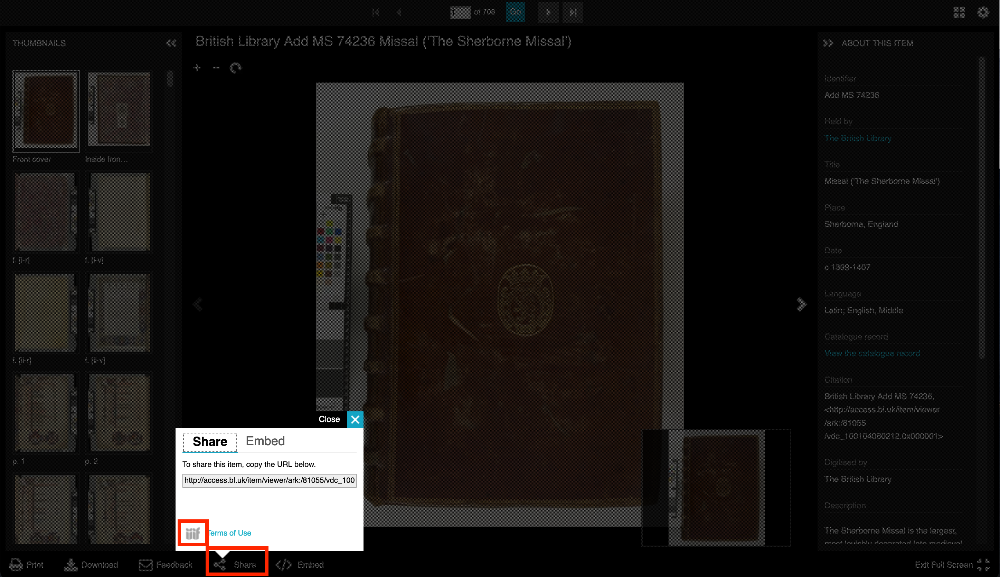
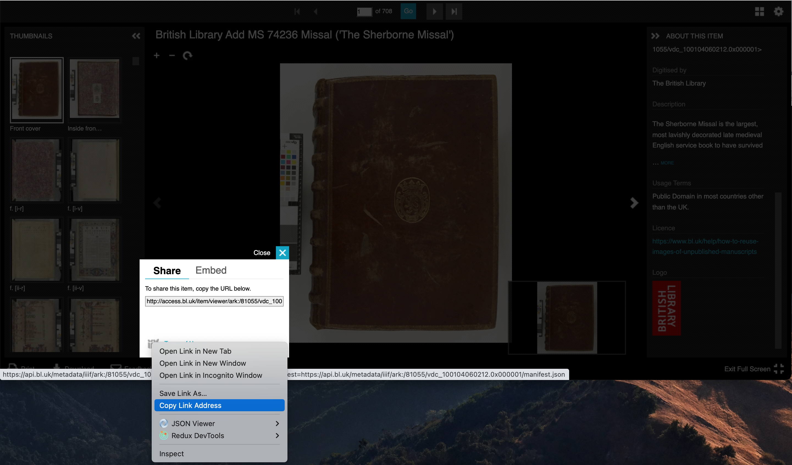
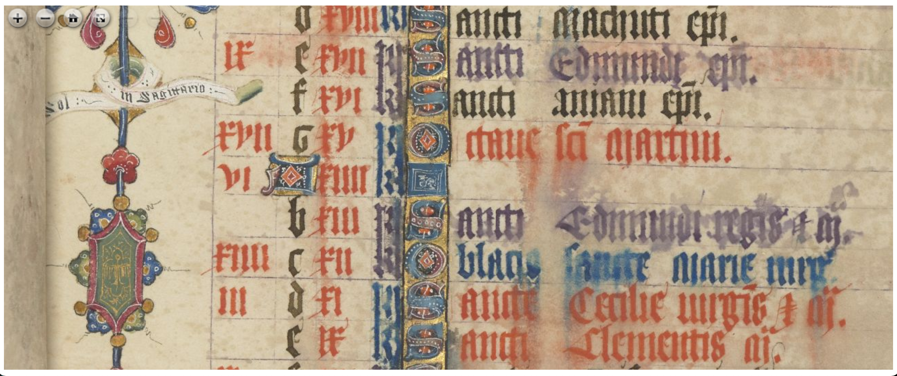
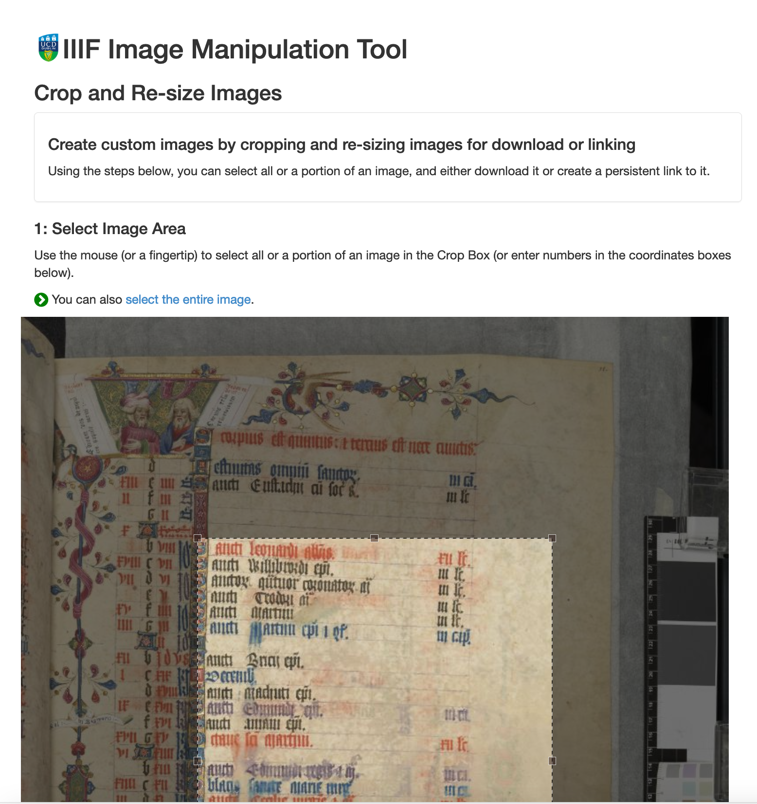

<script src="../canvas_finder.js">
</script>

# Finding British Library IIIF Images

For this exercise we are going to find a couple of British Library IIIF Images that we can use tomorrow in the IIIF Presentation API session. This exercise will show you how to find a single IIIF image within a digital object and then how you can manipulate this image so you can use it to tweet or embed in a blog or publication. 

***BL Images Issue - January 2022*** - it appears there is an issue with the BL Universal Viewer images which causes a log-in error message when you click on a image. This doesn't seem to affect Firefox but even on the other Web Browsers you can still view the thumbnails, download images and open the IIIF manifest link. The Manifest will work on the demo [Universal Viewer](https://universalviewer.io/) site and should also work with the tools given in this guide.

## Stage 1: Find a BL digital item

Using the [BL collection guide](https://www.bl.uk/collection-guides/iiif) find a digital object and open it up in the Viewer. Once you have found your item it should look as follows:



Now we have found the item we want to get the 'IIIF Manifest' for this item. We will go into more details about IIIF Manifests on Wednesday but a Manifest is a JSON document that contains links to all of the images and metadata that goes into a digital item. We are going to find the link to the IIIF Manifest and past this into a tool below which will allow us to find the IIIF Image URL to the image we want. 

To find the manifest click the 'share' link at the bottom of the viewer and then right click on the IIIF icon and select 'Copy link' or 'Copy Link Address' in Chrome:

***Note:*** some collections like the Google printed books collection do not currently allow sharing so the share button will not be present.




You can see the copy link from Firefox in this image: 



The copied link should look something like:

```
https://api.bl.uk/metadata/iiif/ark:/81055/vdc_100104060212.0x000001/manifest.json?manifest=https://api.bl.uk/metadata/iiif/ark:/81055/vdc_100104060212.0x000001/manifest.json
```

You can see the link to the manifest is created twice in this link so it can be cleaned up by removing everything after the `?` to leave:

```
https://api.bl.uk/metadata/iiif/ark:/81055/vdc_100104060212.0x000001/manifest.json
```

Some IIIF viewers and tools will be able to cope with the manifest being repeated but if possible its best to remove everything after the `?`. 

## Stage 2: Find IIIF Image URL

Now we have got our Manifest we need to find the URL (or link) for image we want. We could do this by looking through the JSON and we can have a look at doing this after the Presentation API session on Wednesday but for now I have created the following tool that will take a link to a manifest and allow you to choose the image you want. Paste your manifest into the box below and click Load.

<script src="https://kit.fontawesome.com/0060d53ddc.js" crossorigin="anonymous"></script>
<div id="canvas_finder" style="border: 1px solid black; padding: 5px;">
<div id="manifest_enter" style="padding: 5px;">
    <form>
        <label for="exampleInputEmail1"><b>Manifest URL:</b></label>
        <input type="text" id="manifest_uri" style="width:70%"/>
        <button onclick=loadManifest(event)>Load</button>
        <button onclick=clearManifest(event)>Clear</button>
    </form>
</div>
<div id="manifest_content">
</div>
</div>

## Stage 3: Experiment

Now you have a IIIF Image URL you can plug it into the following IIIF Tools:

Check it works with a zooming viewer like OpenSeaDragon:

  [https://iiif.gdmrdigital.com/openseadragon/index.html?image=https://api.bl.uk/image/iiif/ark:/81055/vdc_100104087143.0x000011/info.json](https://iiif.gdmrdigital.com/openseadragon/index.html?image=https://api.bl.uk/image/iiif/ark:/81055/vdc_100104087143.0x000011/info.json)



Pull out regions using the UCD selector tool:

  [https://jbhoward-dublin.github.io/IIIF-imageManipulation/index.html?imageID=https://api.bl.uk/image/iiif/ark:/81055/vdc_100104087143.0x000011](https://jbhoward-dublin.github.io/IIIF-imageManipulation/index.html?imageID=https://api.bl.uk/image/iiif/ark:/81055/vdc_100104087143.0x000011)


