# Using the Internet Archive

The Internet Archive allows you to upload images and then provides a IIIF Image API service. Helpfully they also have a function to delete your images after 30 days if you are using this as a test. The overall process is as follows:

__Note__: some people have had some issues getting their images to show when uploading to the InternetArchive. To avoid these issues:

 * Ensure you only upload 1 image ( if you want multiple images you will need to create multiple items)
 * Ensure the mediatype is set to `image`. `Texts` seems to break the image viewing
 * Some of the IIIF images appear very small even if you uploaded a large image. See note below on adding the filename to the URL.

1. Register for a user account at [archive.org](https://archive.org)
2. Upload your image
  * __Ensure you only upload a single image__ 
  * __Set the mediatype to `image`__ 
3. On the details page get the identifier for the image. For example if the details page link is:
  
  https://archive.org/details/img-8664
 
  the identifier would be `img-8664`
4. Use the Internet Archive image service with this identifier:

  https://iiif.archivelab.org/iiif/img-8664/info.json

5. You should then be able to use this image:

  Create an image link:
  
  [https://iiif.archivelab.org/iiif/img-8664/full/512,/0/default.jpg](https://iiif.archivelab.org/iiif/img-8664/full/512,/0/default.jpg)

  Check it works with a zooming viewer like OpenSeaDragon:

  [https://iiif.gdmrdigital.com/openseadragon/index.html?image=https://iiif.archivelab.org/iiif/img-8664/info.json](https://iiif.gdmrdigital.com/openseadragon/index.html?image=https://iiif.archivelab.org/iiif/img-8664/info.json)

  Pull out regions using the UCD selector tool:

  [https://jbhoward-dublin.github.io/IIIF-imageManipulation/index.html?imageID=https://iiif.archivelab.org/iiif/img-8664](https://jbhoward-dublin.github.io/IIIF-imageManipulation/index.html?imageID=https://iiif.archivelab.org/iiif/img-8664)

### Small images workaround

__Update - 10th June__: hopefully this issue has been fixed now. 

Some images are appearing small, to get round this issue you will need to add the filename to the URL. In the following example:

https://archive.org/details/img-8664

you would normally create the following URL:

https://iiif.archivelab.org/iiif/img-8664/info.json

but to make the image larger you need to add the filename (`$IMG_8664.jpg`) so it looks like:

https://iiif.archivelab.org/iiif/img-8664$IMG_8664.jpg/info.json

To find the image navigate to the details page:

https://archive.org/details/img-8664

and click on the main image. This will show the image full screen and if you look in the address bar you will be able to see the filename. The reason this happens is due to a bug in the Internet Archive IIIF implementation and I have submitted a [Bug](https://github.com/ArchiveLabs/iiif.archivelab.org/issues/44) and a fix on their github.

## Step by step guide

A step by step guide with screen shots for the above steps is below:

1. Register for a user account at [archive.org](https://archive.org) 

 Click signup or login if you already have an account:

 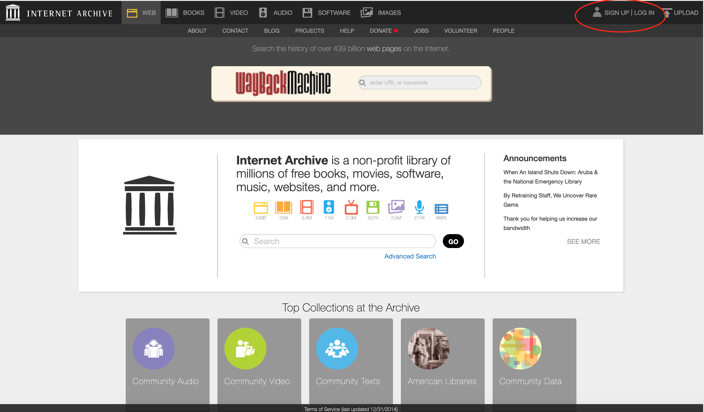

 Then create your user:

 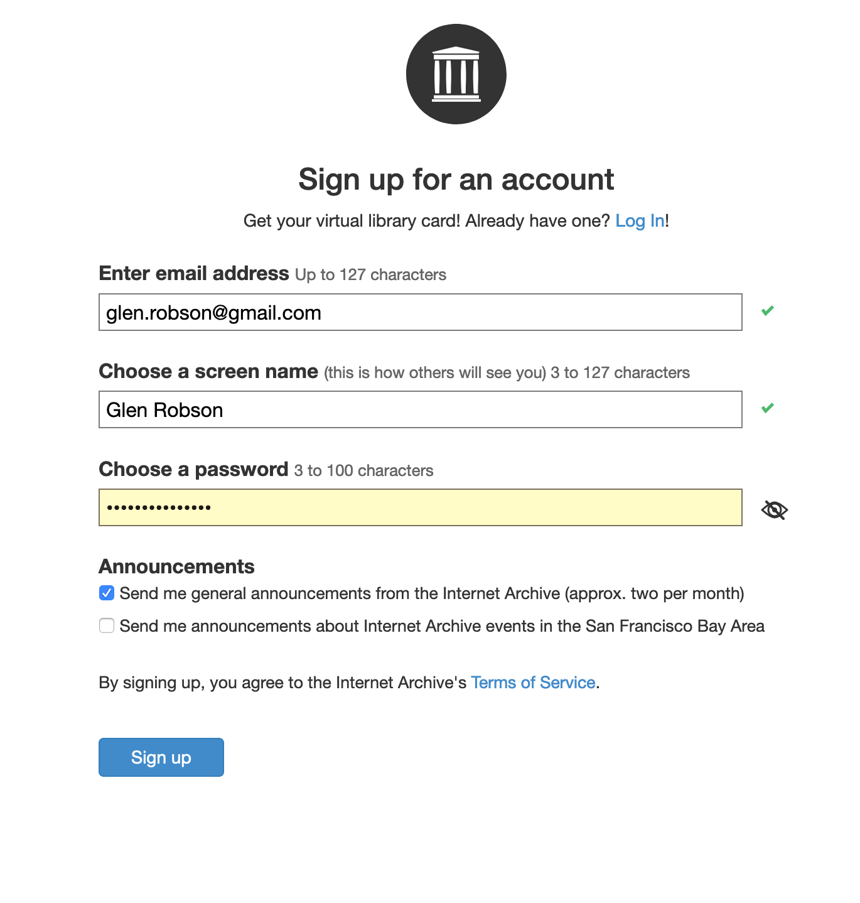

 They will then ask you to verify your email address:

 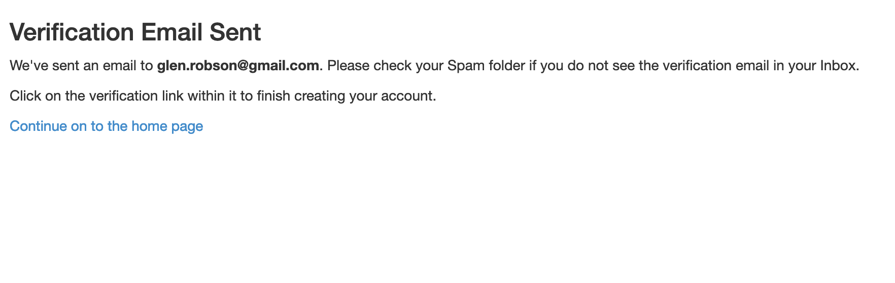

 You will then see an email like the following:

 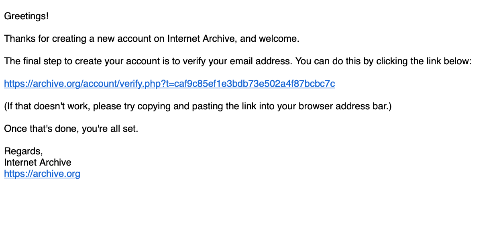

 Click on the link on the email and you will get the following screen:

 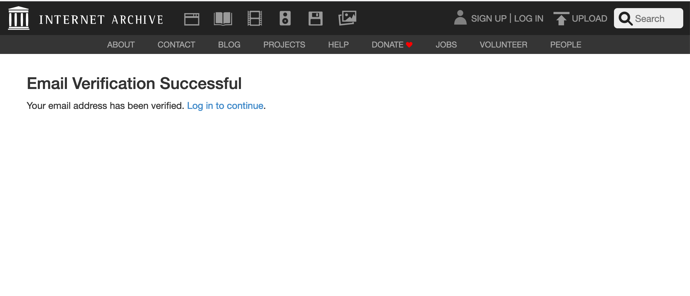

2. Upload your image

 Select upload on the Archive Welcome screen:

 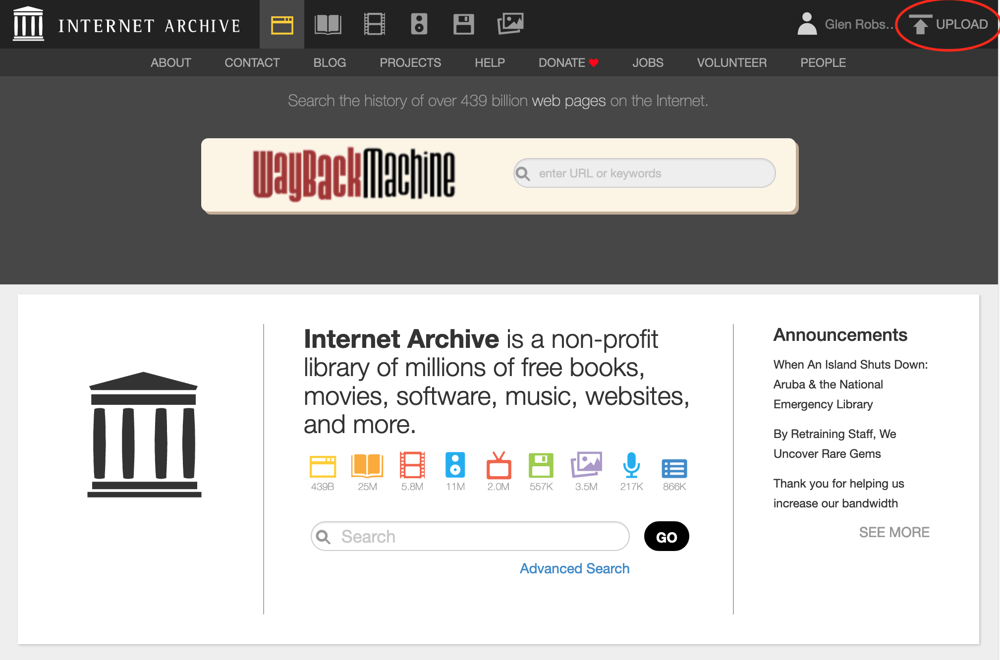

 You will then see the following screen. Select the green Upload Files button:

 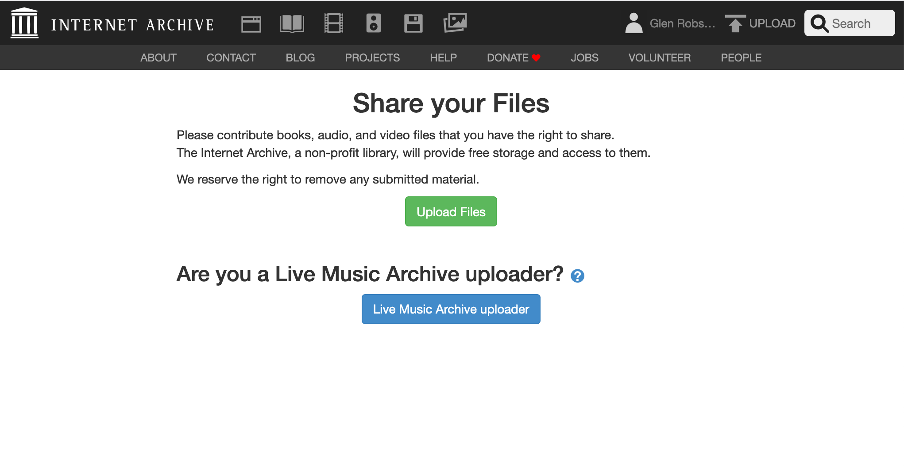

 Then click on the 'choose files to upload' button and select the image to upload:

 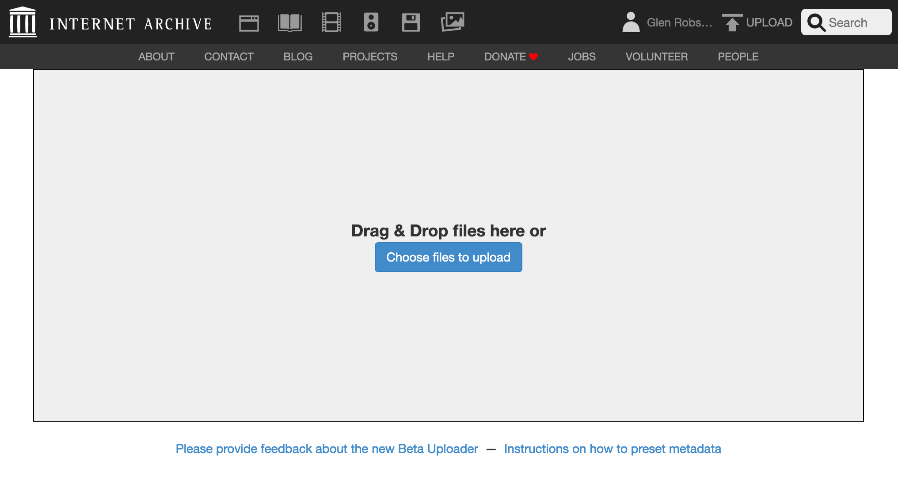

 Add metadata. The Title, URL, Description tags are mandatory. I left it in the Community Image collection. Usefully you can also say if its a test item which can be deleted after 30 days. 
 
 __Update__: ensure collection is `Community Image Collection` otherwise the image won't work as IIIF. 

 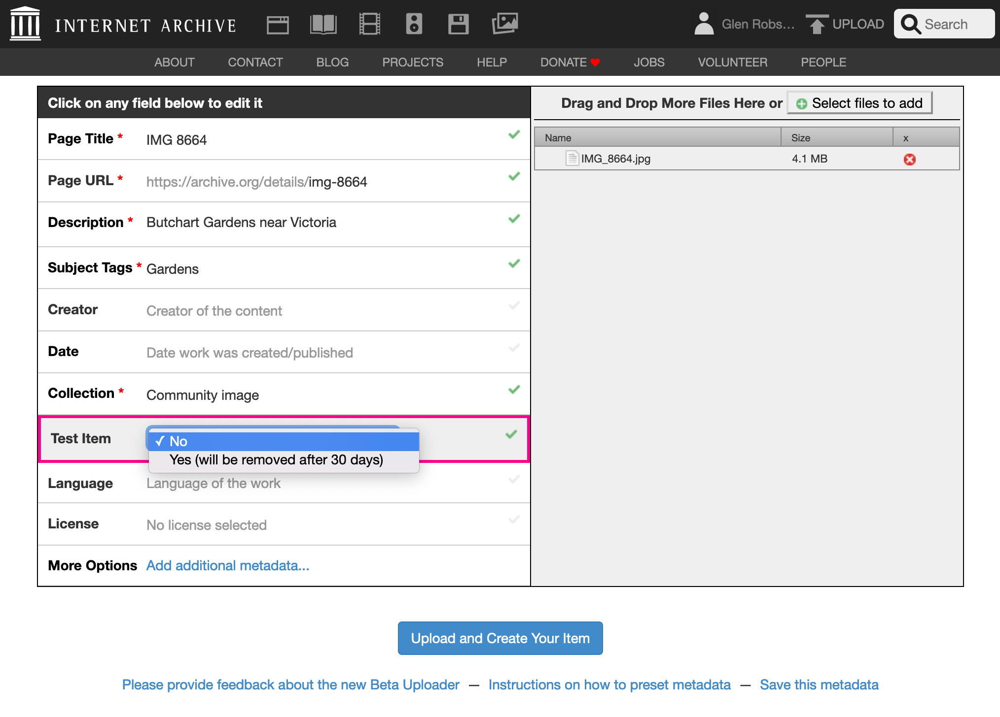

 Then click 'Upload and Create Your Item'. This took at least 5 minutes and after the bar has completed you have to wait longer presumably so it can setup the derivative images.

 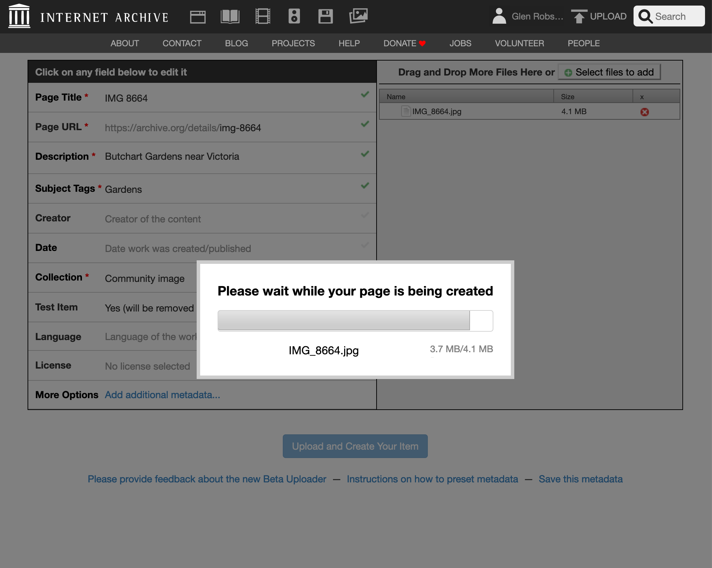

 If all has gone well you should see the item page:

 

3. On the details page get the identifier for the image. For example if the details page link is:
  
  https://archive.org/details/img-8664
 
  the identifier would be `img-8664`

 

4. Use the Internet Archive image service with this identifier:

  [https://iiif.archivelab.org/iiif/img-8664/full/full/0/default.jpg](https://iiif.archivelab.org/iiif/img-8664/full/full/0/default.jpg)

  

5. You should then be able to use this image:

  Create an image link:
  
  [https://iiif.archivelab.org/iiif/img-8664/full/512,/0/default.jpg](https://iiif.archivelab.org/iiif/img-8664/full/512,/0/default.jpg)

  Check it works with a zooming viewer like OpenSeaDragon:

  [https://iiif.gdmrdigital.com/openseadragon/index.html?image=https://iiif.archivelab.org/iiif/img-8664/info.json](https://iiif.gdmrdigital.com/openseadragon/index.html?image=https://iiif.archivelab.org/iiif/img-8664/info.json)

  

  Pull out regions using the UCD selector tool:

  [https://jbhoward-dublin.github.io/IIIF-imageManipulation/index.html?imageID=https://iiif.archivelab.org/iiif/img-8664](https://jbhoward-dublin.github.io/IIIF-imageManipulation/index.html?imageID=https://iiif.archivelab.org/iiif/img-8664)

  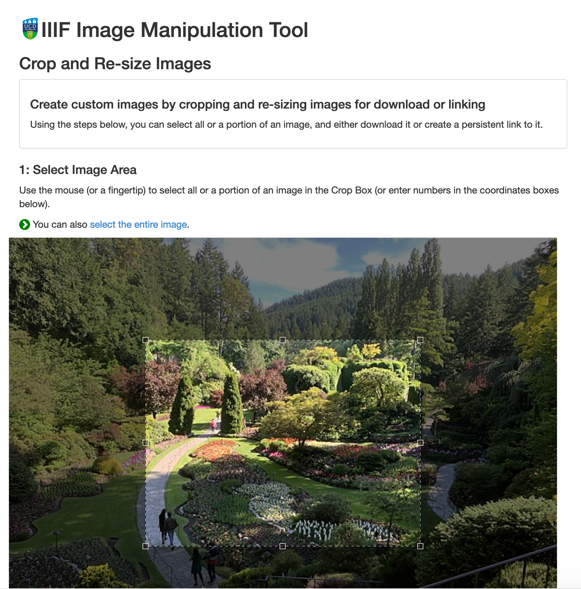

