# Using the Internet Archive

The Internet Archive allows you to upload images and then provides a IIIF Image API service. Helpfully they also have a function to delete your images after 30 days if you are using this as a test. The Internet Archive service uses Cantaloupe as their image server and images can be accessed as either Version 2 or Version 3 of the IIIF Image API. 

__Note__: some people have had some issues getting their images to show when uploading to the Internet Archive. To avoid these issues:

 * Ensure you only upload 1 image ( if you want multiple images you will need to create multiple items)
 * Ensure the collection is 'Community Image' collection. The `Community Texts` collection seems to break the image viewing currently

## High level steps for getting acccess to IIIF images

1. Register for a user account at [archive.org](https://archive.org)
2. Upload your image
  * __Ensure you only upload a single image__ 
  * __Ensure you select the 'Community Image' collection__ 
3. On the details page get the identifier for the image. For example if the details page link is:
  
  https://archive.org/details/img-8664_202009
 
  the identifier would be `img-8664_202009`
4. Use the Internet Archive image service with this identifier:

  https://iiif.archive.org/iiif/img-8664_202009/info.json

  __Note:__ If you open the URL above the Interent archive automatically forwards you to the actual image server URL:

  https://iiif.archive.org/image/iiif/2/img-8664_202009%2fIMG_8664.jpg/info.json

  This is a feature specific to the Internet Archive and most other image servers will not forward you to another location. IIIF viewers tend to work OK with this automatic forwarding and you can use either the original link or the forwarded version in viewers like OpenSeadragron and the UCD image cropper. 

  If you want to access a version 3 IIIF Image you can change the version number to 3 in the forwarded URL:

  https://iiif.archive.org/image/iiif/3/img-8664_202009%2fIMG_8664.jpg/info.json

5. You should then be able to use this image:

  Create an image link:
  
  [https://iiif.archive.org/iiif/img-8664_202009/full/512,/0/default.jpg](https://iiif.archive.org/iiif/img-8664_202009/full/512,/0/default.jpg)

  Check it works with a zooming viewer like OpenSeaDragon:

  [https://iiif.gdmrdigital.com/openseadragon/index.html?image=https://iiif.archive.org/iiif/img-8664_202009/info.json](https://iiif.gdmrdigital.com/openseadragon/index.html?image=https://iiif.archive.org/iiif/img-8664_202009/info.json)

  Pull out regions using the UCD selector tool:

  [https://glenrobson.github.io/iiif-imageManipulation/index.html?iiif-content=https://iiif.archive.org/iiif/img-8664_202009](https://glenrobson.github.io/iiif-imageManipulation/index.html?iiif-content=https://iiif.archive.org/iiif/img-8664_202009)

## Step by step guide

A step by step guide with screen shots for the above steps is below:

1. Register for a user account at [archive.org](https://archive.org) 

 Click signup or login if you already have an account:

 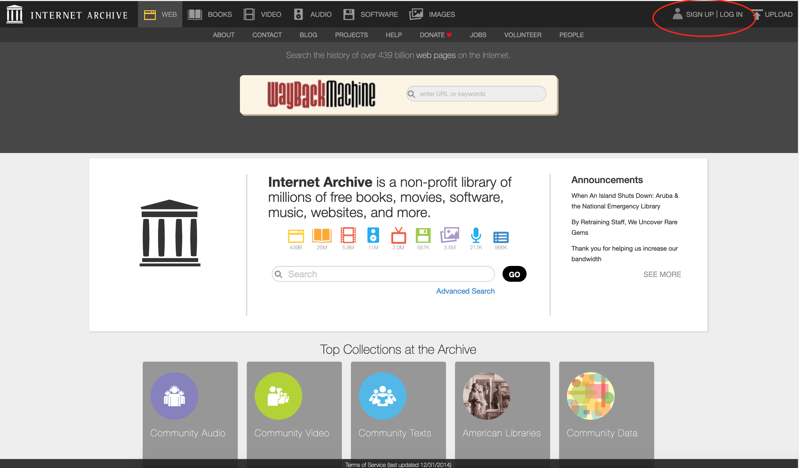

 Then create your user:

 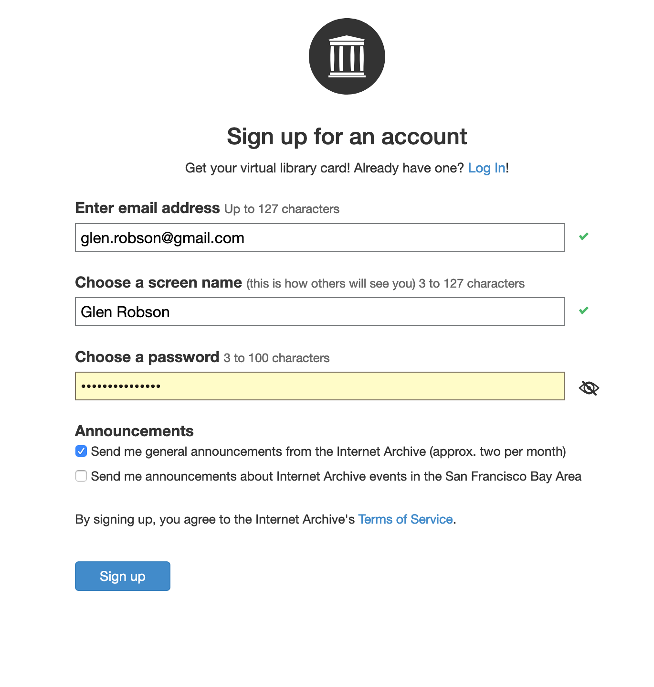

 They will then ask you to verify your email address:

 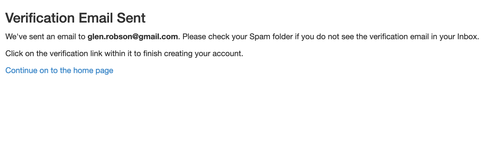

 You will then see an email like the following:

 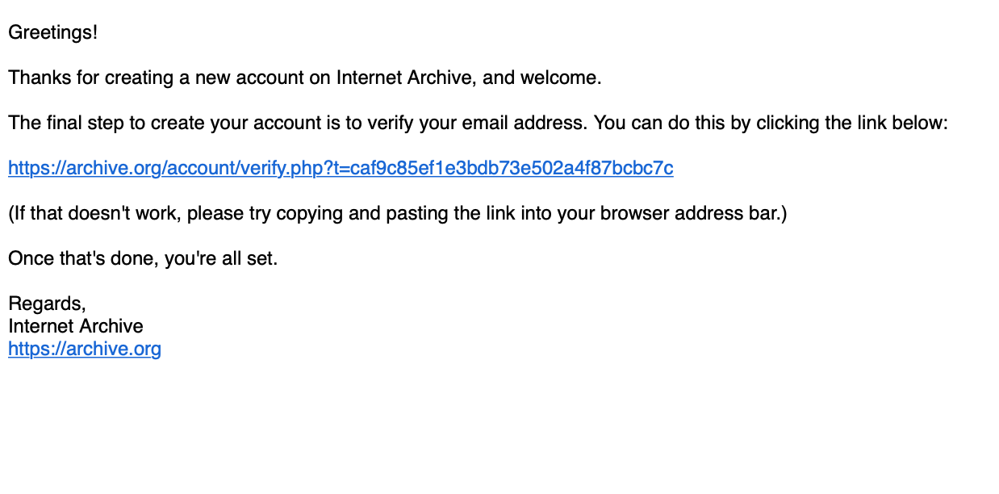

 Click on the link on the email and you will get the following screen:

 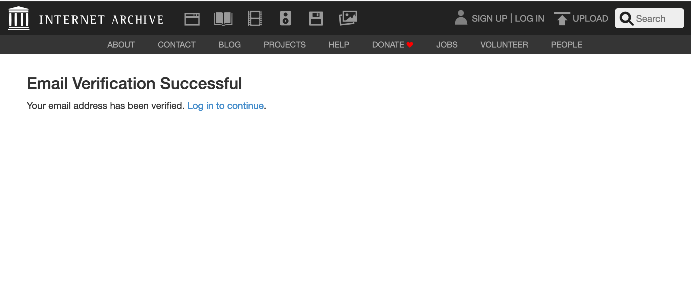

2. Upload your image

 Select upload on the Archive Welcome screen:

 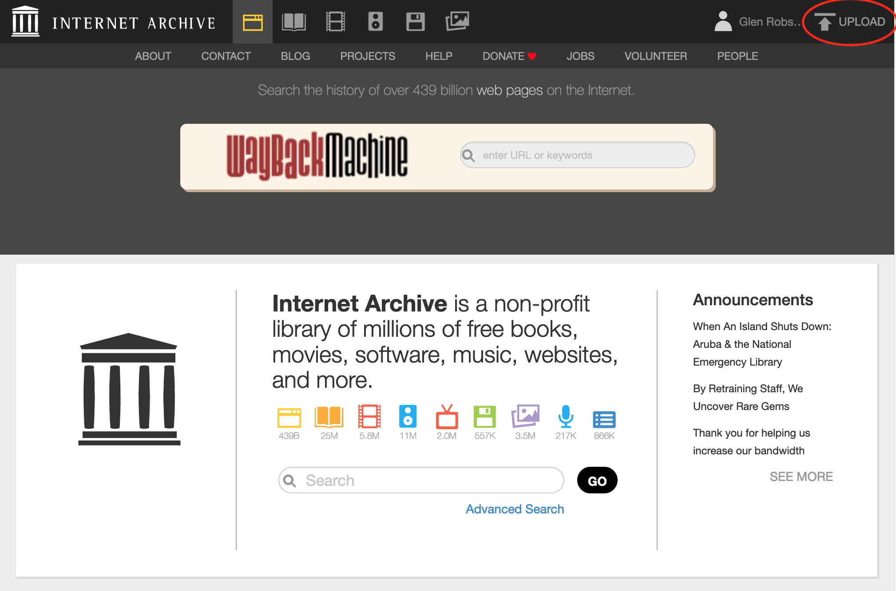

 You will then see the following screen. Select the green Upload Files button:

 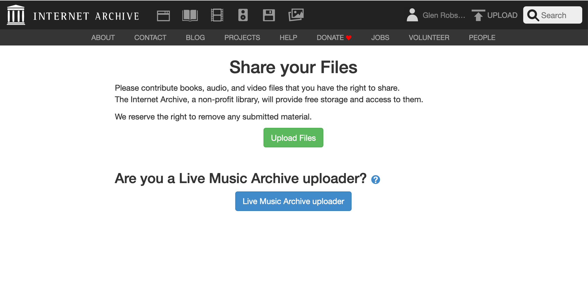

 Then click on the 'choose files to upload' button and select the image to upload:

 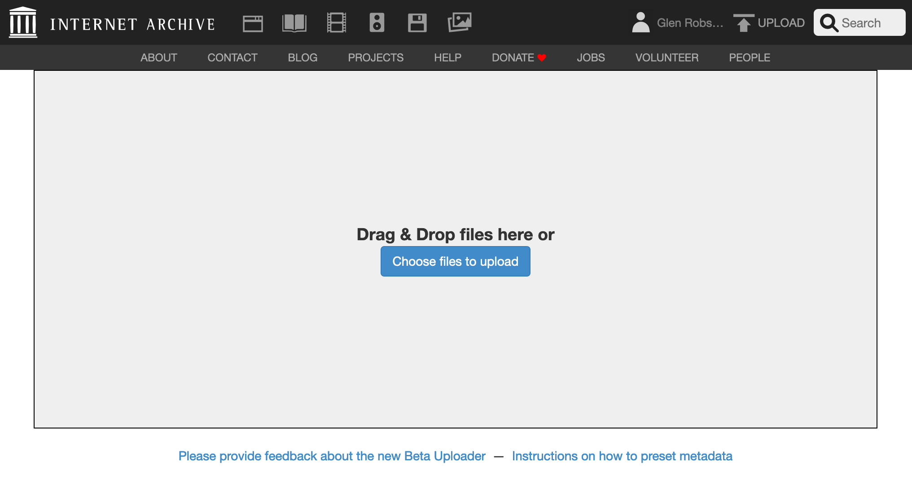

 Add metadata. The Title, URL, Description tags are mandatory. I left it in the Community Image collection. Usefully you can also say if its a test item which can be deleted after 30 days. 
 
 __Update__: ensure collection is `Community Image Collection` otherwise the image won't work as IIIF. 

 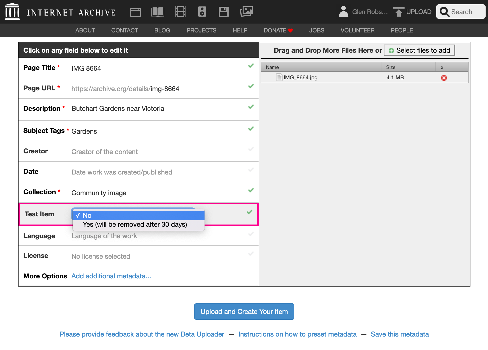

 Then click 'Upload and Create Your Item'. This took at least 5 minutes and after the bar has completed you have to wait longer presumably so it can setup the derivative images.

 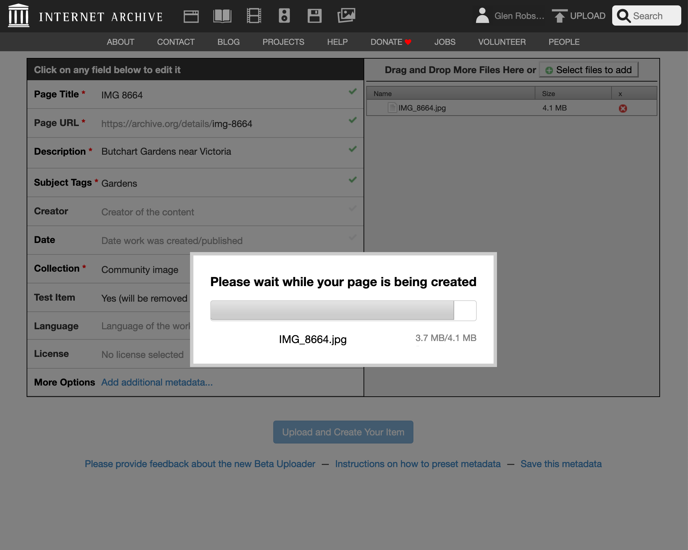

 If all has gone well you should see the item page:

 

3. On the details page get the identifier for the image. For example if the details page link is:
  
  https://archive.org/details/img-8664_202009
 
  the identifier would be `img-8664_202009`

 

4. Use the Internet Archive image service with this identifier:

  [https://iiif.archive.org/iiif/img-8664_202009/full/full/0/default.jpg](https://iiif.archive.org/iiif/img-8664_202009/full/full/0/default.jpg)

  

5. You should then be able to use this image:

  Create an image link:
  
  [https://iiif.archive.org/iiif/img-8664_202009/full/512,/0/default.jpg](https://iiif.archive.org/iiif/img-8664_202009/full/512,/0/default.jpg)

  Check it works with a zooming viewer like OpenSeaDragon:

  [https://iiif.gdmrdigital.com/openseadragon/index.html?image=https://iiif.archive.org/iiif/img-8664_202009/info.json](https://iiif.gdmrdigital.com/openseadragon/index.html?image=https://iiif.archive.org/iiif/img-8664_202009/info.json)

  

  Pull out regions using the UCD selector tool:

  [https://glenrobson.github.io/iiif-imageManipulation/index.html?iiif-content=https://iiif.archive.org/iiif/img-8664_202009](https://glenrobson.github.io/iiif-imageManipulation/index.html?iiif-content=https://iiif.archive.org/iiif/img-8664_202009)

  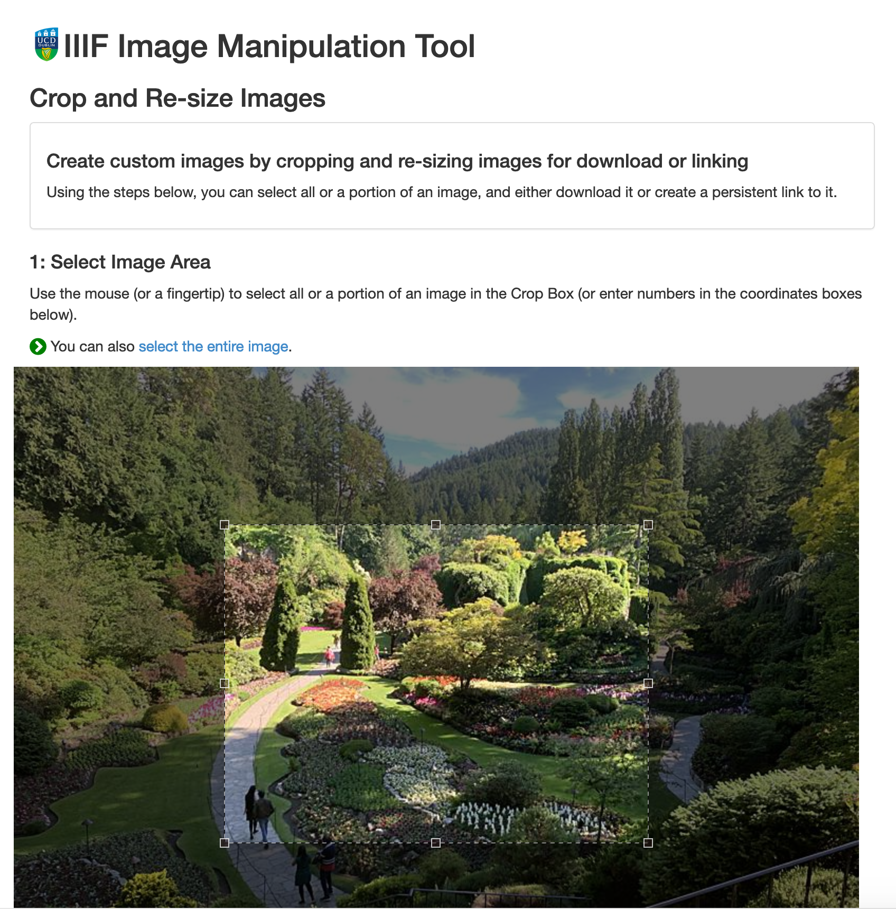

