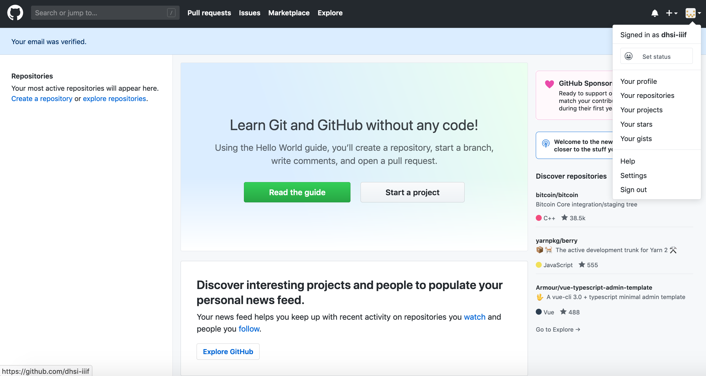
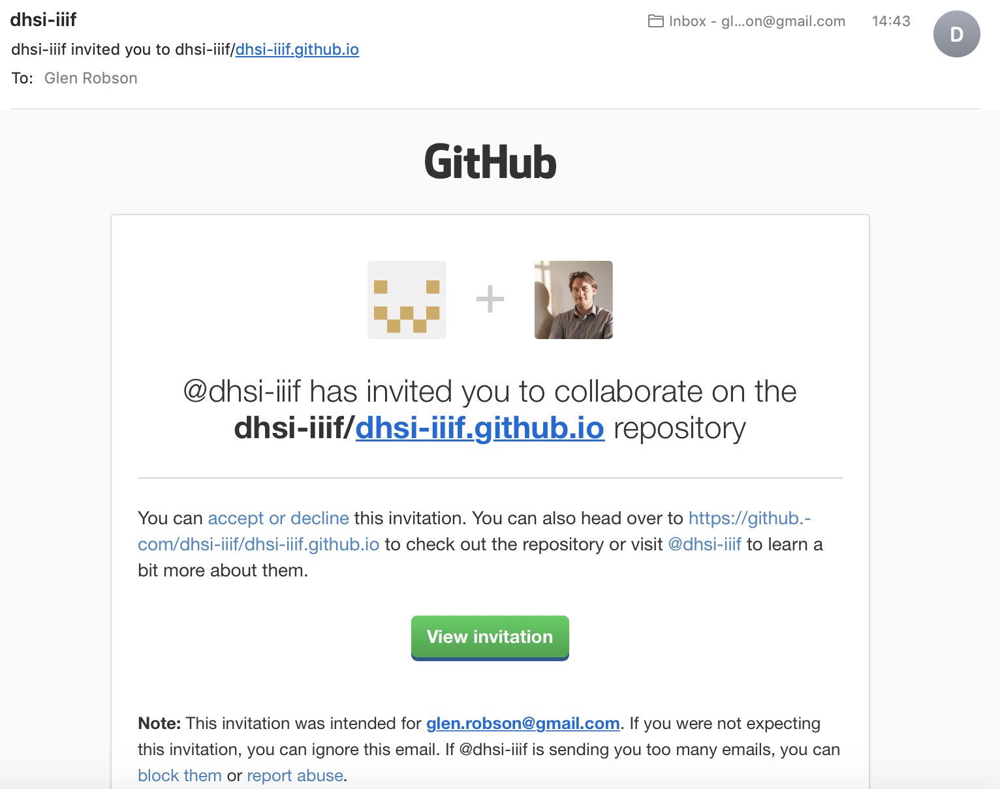
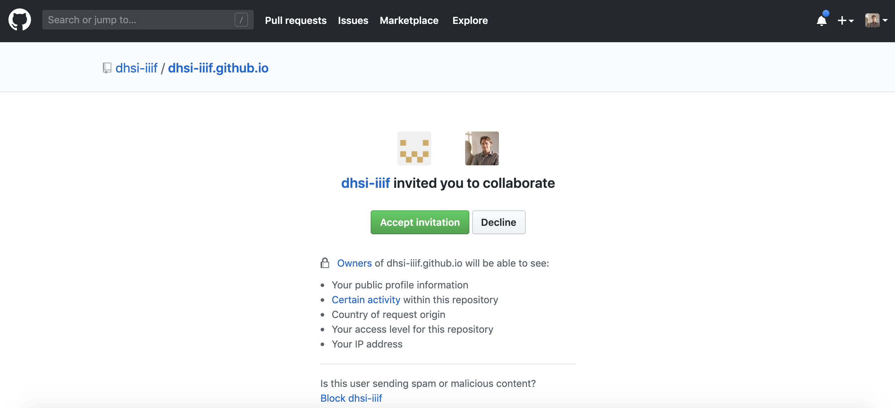
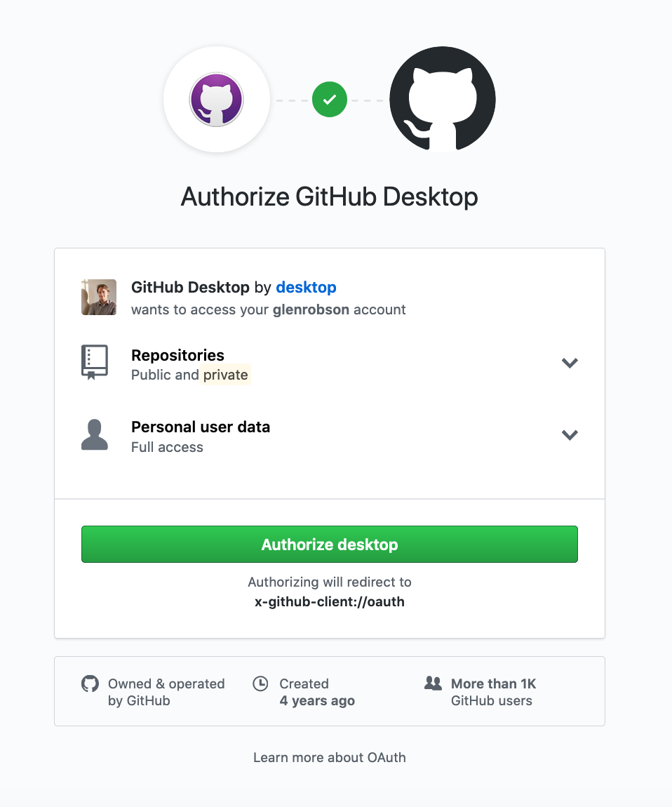
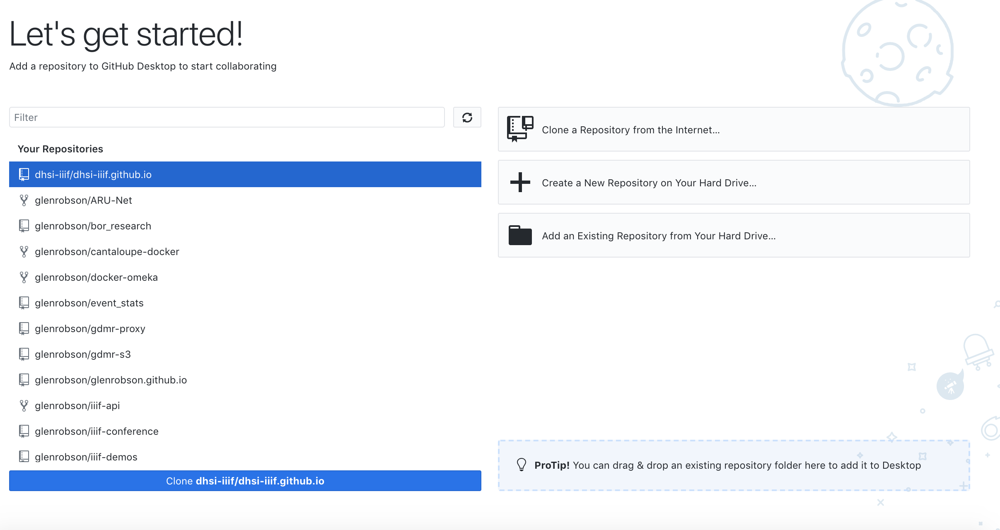
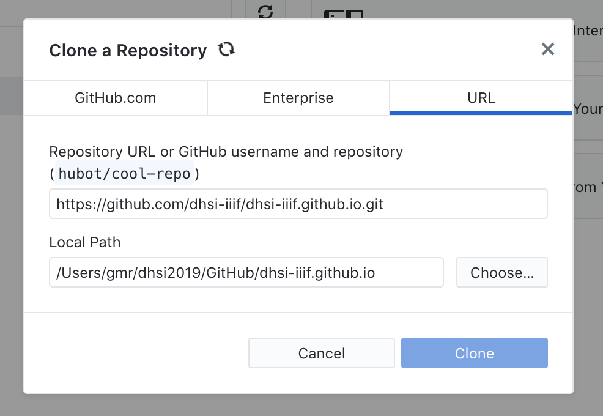
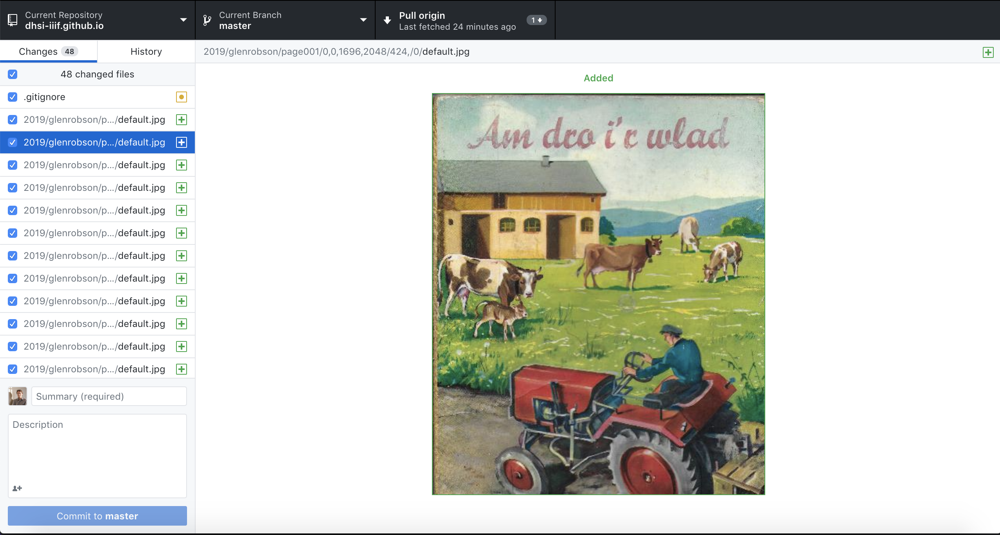
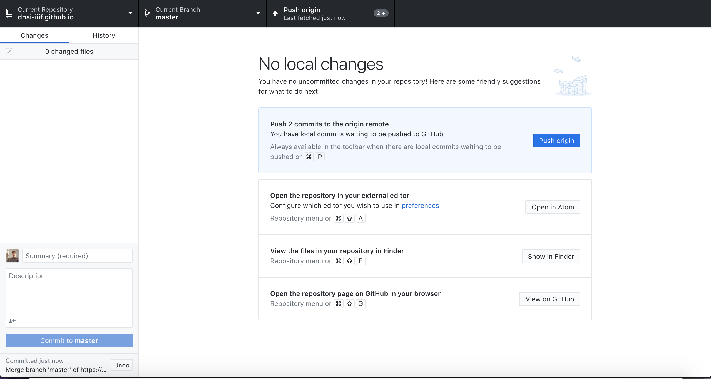

# Level 0 hosting with GitHub Pages

Once you have created your level 0 image we need to make it available to the public. 

One way to get access to free web hosting is to use GitHub pages. GitHub is a software and web application created to manage projects with multiple developers and manages the source code to ensure people's changes don't get overwritten. One feature of Github is GitHub Pages which allows you to create a Web page about your project. We are going to use this functionality to host a IIIF Image. This is a relatively convoluted process but once setup it will give you a free way to publish IIIF Images.

## Step 1: Sign up to GitHub
Created an account by going to [Github](https://github.com/) and clicking signup.

 * Create Username, password, email

    

 * Complete verify puzzle

    

 * Choose free option

    

 * Customise experience (skip this step)

    

 * Verify email address

    

 * Success!!

    

## Step 2: Get Read/write access to repo
 * Add username to: https://github.com/dhsi-iiif/dhsi-iiif.github.io/issues/1
 * You will get an invitation through the email you registered with in GitHub

    

 * Accept invitation

    

## Step 3: Check out repo
The GitHub desktop application manages the upload of your data to GitHub. It is possible to do this through the Git command line but for this part of the workshop it is suggested to use the Desktop version. 

 * Download and install Github desktop https://desktop.github.com/
 * Login 
  * Click login through website

    

 * Configure name and email

    

 * Download the GitHub dhsi 2019 repository to your local machine in the dhsi2019/dhsi-iiif.github.io. GitHub calls download a repository 'cloning'. So select the dhsi-iiif.github.io repository and click clone.

    

 * Selecting where to download the repo to.

    

 * Click open in Finder or similar for Windows

    

 * Make a directory inside the 2019 directory for your examples:
 
 ```
 dhsi-iiif.github.io/2019/<your_github_user>
```
## Step 4: Upload level 0 image
Now move the directory you created in the previous step (Step 3 from [static-tiles](static-tiles.md)) into the following:

 ```
 dhsi-iiif.github.io/2019/<your_github_user>
 ```

Now go to Github Desktop

    

 * Add a commit message on the left hand side. Fill in the Summary and a short description.
 * Click commit to master
 * You now need to send your local changes to GitHub. To do this click the Push Origin button. Note if others in the class are also on this step they may have made changes to GitHub and the GitHub desktop application will not let you send your changes until you have the latest copy from GitHub. If this is the case it may ask you to Pull from origin. If this is the case Pull the latest changes before pushing your changes. 

    

 * In your local copy of `2019/<your_github_user>/<your_image_dir>/info.json`, open it up in an editor and edit the `@id` with: `https://dhsi-iiif.github.io/2019/<your_github_user>/<your_image_dir>`
 * As you did earlier add a Commit summary and description then commit and Push changes
 * Wait 2mins
 * Go to: `https://dhsi-iiif.github.io/2019/<your_github_user>/<your_image_dir>/info.json`
 * and you should see your info.json!

##  Step 5: View image:
 * Leaflet: http://mejackreed.github.io/Leaflet-IIIF/examples/?url=https://dhsi-iiif.github.io/2019/glenrobson/page001/info.json
 * Openseadragon: http://iiif.gdmrdigital.com/openseadragon/index.html?image=https://dhsi-iiif.github.io/2019/glenrobson/page001/info.json
 * Note not all software works with level 0 images. 

