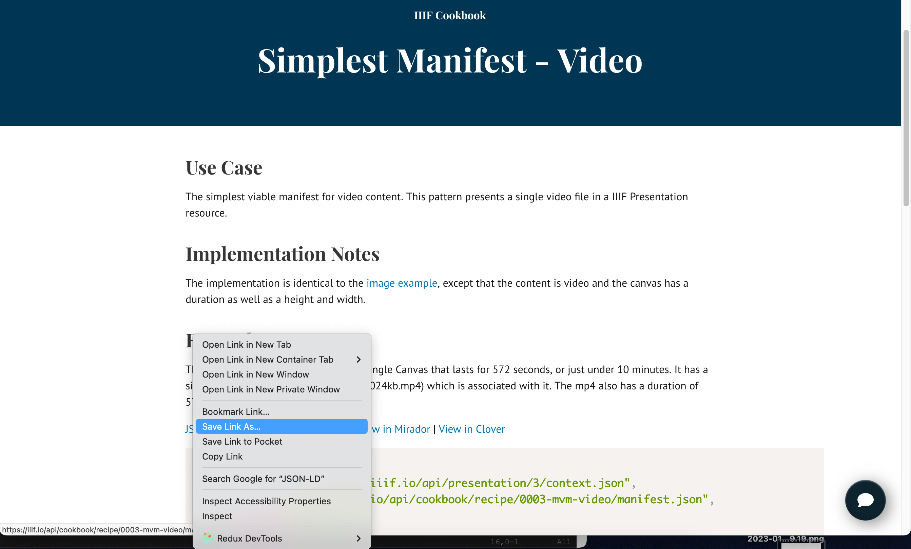
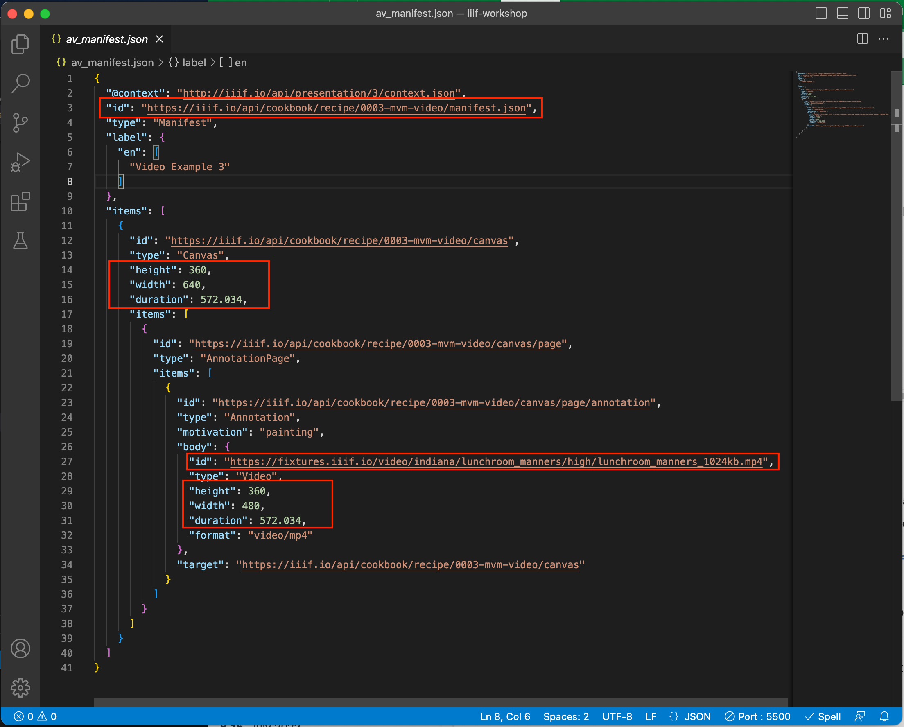

# A basic Video Manifest

This guide shows you how to create a basic video manifest using the VS code setup we did in Day 3 of the presentation API. The overall steps are as follows:

 1. Download the example Video Manifest from the IIIF Cookbook
 2. Move your video to the `iiif-workshop` directory 
 3. Edit the example Video manifest to point to your Video
 4. Test it in a IIIF viewer

The steps in more detail are as follows:

## 1. Download the example video Manifest from the IIIF Cookbook

The IIIF Cookbook is a useful place to see examples of different use cases of IIIF. The example manifests provided in the recipes also allow you to take a working manifest and edit it with your content. 

To do this we will download the JSON from the following URL:

[https://iiif.io/api/cookbook/recipe/0003-mvm-video/](https://iiif.io/api/cookbook/recipe/0003-mvm-video/)

If you navigate to the above URL then right click on the JSON-LD link and select "Save link as":

  

and save the Manifest to your `iiif-workshop` directory and call it `av_manifest.json`. You should be able to access this manifest by clicking on the following URL:

[http://localhost:5500/av_manifest.json](http://localhost:5500/av_manifest.json)

## 2. Move your video to the iiif-workshop directory

Now move your video into the `iiif-workshop` directory. For this example I am going to use the demo video [MistComing.mp4](video/MistComing.mp4). If you have the live server started then it should be accessible here:

[http://localhost:5500/MistComing.mp4](http://localhost:5500/MistComing.mp4)

## 3. Edit the example Video manifest to point to your Video

We now need to edit the example manifest so it points to our video rather than the example video in the recipe. Before we do this we need to work out the dimensions of the video (i.e. width, height and duration in seconds). I found this on a Mac by right clicking on the video file and selecting Get Info:


You can then see the dimensions in the more info part highlighted below. 


In this example the file has:

 * Width: 960
 * Height: 540
 * Duration: 00:10 or 10 seconds

Now we need to open up the example manifest and start editing. To do this we are going to use the VS Code editor which is free to use and helps with editing JSON. Open up the `av_manifest.json` in VS Code. In the screen shot below I have highlighted the 4 changes that we need to make and more details on this changes are below. 



### Changes:

 1. On line 3 change the id so it points to your manifest. If you've called it `av_manifest.json` the value should be `http://localhost:5500/av_manifest.json`
 2. On line 27 change the URL to the video to point to your vide. If you are using the demo video then the value would be: `http://localhost:5500/MistComing.mp4`
 3. Now change the dimensions of your canvas to match your video. For the example change lines 14 to 16 to be:
```
  "height": 540,
  "width": 960,
  "duration": 10,
```
 4. Finally change the dimensions of your video so they match the canvas on lines 29 to 31.

The full edited manifest should look as follows:

```
{
  "@context": "http://iiif.io/api/presentation/3/context.json",
  "id": "http://localhost:5500/av_manifest.json",
  "type": "Manifest",
  "label": {
    "en": [
      "Video Example 3"
    ]
  },
  "items": [
    {
      "id": "https://iiif.io/api/cookbook/recipe/0003-mvm-video/canvas",
      "type": "Canvas",
      "height": 540,
      "width": 960,
      "duration": 10,
      "items": [
        {
          "id": "https://iiif.io/api/cookbook/recipe/0003-mvm-video/canvas/page",
          "type": "AnnotationPage",
          "items": [
            {
              "id": "https://iiif.io/api/cookbook/recipe/0003-mvm-video/canvas/page/annotation",
              "type": "Annotation",
              "motivation": "painting",
              "body": {
                "id": "http://localhost:5500/MistComing.mp4",
                "type": "Video",
                "height": 540,
                "width": 960,
                "duration": 10,
                "format": "video/mp4"
              },
              "target": "https://iiif.io/api/cookbook/recipe/0003-mvm-video/canvas"
            }
          ]
        }
      ]
    }
  ]
}
```

## 4. Test it in a IIIF viewer

Now you have your first AV manifest it is time to test it in a viewer. If you have named your file `av_manifest.json` the following links should open up your manifest in the UV and Mirador:

 * [http://universalviewer.io/examples/#?c=&m=&s=&cv=&manifest=http://localhost:5500/av_manifest.json](http://universalviewer.io/examples/#?c=&m=&s=&cv=&manifest=http://localhost:5500/av_manifest.json)

Note this example won't work in Mirador because Mirador is hosted at https://projectmirador and a https website is not allowed to access a http manifest. 

