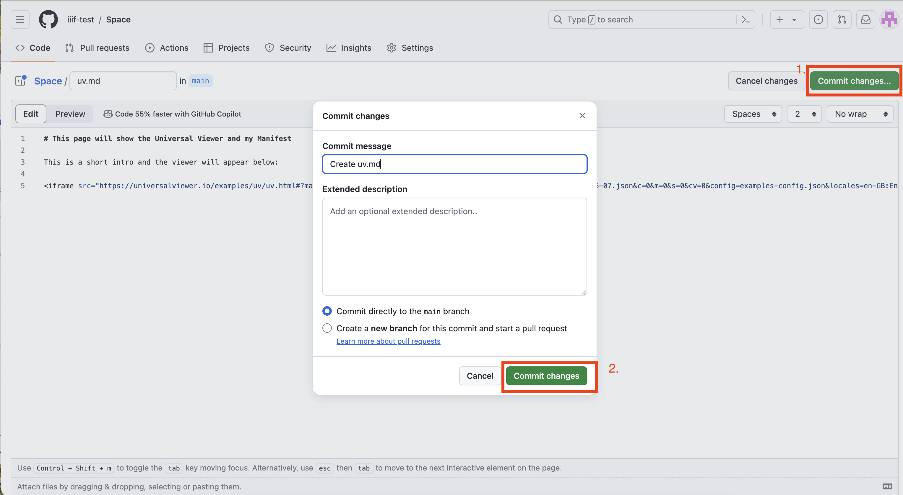

# Embed a viewer on a Website

For this extra task we are going to look at embedding Mirador and the Universal Viewer into a web page. The first thing we need as a place to publish our website and we are going to use Github and the Workbench as we've been using that through the course as a way of publishing our Manifests and images. 

The Workbench acts as a front end to Github but doesn't currently have the functionality to allow editing of Websites so we are going to go into Github and use its editor. It is possible to do this without using the Workbench and look at setting up [Github Pages](https://pages.github.com/) on your own repository.

In this example we are going to use the following project:

https://iiif-test.github.io/Space/index.html

Which has the following Github repository:

https://github.com/iiif-test/Space/tree/main

## Step 1: Find your Github repository

The way to find your Github repository from the Workbench is to open up your project and select the Files tab at the top:


Then click the Github icon highlighted below:


This will take you to the Github repository:


## Step 2: Add a new Web Page

Now we have our repository open we want to create a new file. So click the add file button and select "Create new file":


Once you click on the new file you will be presented with the interface below where you can type the contents of the file. If you are familiar with HTML then you can name the file with a .html extension and put your HTML in the text box. For this example we are going to use [Markdown](https://docs.github.com/en/get-started/writing-on-github/getting-started-with-writing-and-formatting-on-github/basic-writing-and-formatting-syntax) which makes it easier to write a web page.

The first task is to choose a name for your file and I've gone for `uv.md` the `.md` tells Github this is a Markdown file. 


You can see a full list of [Markdown](https://www.markdownguide.org/cheat-sheet/) tags but in this example I am using `#` to denote a heading and just adding some text. You can copy and paste the following:

```
# This page will show the Universal Viewer and my Manifest

This is a short intro and the viewer will appear below:

```


Now we need to find the code to add the UV to this page. If you leave this tab open and navigate back to your Workbench website (https://iiif-test.github.io/Space/index.html) we need to open your manifest in the UV.


## Step 3: Finding the Universal Viewer Embed code

If you open up your manifest in the following version of the Universal Viewer

https://uv-v4.netlify.app

***Note:*** do not use the UV version at http://universalviewer.io as the embed funconality is currently borken. 

Scroll down to where you can add your Manifest ID. Paste your manifest URL in the text box and click Set IIIF Manifest id. 


You can also edit the following URL to directly open your Manifest:

https://uv-v4.netlify.app/#?c=&m=&s=&cv=&manifest=https://iiif-test.github.io/Space/manifests/ganymede-2021-06-07.json

We can find the embed code by clicking on the share icon at the bottom of the UV and then the embed tab:


Then copy the embed code which starts with `<iframe ` and adjust the size of desired. 


## Step 4: Paste the embed code into the Github webpage

Now paste the embed code into the Github markdown file:


Now save your file by clicking the Commit changes button and then when the dialog appears click Commit changes again. 



## Step 5: Update the main page with a link to the UV

Now we have created our Universal Viewer page we want to add it to the main website so we can navigate to it. From the main repository screen click the `index.md` file.


Now click the edit pencil icon to edit this file:


Now if you scroll down to the bottom of the page and add the following Markdown:

```

### Web pages

 * [Universal viewer](uv.md)
```

This will create a heading `Web Pages` and a list with a link called `Universal viewer` which once clicked will navigate to `uv.md`. Once you have done this click commit changes as you did before. 


***Note:*** you may need to scroll up to the top of the page to see the commit button. 

### Step 6: Wait for the website to deploy

If you navigate to the main page of your repository by clicking the Code tab at the top of the page. You should see a orange circle highlighted below:


Wait until this has turned to a green tick as show below:


Then you can check to see if your changes have worked. You can click on the link on the right hand side of your repository to take you straight to the website:

### Step 7: View your website

Now scroll to the bottom of the page and you should see the new heading and link to the UV:


Following that link you should get to the UV with your manifest loaded. 

