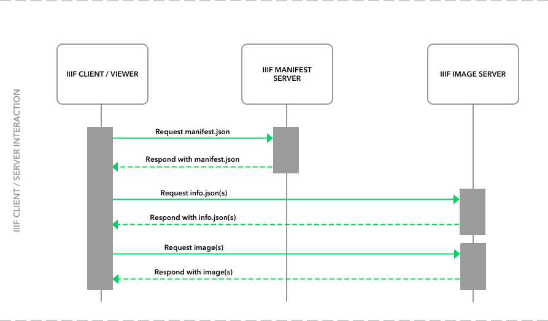

# Software

Most of the IIIF software developed is open source and can be found through the [Awesome-IIIF](https://github.com/IIIF/awesome-iiif) list.

A typical IIIF request response cycle looks something like this.

This request response cycle follows a basic pattern, where a IIIF client wants to display an object consisting of `n` images. The client then requests a IIIF Presentation API [`manifest.json`](https://purl.stanford.edu/cy496ky1984/iiif/manifest.json) from a server. The client then parses the manifest and starts to put together a view of the image object. For each image that it wants to display, the client then requests an [`info.json`](https://stacks.stanford.edu/image/iiif/cy496ky1984%2Fcy496ky1984_00_0002/info.json) response from the IIIF server. The `info.json` response contains information about the image, including dimensions, available image server options, and available tile levels.

## IIIF manifest software
IIIF manifest's can be served as static or dynamic content. The manifest can be quite complex, but at its basic level it contains metadata about the image object. [Several libraries](https://github.com/IIIF/awesome-iiif#presentation-api-libraries) exist for creating these manifests.

## IIIF image server software
There are several [IIIF image server software applications](https://github.com/IIIF/awesome-iiif#image-api-libraries) available. These image servers have two main functions: responding to `info.json` requests and responding to image requests. Later on in this workshop we are going to install the [Cantaloupe IIIF Image Server](https://github.com/medusa-project/cantaloupe/).

## IIIF client software
IIIF clients are built to consume IIIF web services using the technical specications. Some clients are focused on presenting image objects while, others are only interested in consuming the image server responses.
