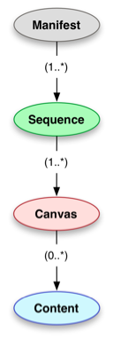

# IIIF Specifications

The IIIF technical specifications are the glue that holds things together for image interoperability.

[Complete list of specifications](http://iiif.io/api/#current-specifications)

IIIF provides two core APIs:
 - Image API (I want to get image pixels)
 - Presentation API (I want to display the images)
 
There are several more APIs that IIIF supports including Search and Authentication. This workshop will focus on the Image and Presentation APIs.

## [Image API](http://iiif.io/api/image/2.1/)

The Image API provides for a standardized way to request and deliver images. This can be as simple as, give me the original image to give me an upside down tiled version of the image in gif format. The IIIF Image API is restful and allows for images to be served dynamically or from a static cache (implementation details).

Images are requested using URI templates that have the following syntax:

```
{scheme}://{server}{/prefix}/{identifier}/{region}/{size}/{rotation}/{quality}.{format}
``` 

Here is a quick example of how modifying these parameters can change the image that is delivered back to you.

[](http://iiif.io/api/image/2.1/#order-of-implementation)[^1]
```
region=125,15,120,140 size=90, rotation=!345 quality=gray
.../125,15,120,140/90,/!345/gray.jpg
# Source: http://iiif.io/api/image/2.1/#order-of-implementation
```

We will go more in depth on this later with a hands on demonstration of how this works.

## [Presentation API](http://iiif.io/api/presentation/2.1/)

The IIIF Presentation API enables you to provide metadata about the structure and layout of image objects. Image type objects represent things like:
 - single images
 - groups of ordered images
 - groups of images that represent pages (book, manuscript)
 
The Presentation API provides metadata about how these image objects can be displayed.

### Basic objects
[](http://iiif.io/api/presentation/2.1/#basic-types)[^2]

### More complex objects
[](http://iiif.io/api/presentation/2.1/#additional-types)[^3]

[^1]: http://iiif.io/api/image/2.1/#order-of-implementation
[^2]: http://iiif.io/api/presentation/2.1/#basic-types
[^3]: http://iiif.io/api/presentation/2.1/#additional-types

Some content adopted from [Everything you ever wanted to know about IIIF but were too afraid to ask](https://www.slideshare.net/Cogapp/everything-you-ever-wanted-to-know-about-iiif-but-were-too-afraid-to-ask).
