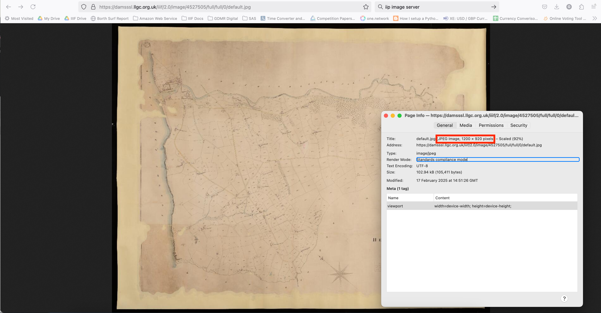

# NLW Image Servers

This may be out of date but I believe the NLW has two Image servers. For modern collections digitised after the Newspapers project, all items have JPEG2000 and use the [IIPImage server](https://iipimage.sourceforge.io/documentation/server). Before then the NLW used PFF zoomify images to provide access to zoomable images. I wrote a Java library to serve PFF images over IIIF. 

## IIPImage server images

An example image is as follows:

 * Newspaper: https://damsssl.llgc.org.uk/iiif/2.0/image/3406011
 * Journal: https://damsssl.llgc.org.uk/iiif/2.0/image/2070010
 * Cynefin: https://damsssl.llgc.org.uk/iiif/2.0/image/4527505

Some interesting features:
 * Images are limited to 1200 by 1200 

Image limiting was brought in in version 2.1 and 3.0. It allows the server to enforce a limit for downloading the full image. It doesn't stop users from zooming into an image and its always possible to stich together the tiles to get the higher quality image. 

## PFF Image server

An example image is as follows:
 * Geoff Charles image: https://damsssl.llgc.org.uk/iiif/2.0/image/1489986
 * Wills image: https://damsssl.llgc.org.uk/iiif/2.0/image/2

Some interesting features:
 * No Image limiting for these images (it used to limit without the max keywords in the info.json)
 * The info.json includes a logo 
 * It supports less IIIF features than IIPImage

 