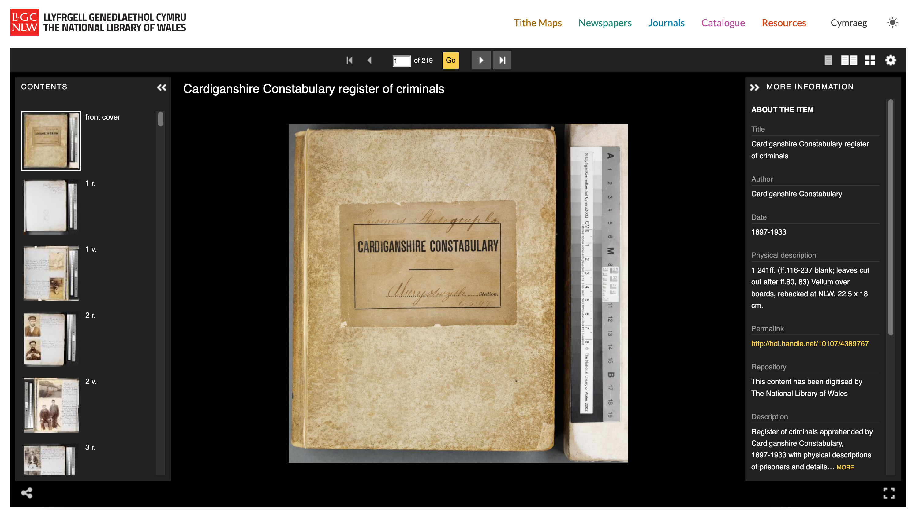
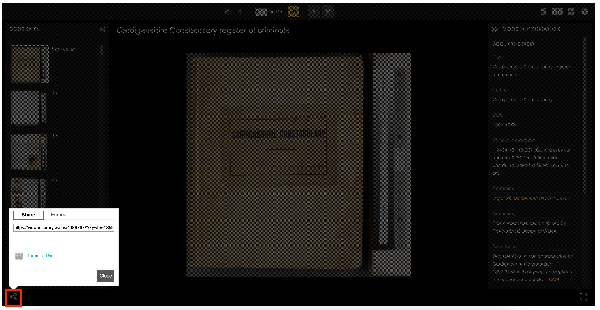
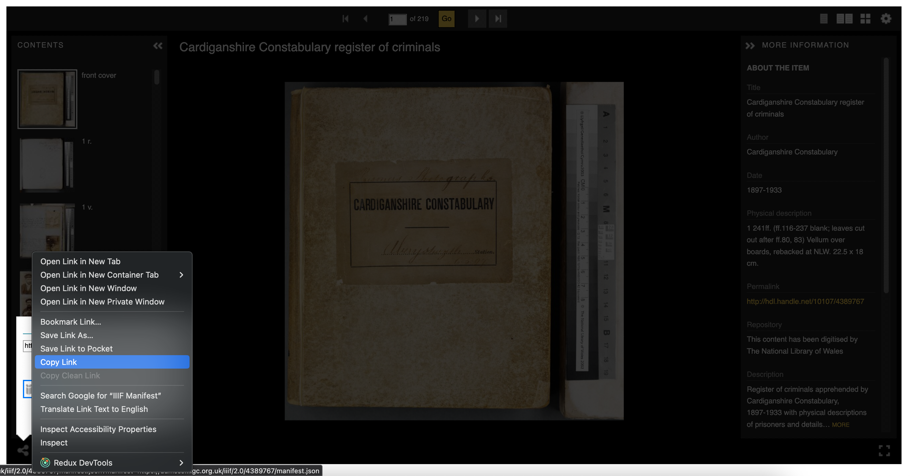
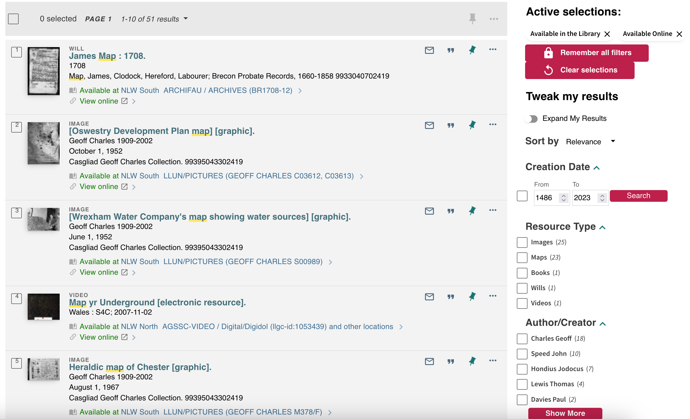
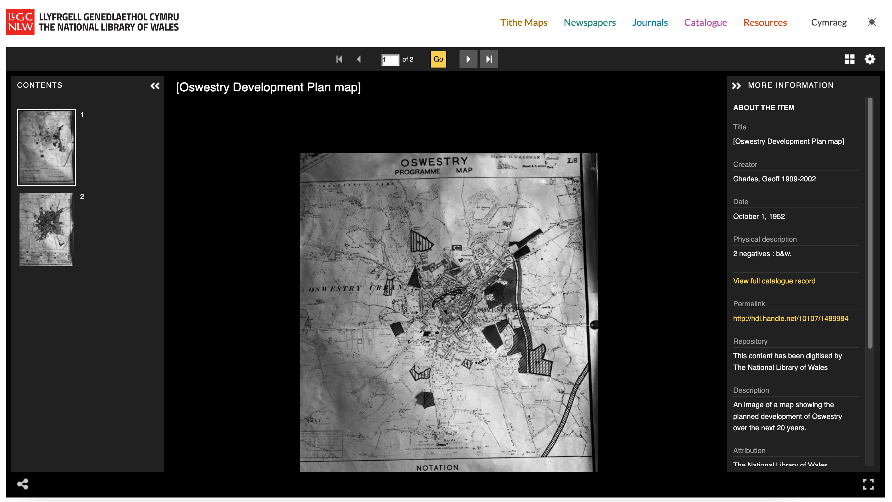
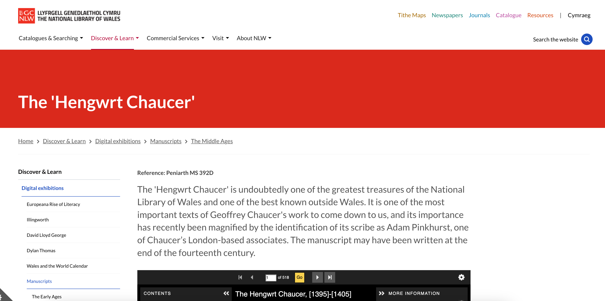
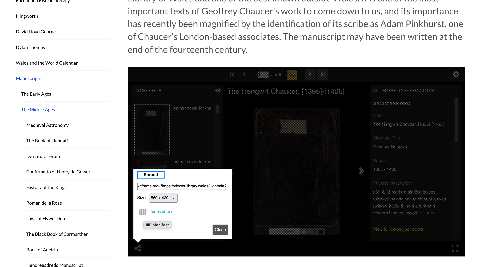
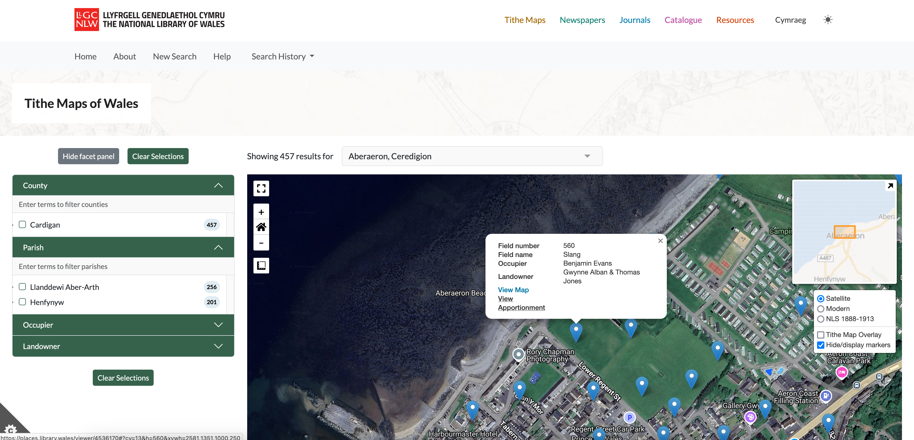
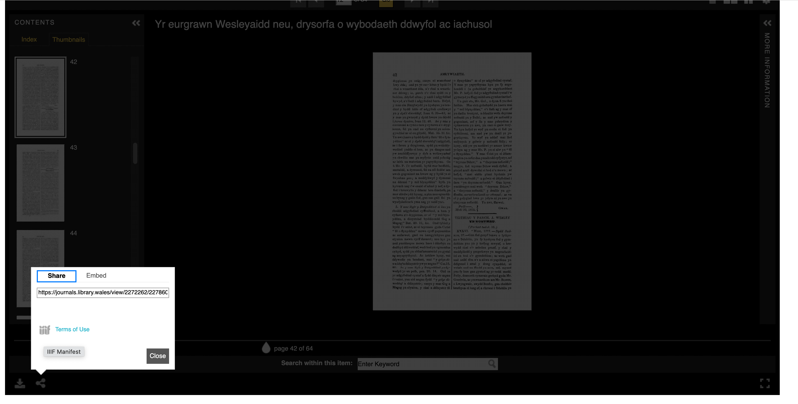
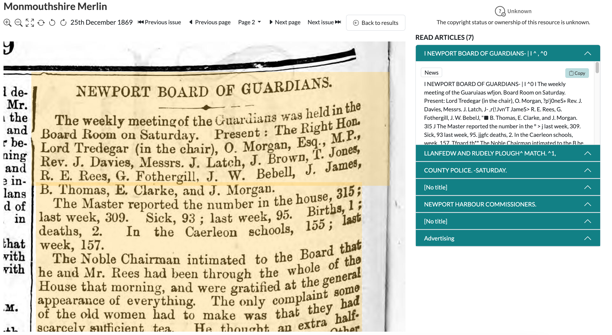

## National Library of Wales Manifests

The NLW are in an usual position in that all of the collections are made available as IIIF. Generally the way to access a IIIF Manifest is the same once you get to the NLW Viewer. This exercise is to look at how researchers use your collections and how they can re-use manifests.

Once you have found a manifest URL using the methods detailed below you can try and open them in the following viewers:

 * https://projectmirador.org/embed/?iiif-content=MANIFEST_URL
 * https://uv-v4.netlify.app/#?c=&m=&s=&cv=&manifest=MANIFEST_URL
 * https://ncsu-libraries.github.io/annona/tools/#/display?url=MANIFEST_URL&viewtype=iiif-storyboard&settings=%7B%22fullpage%22%3Atrue%7D
 * https://samvera-labs.github.io/clover-iiif/docs/viewer/demo?iiif-content=MANIFEST_URL
 * https://demo.viewer.glycerine.io/viewer?iiif-content=MANIFEST_URL
 * https://theseusviewer.org/?iiif-content=MANIFEST_URL
 * http://codh.rois.ac.jp/software/iiif-curation-viewer/demo/?manifest=MANIFEST_URL

You will need to replace the MANIFEST_URL with the URL you have copied from the IIIF logo.

Details for finding an item from the Universal Viewer for the different projects is below but the process of getting a manifest is the same for all once you have got to the viewer. 

For example with this item: [Cardiganshire Constabulary register of criminals](https://viewer.library.wales/4389767)



We want to get the 'IIIF Manifest' for this item. We will go into more details about IIIF Manifests on later but a Manifest is a JSON document that contains links to all of the images and metadata that goes into a digital item. We are going to find the link to the IIIF Manifest and past this into a tool below which will allow us to find the IIIF Image URL to the image we want. 

To find the manifest click the 'share' link at the bottom of the viewer and then right click on the IIIF icon and select 'Copy link' or 'Copy Link Address' in Chrome:



You can see the copy link from Firefox in this image: 



The copied link should look something like:

```
https://damsssl.llgc.org.uk/iiif/2.0/4389767/manifest.json?manifest=https://damsssl.llgc.org.uk/iiif/2.0/4389767/manifest.json
```

You can see the link to the manifest is created twice in this link so it can be cleaned up by removing everything after the `?` to leave:

```
https://damsssl.llgc.org.uk/iiif/2.0/4389767/manifest.json
```

Some IIIF viewers and tools will be able to cope with the manifest being repeated but if possible its best to remove everything after the `?`. 

## Catalogue 

To access most items in the collection its possible to use the catalogue at [discover.library.wales](https://discover.library.wales/). Questions:

 * Is there a way to get access to all digital collections? 

Once you find a digital item, usually the clue is a thumbnail: 



You can access the viewer and then by clicking on the link icon you can get access to the IIIF Manifest:



Examples include:
 * [Oswestry Development Plan map - https://damsssl.llgc.org.uk/iiif/2.0/1489984/manifest.json](https://damsssl.llgc.org.uk/iiif/2.0/1489984/manifest.json)

The URL or Web address to the Manifest is not specified by IIIF but the NLW implementation is made up of the following:

```
https://damsssl.llgc.org.uk/iiif/2.0/1489984/manifest.json
```

 * **https** this is important as all IIIF manifests and images need to be https to allow re-use. We will discuss this later.
 * **damsssl.llgc.org.uk** hostname or the machine that has copies of the images and manifests. Note dams.llgc.org.uk is the http version
 * **iiif/2.0** IIIF version of the manifest and image. This is to allow future implementation of version 3 or 4 of IIIF. 
 * **1489984** the Fedora PID of the parent object. 
 * **manifest.json** This is the name of the IIIF manifest and by convention is `manifest.json` but it could be called anything. 

## Exhibitions

Another way of finding digital content is through the exhibition route. Once you find an item:



You can view the manifest by clicking on the link icon and right clicking on the IIIF manifest:



 * [The Hengwrt Chaucer -  https://damsssl.llgc.org.uk/iiif/2.0/4628556/manifest.json](https://damsssl.llgc.org.uk/iiif/2.0/4628556/manifest.json)


## Places 

For the places website once you have navigated to an area and clicked on a pin you can access the map or apportionment:



Which will take you to the viewer which you can again click on the share button to access the IIIF manifest:


 * [Map of the parish of Henfynyw in the County of Cardigan - https://damsssl.llgc.org.uk/iiif/2.0/4527504/manifest.json](https://damsssl.llgc.org.uk/iiif/2.0/4527504/manifest.json)

## Journals 

The Journals website also uses the Universal Viewer to show IIIF items but note the Manifest will be for the Journal Issue rather then the Journal Title. 



 * [The Cambrian quarterly magazine and Celtic repertory - https://damsssl.llgc.org.uk/iiif/2.0/2070799/manifest.json](https://damsssl.llgc.org.uk/iiif/2.0/2070799/manifest.json)

 To get to a Journal title we can look at the following link:

[https://journals.library.wales/view/2070008/2070799/65#?xywh=-2243%2C-198%2C6731%2C3949](https://journals.library.wales/view/2070008/2070799/65#?xywh=-2243%2C-198%2C6731%2C3949)

In this example:
 * **2070008** the first PID is the title pid
 * **2070799** is the issue PID

We can then access the title Collection using the following:

 * [The Cambrian quarterly magazine and Celtic repertory - https://damsssl.llgc.org.uk/iiif/2.0/2070008/manifest.json](https://damsssl.llgc.org.uk/iiif/2.0/2070008/manifest.json)

## Newspapers

There isn't a public IIIF link for the Newspapers as this was before the NLW implemented IIIF but the NLW newspapers do use IIIF images. 



There are hidden IIIF manifests which were used for prototyping for example:

Title: https://damsssl.llgc.org.uk/iiif/newspapers/3036868.json
Issue: https://damsssl.llgc.org.uk/iiif/newspaper/issue/3036869/manifest.json

Note the Newspaper title manifests don’t generate for some titles but this one works well as its a small title:

https://damsssl.llgc.org.uk/iiif/newspapers/3100020.json

There are some issues, the main one is the https versions linked above contain http IIIF images which causes them not to work in most viewers. 

## Archives

During the implementation of the WW1 archive a number of Archive records were made available as IIIF. These were then indexed for the [Cymru 1914 - http://cymru1914.org](http://cymru1914.org) website. 

These manifests and collections are interesting as it replicates the full hierarchy of the original archival cataloguing. Unfortunately they won't work in viewers as they are all from http links:

 * [Fonds for Cardiganshire Great War Tribunal (Appeals) Records](http://dams.llgc.org.uk/iiif/archive/3975658/fonds.json)