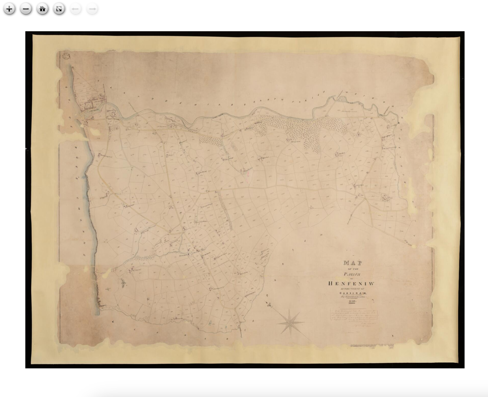
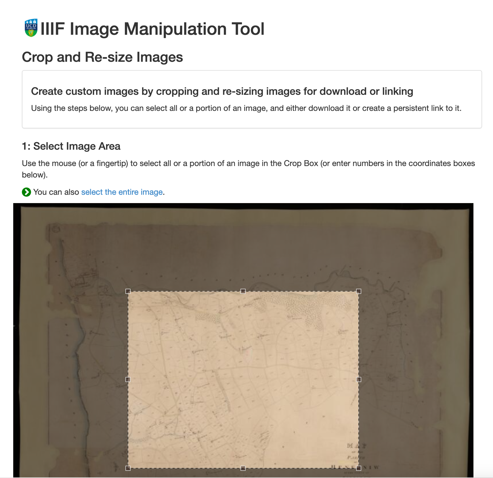

# Finding NLW IIIF Images

For this exercise we are going to find a couple of NLW IIIF Images that we can use later in the IIIF Presentation API session. This exercise will show you how to find a single IIIF image within a digital object and then how you can manipulate this image so you can use it to tweet or embed in a blog or publication. 

## Stage 1: Find a NLW digital item

Using the [Guide provided](nlw-manifests.md) in the introduction find a digital object and open it up in the Viewer. Once you have found an item follow the previous steps to get the manifest.

## Stage 2: Find IIIF Image URL

Now we have got our Manifest we need to find the URL (or link) for image we want. We could do this by looking through the JSON and we can have a look at doing this after the Presentation API session later but for now I have created the following tool that will take a link to a manifest and allow you to choose the image you want. Paste your manifest into the box below and click Load.

    <form>
        <label for="exampleInputEmail1"><b>Manifest URL:</b></label>
        <input type="text" id="manifest_uri" style="width:70%"/>
        <button onclick=loadManifest(event)>Load</button>
        <button onclick=clearManifest(event)>Clear</button>
    </form>

## Stage 3: Experiment

Now you have a IIIF Image URL you can plug it into the following IIIF Tools:

Check it works with a zooming viewer like OpenSeaDragon:

  [https://iiif.gdmrdigital.com/openseadragon/index.html?image=https://damsssl.llgc.org.uk/iiif/2.0/image/4527505/info.json](https://iiif.gdmrdigital.com/openseadragon/index.html?image=https://damsssl.llgc.org.uk/iiif/2.0/image/4527505/info.json)

Pull out regions using the UCD selector tool:

  [https://jbhoward-dublin.github.io/IIIF-imageManipulation/index.html?imageID=https://damsssl.llgc.org.uk/iiif/2.0/image/4527505](https://jbhoward-dublin.github.io/IIIF-imageManipulation/index.html?imageID=https://damsssl.llgc.org.uk/iiif/2.0/image/4527505)

