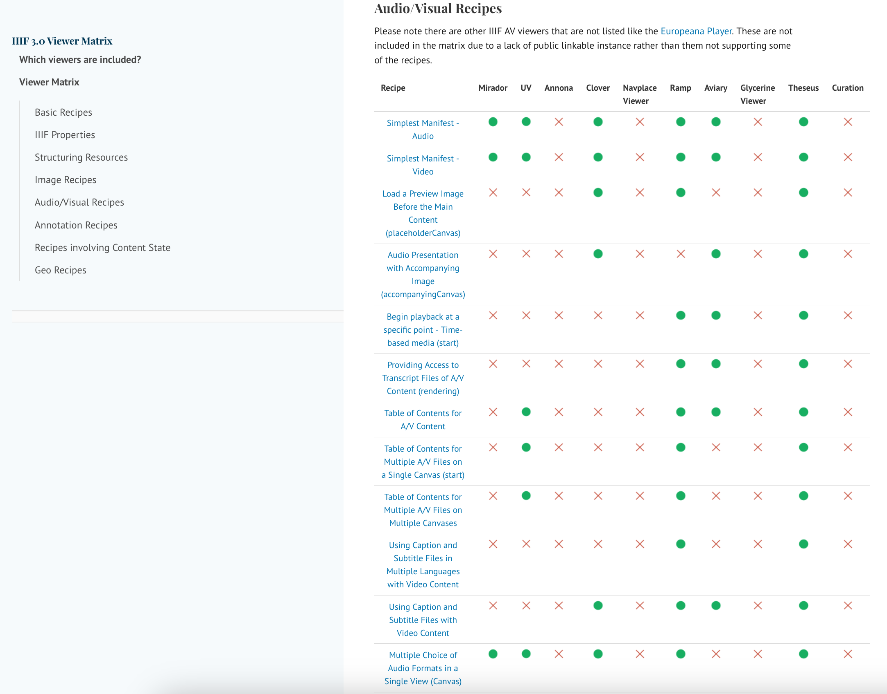

# Tools and Implementations

## IIIF Cookbook
https://iiif.io/api/cookbook

The IIIF Cookbook is maintained by volunteers and provides the following functions:

 * Examples for beginners to copy. 
 * Shows which viewers support which IIIF feature
 * Gives viewer developers fixtures to test with

Each recipe has gone through a formal review process and gives a guide to both IIIF publishers and viewer developers for accepted patterns. By detailing which viewers support which recipe it also provides a matrix so you can see the strengths and weaknesses of each viewer. It also solves a common problem with IIIF where the specification supports a feature but you don't know if its implemented in a viewer. If you create a test manifest you are unsure if its the viewer at fault or if you've made a mistake in the manifest.  

## Omeka-s 

Omeka-s is a great way of creating digital exhibition or simple websites and integrates well with IIIF. Its possible to embed IIIF viewers and there are even plugings to enable a native IIIF image server. The guide below takes you through a use case at the University of Ghent where students are tasked with creating exhibitions using the Ghent digital collections. 

https://training.iiif.io/advanced_iiif/modules/omeka/

### Zooniverse 

The British Library funded the support of IIIF within the Zooniverse crowdsourcing system. The guide below takes you through creating a IIIF enabled crowdsourcing project. 

https://training.iiif.io/advanced_iiif/modules/zooniverse/

## Transkribus

Transkribus is a Handwriting Text Recognition system that can be trained to turn handwriting into annotations. You can import a IIIF manifest, then transcribe a portion of the text and create a model that will transcribe the rest of the content. They have some out of the box models that may work with some content but it works best with large collections of personal archives like diaries and letters written by the same person. 

https://www.transkribus.org/

## Glycerine

Glycerine is a relatively new annotation system that is developed by a company in Australia. We have come across the viewer early in the course but it also has a annotation server that allows easy annotation of collections:

https://glycerine.io/ 

## liiive.now

This is a very recent entrance to the IIIF annotation space. The early beta testing release came out over Christmas but it looks like it will be a very interesting collaborative annotation system. All of the other annotation systems are one person at a time systems or systems where the annotations are private. This is the first one which allows real time collaboration in a similar form to Google docs. 

https://liiive.now/

## More

There are so many more exciting projects and the best place to find them is in the IIIF Community calls on [youtube](https://www.youtube.com/playlist?list=PLYPP1-8uH9c6VZbIlaNSj1WV9AEAnkmGC). Other ways to find IIIF compatible tools include:

 * [IIIF Newsletter](https://iiif.io/newsletter/)
 * [IIIF Conference](https://iiif.io/event/2025/leeds/)
 * [IIIF slack](http://bit.ly/iiif-slack)
